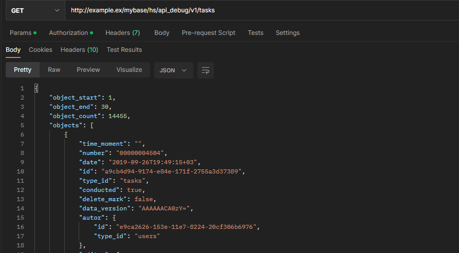

# API

> **Что такое API?**   
> API(Application Programming Interface) - это механизм, позволяющий осуществить обмен информации между двумя программными продуктами, с помощью определений и протоколов.

Разработанное **REST API** в конфигурации **"Управление IT-отделом 8"**, призвано расширить привычные рамки взаимодействия с конфигурацией из сторонних программ. Данный механизм в первую очередь будет полезен программистам или системным администраторам, которые хотят настроить полную синхронизацию данных с сайтом, программой или любыми другими сервисами позволяющими делать HTTP-Запросы.

API может взаимодействовать с большим количеством объектов информационной базы, например: 

*  Задания 
*  Контрагенты 
*  Контактные лица 
*  Спринты 
*  Номенклатура 
* И многое другое (все типы описаны в [документации API](https://softonit.ru/api/docs/))...

Практически с каждым объектом можно взаимодействовать с помощью четырех HTTP-Методов:
1. `GET` - Получает объект или массив объектов  
2. `POST` - Создает объект или массив объектов  
3. `PUT` - Изменяет объект или массив объектов.  
4. `DELETE` - Удаляет объект или массив объектов.    

Более подробно ознакомиться с методами и настройками можно [в документации API](https://softonit.ru/api/docs/)