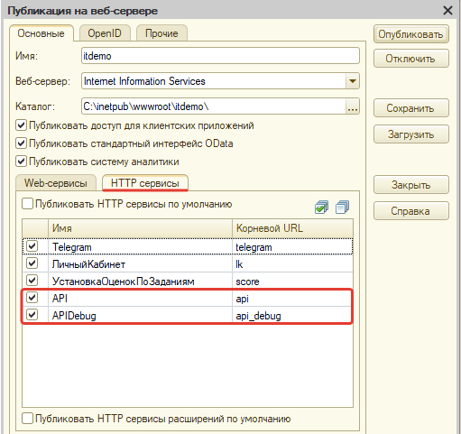

# Первый запуск API

Чтобы выполнить первое подключение через API, необходимо опубликовать рабочую базу через службы IIS или Apache.

Как опубликовать базу вы можете ознакомиться в статьях:
    - [Публикация на сервере - IIS](https://softonit.ru/FAQ/courses/?COURSE_ID=1&LESSON_ID=592)
    - [Публикация на сервере - Apache](https://softonit.ru/FAQ/courses/?COURSE_ID=1&LESSON_ID=591)

!!!
Важно! Для работы обмена, между мобильным приложением и основной базой, при публикации, должны быть включены HTTP сервисы для работы с API, а именно: API и APIDebug для отладки.
Также в основной рабочей базе в разделе: Администрирование -> Настройки параметров учета, должна быть включена функциональная опция «Использовать API».
!!!

Для того, чтобы использовать подключение, необходимо установить следующий набор ролей:  

* [x] Базовые права API.
* [x] Базовые права БСП
* [x] Базовые права УФ.
* [x] Выполнение заданий.
* [x] Добавление заданий.
* [x] Чтение покер планирования.

Подключение
После того, как информационная база была опубликована и установлены роли, необходимо убедиться что все работает корректно, для этого откройте браузер, и сформируйте ссылку по образцу: http://имя_хоста/имя_публкации/hs/api_debug/v1/tasks.

В открвшейся странице заполняем логин и пароль пользователя информационной базы 1С, в успешном случае должен отобразиться текст JSON с данными существующих заданий, если это так API работает корректно, в противном случае необходимо искать проблемы с публикацией и пробовать подключение повторно.