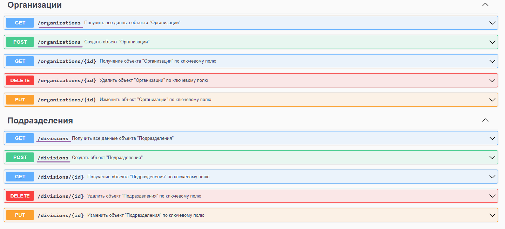

# Тестирование API, пробные запросы

## Тестирование через браузер

В [основной документации](https://softonit.ru/api/docs/) описаны методы по которым можно взаимодействовать с данными, для простого тестового получения данных через API, в [документации](https://softonit.ru/api/docs/) выберите необходимый метод, скопируйте его англоязычное представление и перейдите в браузере по ссылке http://имя_хоста/имя_публикации/hs/api_debug/v1/имя_метода, после авторизации, будет отображен результатирующий JSON файл.
Если необходимо, параметры стоит писать после url по образцу:
`"?ИмяПараметра1=ЗначениеПараметра1&ИмяПараметра2=ЗначениеПараметра2..."`
К сожалению, делать POST, PUT, DELETE запросы без стороннего софта через браузер нельзя, поэтому для более глубокого погружения, рекомендуем использовать программу [Postman](https://www.postman.com/) описанную ниже.

## Тестирование через Postman

Скачайте и установите программу Postman при первом запуске от регистрации аккаунта можно отказаться, далее следуйте пунктам описанным ниже:

1. Создайте новую вкладку запроса.
2. Выберите любой из методово (GET, POST, PUT, DELETE), для начала рекомендуем использовать GET для получения данных
3. Введите URL запроса по типу приведенном выше при тестировании в браузере.
4. На вкладке "params" при необходимости введите параметры и значения.
5. На вкладке "Authorization" в поле "type" необходимо выбрать "Basic Auth", и ввести логин и пароль пользователя информационной базы 1С.
6. На вкладке "Headers" при необходимости можно редактировать заголовки.
7. При использовании методов PUT или POST на вкладке "Body", необходимо вставить тело запроса
8. Отправляем запрос и в основном текстовом окне получаем результат. 
