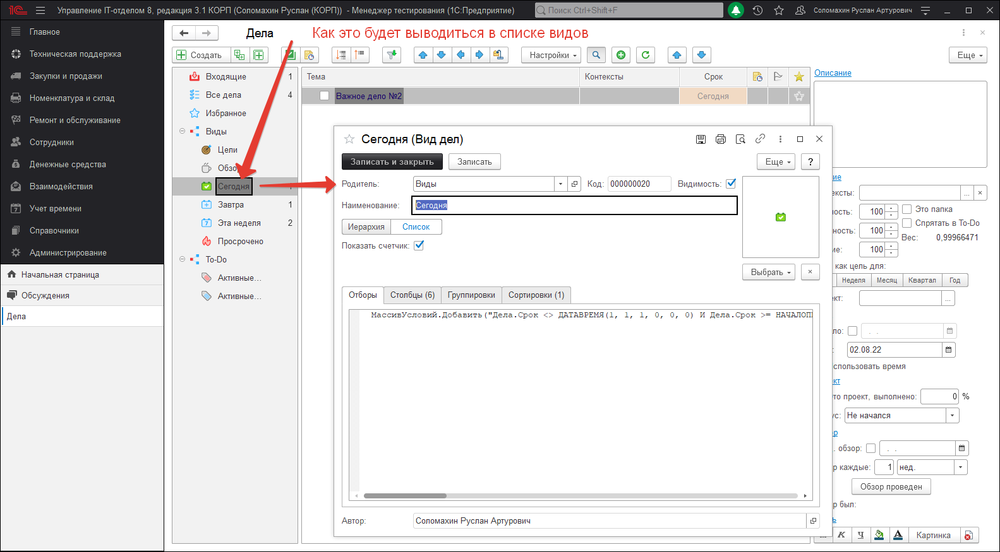

# Настройки видов дел

Виды дел позволяют отобразить отфильтрованные, отсортированные и сгруппированные дела по Вашим условиям. При первом запуске будут созданы стандартные виды. Все имеющиеся виды отображаются в левой панели видов. Вы можете создавать свои собственные Виды, используя встроенные возможности для фильтрации, сортировки и группировки ваших дел.
Это позволит вам без труда работать с разными делами просто перейдя на соответствующий вид.

Где:  
(1) - Отборы. Специальные условия выборки данных.  
(2) - Столбцы. Какие столбцы выводить в выбранном виде.  
(3) - Группировки. Группирует дела в зависимости от выбранных значений.  
(4) - Сортировки. По каким столбцам отсортировать в конце отборов и группировок дерево дел.  
(5) - Как представить дерево дел в виде дерева, или в виде линейного списка. Например, избранное имеет смысл смотреть списком.  

При иерархическом просмотре можно дополнительно указать, что выводить дела с учетом дочерних или родительских элементов.