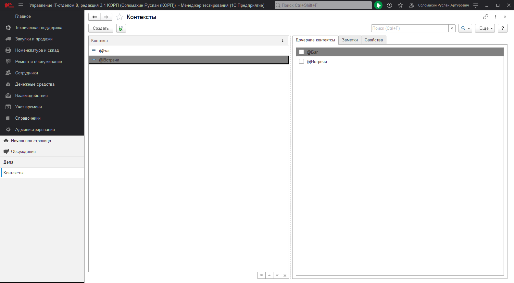

# Настройки контекстов
 
Многие из дел в Вашем списке могут быть завершены только в определенных контекстах или ситуациях. Например, выполнить дело "обсудить с руководством внедрение проекта автоматизации" можно лишь, находясь непосредственно в кабинете руководителя. Таким образом, Вы можете создать новый контекст "Руководитель" и назначить этот контекст для вышеупомянутой задачи. Затем добавить вид с фильтром контекста "Руководитель" и Вы сможете выбрать лишь те дела, которые связанны с этим контекстом. Также, Вы можете думать о контекстах, как о категориях для задач.

Каждый контекст может включать другие Контексты.

Каждый контекст может быть открыт/закрыт в определенное время.

Можно создавать, переименовывать, удалять и назначать параметры для контекстов в диалоге Управления контекстами. Для открытия этого диалога, выберите в меню списка дел **"Настройки > Контексты"**.

Обратите внимание, на то, что контекст может иметь автора и таблицу пользователей. Эта возможность позволяет открыть задания с этим контекстом другим пользователям для совместной работы.
Например, создав контекст ***"@Платежный календарь"***, мы можем делам, которые необходимо проплатить устанавливать эти контексты. В этом случае эти дела увидят другие пользователи указанные на закладке "Пользователи" в контексте.

Присваивание делам контекстов позволяет отфильтровывать дела в видах и делиться этими делами с другими пользователями.