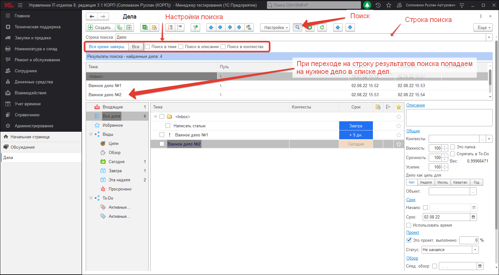

# Поиск в делах 

Иногда бывает необходимо найти что-то в большом списке дел. Можно воспользоваться механизмом поиска:

Если что-то по введенной строке будет найдено, то при переходе на найденную строку, будет выполнен переход к найденному делу в дереве.
