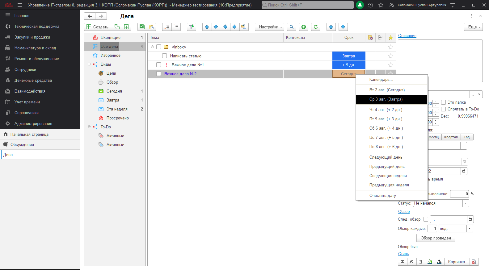

# Работа с делами в дереве дел

После добавления дела, можно изменить тему, выбрать контексты, установить срок и т.д. в самом дереве нажав, правую кнопку мыши:

Так же при выделении дела, в правой части будут отображены ее реквизиты.