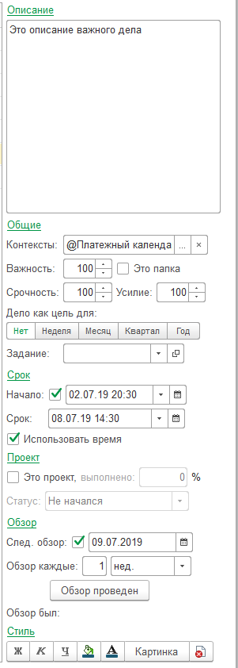

# Реквизиты дел

Любое дело имеет список реквизитов. При активации любого дела, справа отображается панель свойств этого дела:

--

## Описание

Тема - заголовок дела (длиной до 512 символов)
Описание - это текст неограниченной длины, который служит дополнением для темы и позволяет подробнее описать выделенное дело.

## Общие 

* **Контексты** - список контекcтов текущего выделенного дела.
* **Важность** - на сколько важно дело. Число от 0 до 200 по умолчанию 100.
* **Срочность** - на сколько срочно дело. Число от 0 до 200 по умолчанию 100.
* **Усилие** - какое усилие нужно приложить к делу, чтобы его выполнить. Число от 0 до 200 по умолчанию 100.
* **Это папка** - дело может содержать в себе другие дела и не выполняться, т.е. своеобразным разделом. Например, папка "Дни рождения", которая содержит информацию, о днях рождения коллег. Естественно, это не дело - это какая-то информация, которая возможно может пригодиться. Поэтому у папки нельзя установить признак "Выполнено".
* **Дело как цель** - любое дело может быть нашей целью. А цели могут быть недели, месяца, квартала или года. По умолчанию цель недели оформляется с одним восклицательным знаком, а месяца с двумя. Остальные цели являются стратегическими. Так же по умолчанию цели отображаются в системном виде "Цели". Просматривая периодически наши цели, мы их актуализируем и стараемся достичь.
* **Задание** - любое задание может быть связано с делом этим реквизитом.

## Срок

* **Начало** - дата, когда дело начнется или началось. Может быть пустым, если дата не известна.
* **Срок** - дата, когда дело должно быть выполнено. Один из ключевых реквизитов дел. В таблице колонка срок отображается в удобном виде: сегодня, завтра, вчера, четверг и т.д. Это позволяет более конкретно представлять дату если она близко. Может быть пустым, если нет срока выполнения.
* **Использовать время** - галочка, которая определяет формат даты реквизитов начало и срок. Если галочка установлена, то срок будет с временем. По умолчанию выключена.

## Проект

* **Это проект** - галочка, которая свидетельствует о том, что текущее дело является проектом. Т.е. состоит из нескольких подчиненных дел. Важный реквизит при планировании проектной деятельности.
* **Процент проекта** - % на сколько выполнен проект. Доступно только для проектов
* **Статус** - статус, на котором находиться проект в текущий момент.

## Обзор

* **След. обзор** - галочка, что по этому заданию есть обзоры. Т.е. периодический просмотр этого и подчиненных дел для контроля. Этим механизмом удобно контролировать выполнение поручений.
* **Дата обзора** - дата, когда необходимо выполнить обзор дела. Так же в видах дел содержит вид "Обзор", где можно посмотреть дела, которые либо с просроченным обзором, либо обзор сегодня. 
* **Обзор каждые N дней, недель, мес.** - позволяет, нажав на кнопку "Обзор проведен" увеличить дату обзора, на указанный интервал времени. Либо, если он пуст, то обзор автоматически включается и считается от текущей даты с учетом настроек обзора периода.
* **Обзор был** - дата последнего обзора.
* **Жирный** - оформить текущую строку жирным шрифтом.

## Стиль

* **Курсив** - оформить текущую строку курсивом.
* **Подчеркнутый** - подчеркнуть текущую строку.
* **Цвет текста** - цвет текста всей строки. Если пересекается с автоформатированием, то имеет приоритет.
* **Цвет фона** - цвет фона всей строки. Если пересекается с автоформатированием, то имеет приоритет.
* **Картинка** - изображение текущего дела. Если пересекается с автоформатированием, то имеет приоритет.
* **Очистить стиль** - очищает все настройки стиля для текущего выделенного дела.