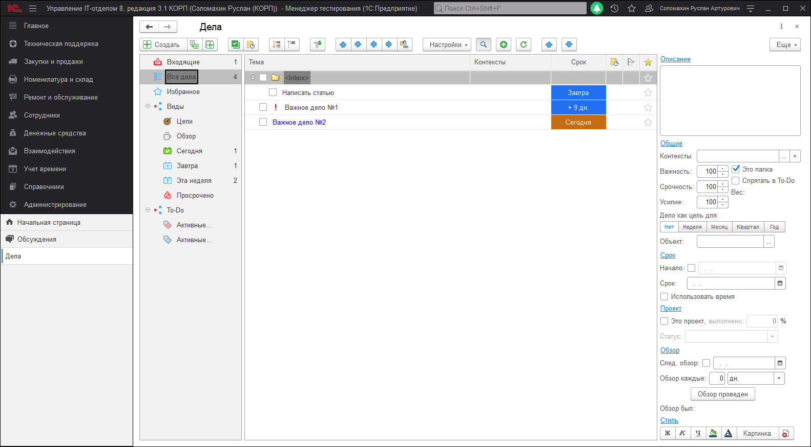
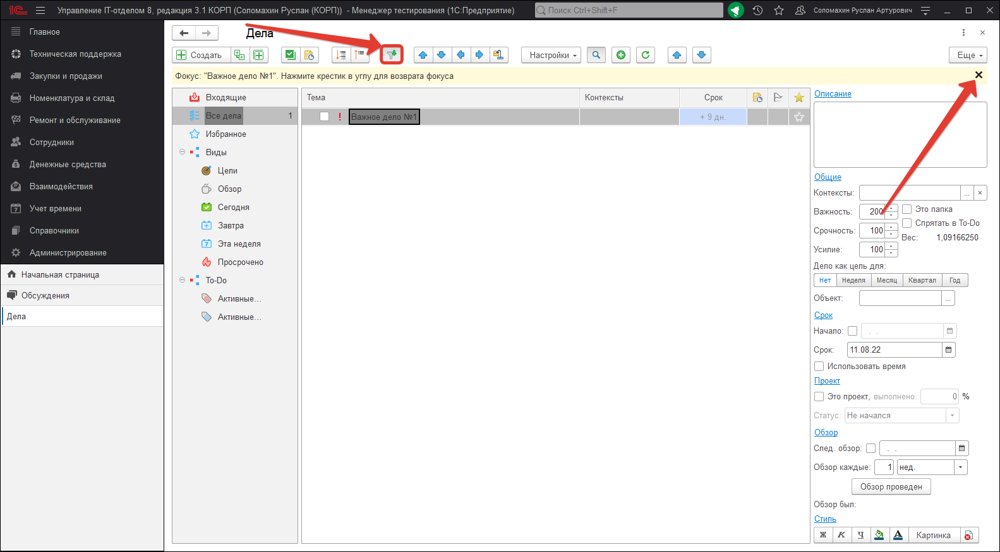
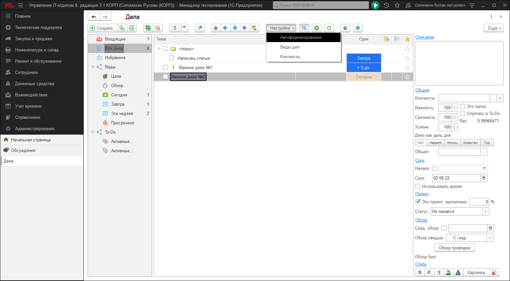

# Сбор информации о делах

Продуктивность без стресса начинается с процесса разгрузки разума, которое заключается в фиксации всего более-менее важного на бумаге или другом носителе — в том, что Аллен, называет корзиной: физический ящик для приёма сообщений, электронный почтовый ящик, диктофон, ноутбук, карманный компьютер, или их комбинация. Суть в том, чтобы выкинуть из головы всё более-менее важное на удобный носитель для последующей обработки. В нашем случае это будет конфигурация "Управление IT-отделом 8".
Все корзины должны быть освобождены (обработаны) по крайней мере раз в неделю. Аллен не настаивает на каком-то определённом методе сбора, но делает акцент на важности регулярного освобождения корзины. Любое место хранения (физический, электронный почтовый ящик, магнитофон, ноутбук, карманный компьютер, и т.д), приемлемо, если оно **регулярно обрабатывается**.
В нашем решении сбором информации занимается подсистема "Дела". Это дополнение к стандартному функционалу, которое позволяет фиксировать все дела как личные, так и рабочие.

1. Для того, чтобы включить использование подсистемы "Дела", откройте *"Администрирование > Сервис > Настройка параметров учета > Функциональность"*.
На этой закладке Вы найдете галочку "Использовать дела". Включите ее, если она выключена и нажмите ОК для того, чтобы настройки были применены.
2. Теперь можно открыть подсистему дел. *"Главное > Дела*"
Вот так выглядит главное окно работы с программой:

**Список дел** - это иерархическое дерево, где каждая строка - это определенное дело и группа дел, которые необходимо выполнить. Причем в нашей программе, надо понимать под делом все в широком смысле. Делом может быть и то, что нельзя выполнить. Ну допустим создать папку "Информация" и взять за правило туда складывать все, что содержит какие важные вам данные.

Кнопка "Создать" на панели дел, позволяет добавлять новые дела на том же уровне, что и текущее выделенное дело. Рядом с этой кнопкой есть кнопка "Создать подчиненное дело". Т.е. для текущего выделенного дела будет создано новое дело, которое будет подчиненно текущему. Далее кнопка "Массовый ввод", которая позволяет кроме того, что Вы введете сразу несколько дел за один раз, так же дополнительно анализировать вводимые данные и в зависимости от текста устанавливать реквизиты добавляемого дела (например срок).
Далее четвертая кнопка "Вид дел в дереве". Она имеет три состояния:  

1. Показаны только не выполненные дела
2. Показаны не выполненные дела + те, которые выполнены в течении последних суток (недавно завершенные)
3. Все дела и выполненные и не выполненные.
4. 
Эта кнопка позволяет по ситуации скрывать или отображать то, что нужно в данный момент времени.

Далее кнопка создания напоминания для текущего дела.

Далее блок кнопок, который сворачивает или разворачивает дерево дел.

Далее кнопка "Установить фокус", при нажатии устанавливается "фокус" на конкретное дело.

Далее блок кнопок, которые отвечают за перемещение дела: вверх, вниз, на уровень выше или ниже и перемещение дела в определенный каталог.

Далее меню настроек:

1. [Автоформатирование](https://softonit.ru/FAQ/courses/?COURSE_ID=1&LESSON_ID=552) - позволяет задать оформление дел по определенным условиям.
2. [Виды дел](https://softonit.ru/FAQ/courses/?COURSE_ID=1&LESSON_ID=551) - список видов, который отображен слева (Входящие, Все дела, Избранное и т.д.) и их настройки.
3. [Контексты](https://softonit.ru/FAQ/courses/?COURSE_ID=1&LESSON_ID=553) - список контекстов наших дел.