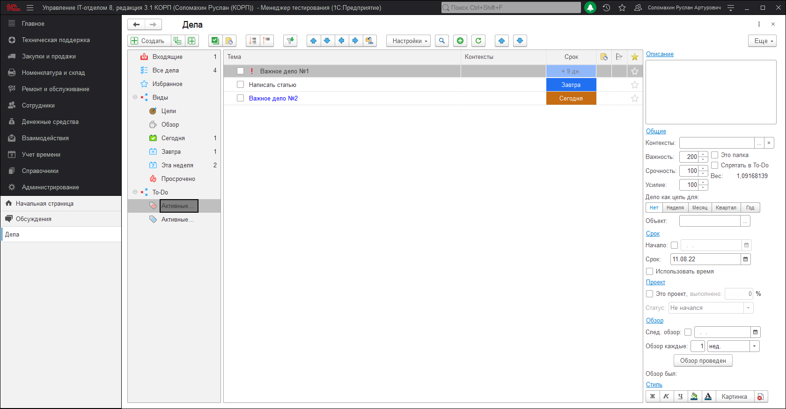

# Список To-Do (следующих действий)

Список To-Do - это список дел, состоящий из подзадач, которые, необходимо выполнить в первую очередь. Каждое дело и подзадача, имеют свой вес (степень важности), в To-Do подзадачи сортируются по весу (сверху-вниз). Таким образом, Вам можно не распределять в списке "Все дела" самостоятельно, какую подзадачу выполнять первой, а перейдя в To-Do, сразу приступать к исполнению. 
Созданная подзадача, сразу помещается в список To-Do "Активные действия". 

Активные действия (по проектам) работает аналогично, единственное отличие заключается в том, что группировка происходит по проектам. 

Флажок "Спрятать в To-Do" отмечает дела, которые не должны попадать в список To-Do

