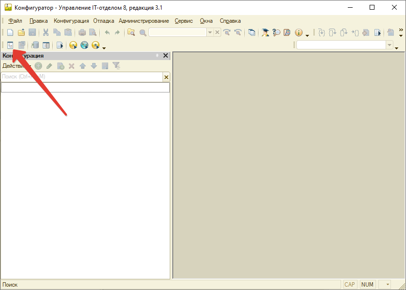
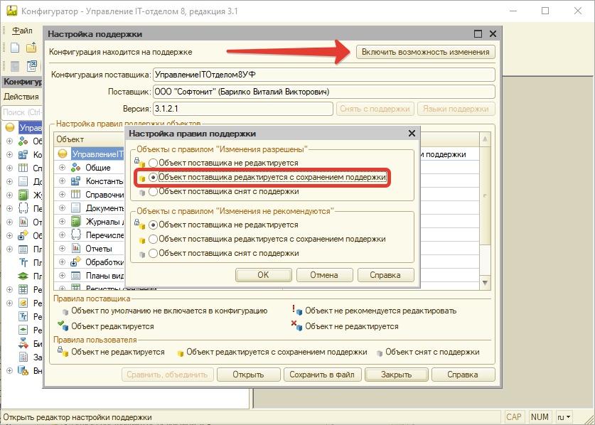

# Включение редактирования конфигурации

Для включения возможности редактирования конфигурации зайдите под учетной записью администратора информационной базы в режиме работы "Конфигуратор".

Далее откройте конфигурацию:

Если эта кнопка не доступна и дерево метаданных открыто, значит конфигурация уже открыта.

Далее в меню: **"Конфигурация > Поддержка > Настройка поддержки"** и нажать на кнопку **"Включить возможность изменения"**.

После этого нажать **ОК** и закрыть форму настройки поддержки, далее необходимо нажать кнопку в меню **"Конфигурация > Обновить конфигурацию базы данных"**.

После этого конфигурацию можно редактировать.