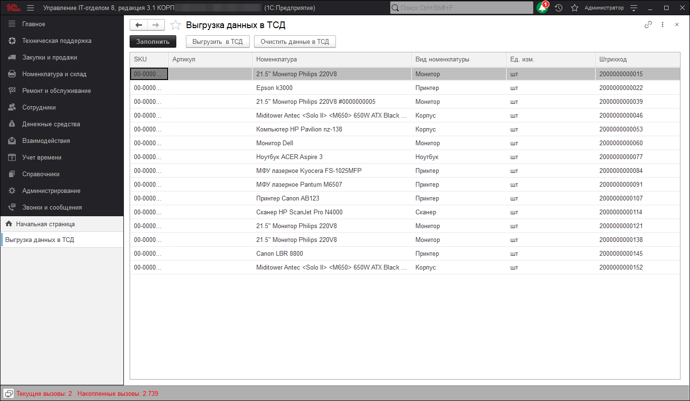

# Выгрузить данные в ТСД

В данной панели осуществляется выгрузка данных в ТСД (терминал сбора данных). Кнопка **Заполнить** заполняет форму номенклатурами, находящимися в справочнике номенклатур.

Обработка выгружает данные по остаткам в ТСД из конфигурации

