# Изменение макета печатной формы

Пример изменения макета печатной формы документа.

В документе «Начало обслуживания» в табличной части есть поле «Описание», которое можно использовать, например, как описание неисправности :

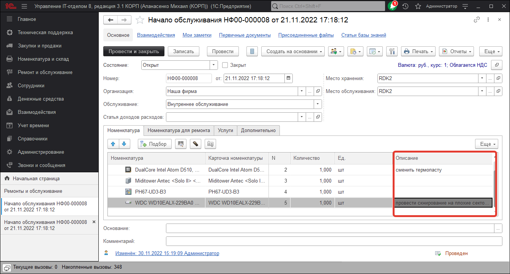

Однако, в печатной форме «Заявка на ремонт (обслуживание)» это поле не выводится (рис.2):

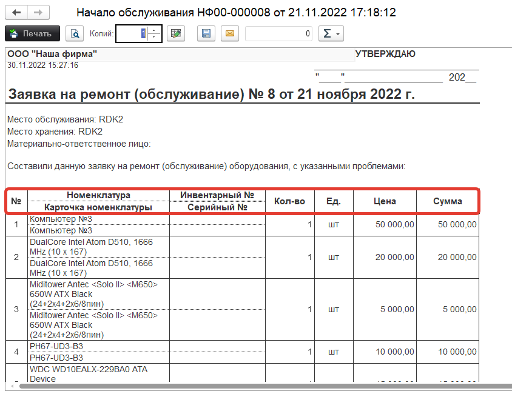

Добавим вывод этого поля в печатную форму, для этого перейдем **«Администрирование» - «Печатные формы, отчеты и обработки» - «Макеты печатных форм»** :

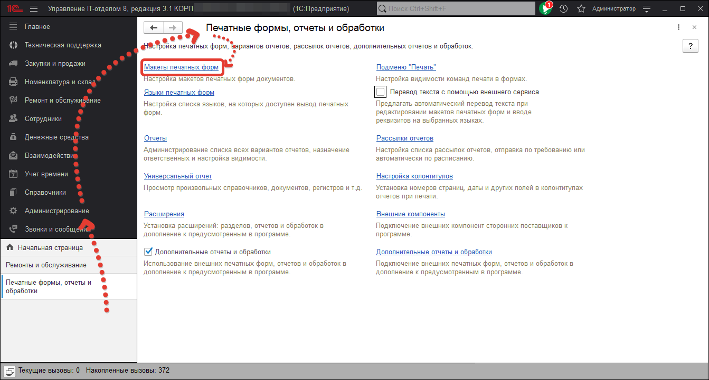

В списке макетов найдем наш макет :

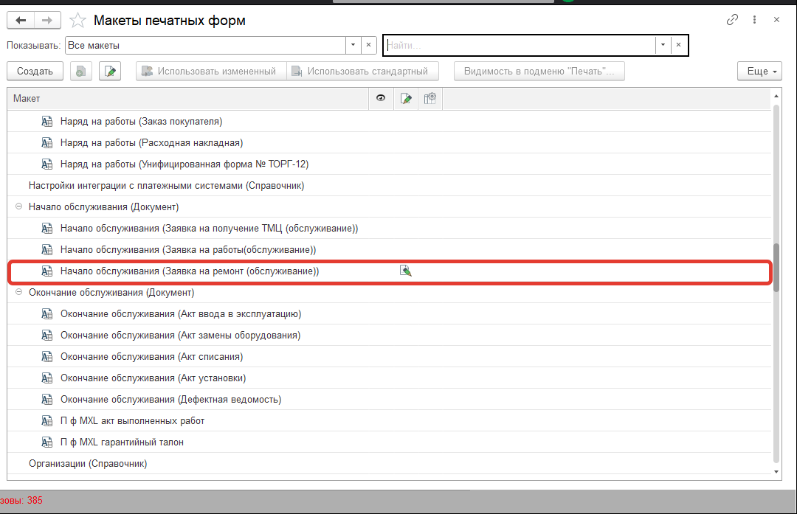

Нажмем на кнопку «Изменить». Откроется форма редактирования макета

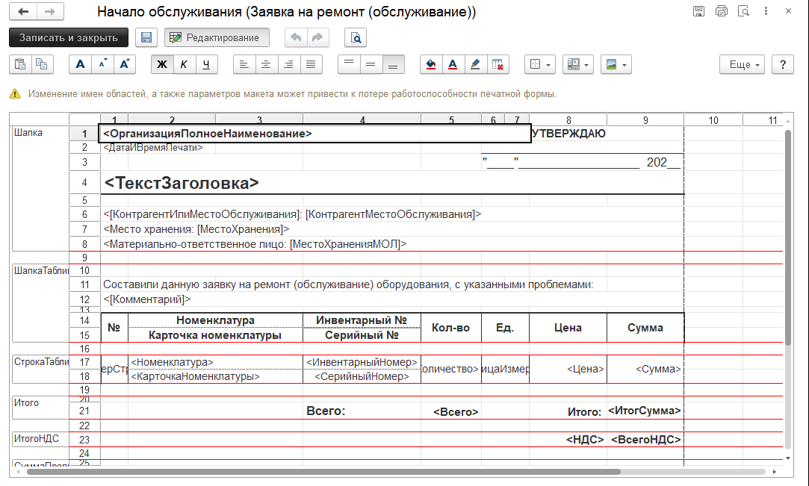

В заголовке колонки с количеством (колонка 4) вызовем контекстное меню (правой кнопкой мыши) и выберем команду **«Раздвинуть»**

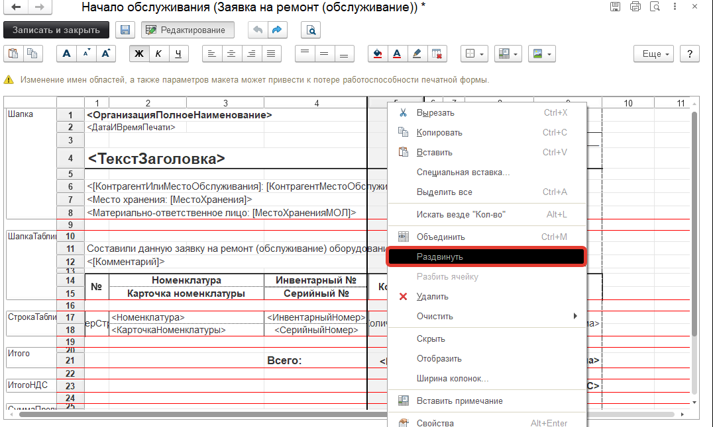

В результате между колонками с количеством и инвентарным номером будет добавлена пустая колонка

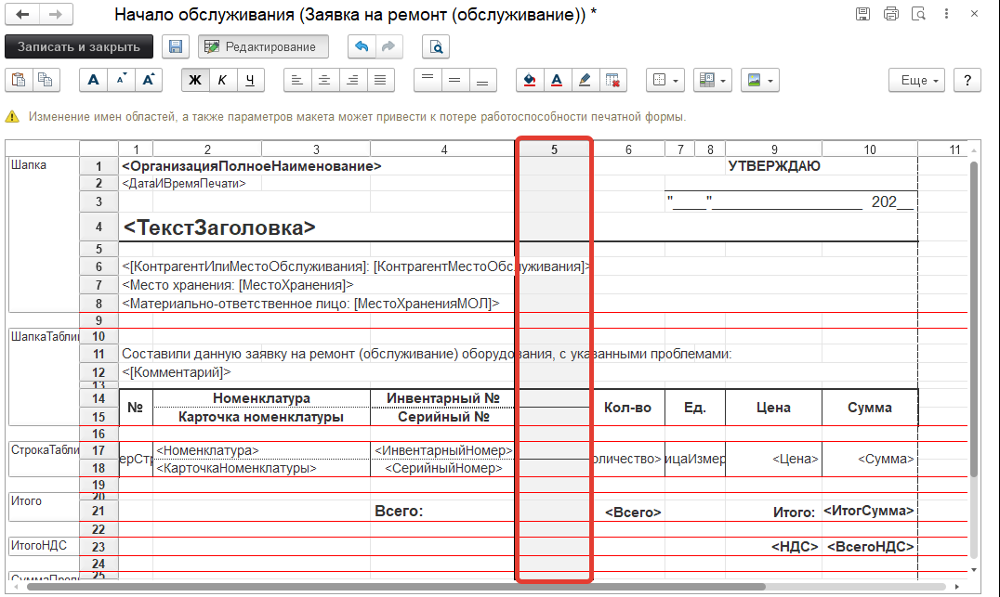

В заголовке таблицы введем заголовок **«Описание»**. Для вывода самого описания необходимо добавить параметр **«Описание»**, для этого в ячейке таблицы в строке с другими параметрами вызовем контекстное меню, в котором выберем команду **«Свойства»**

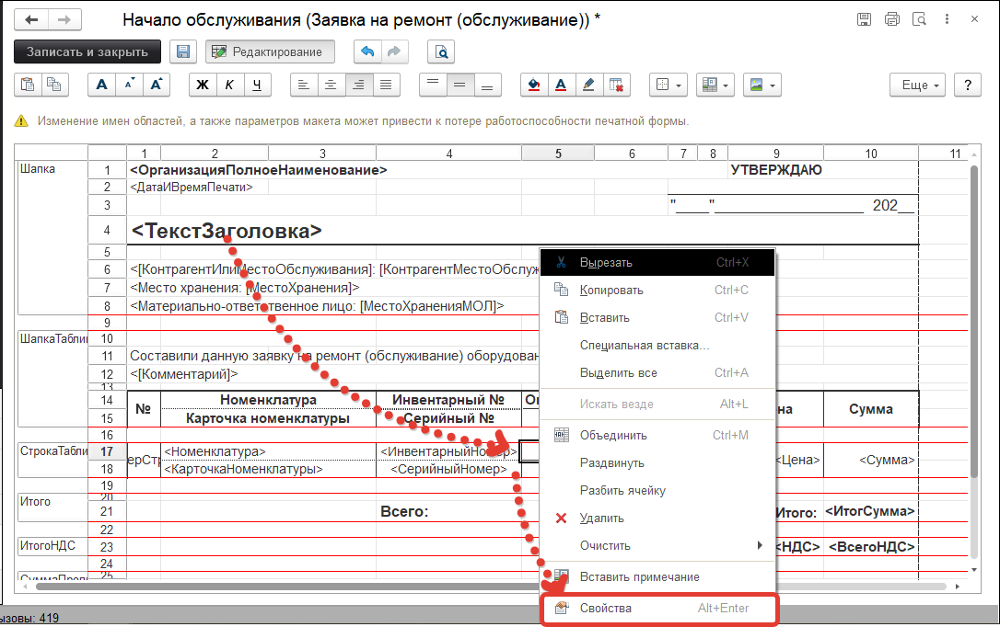

Откроется палитра свойств ячейки, в которой для свойства **«Заполнение»** необходимо указать значение **«Параметр»** и ввести имя параметра **«Описание»**

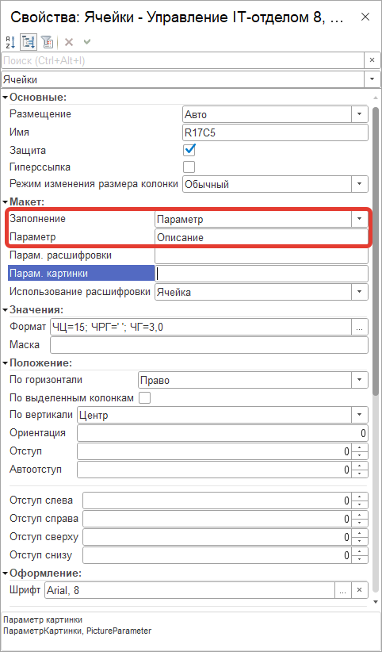

Тут же можно настроить и другие свойства ячейки: размещение текста, положение текста и т.д. Мы перенесем текст со значением "ВСЕГО" на одну колонку вправо. Выделим строки со значениями "Описание" объедим, через свойства ячейки, добавим нижнюю границу и расширим столбец чтобы текст описания помещался:

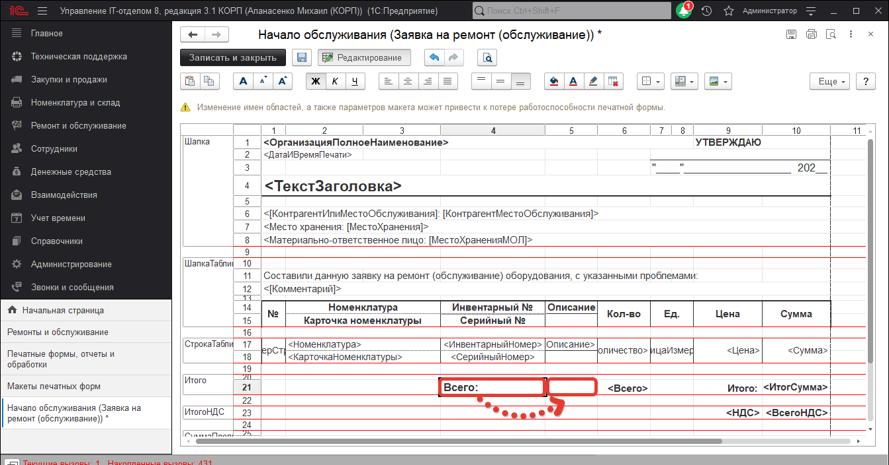
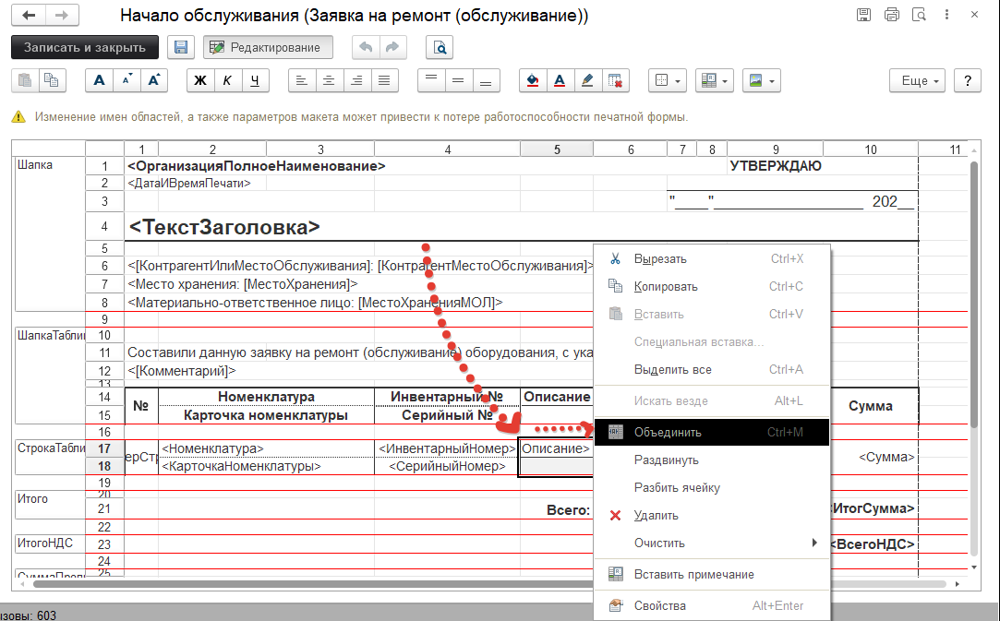
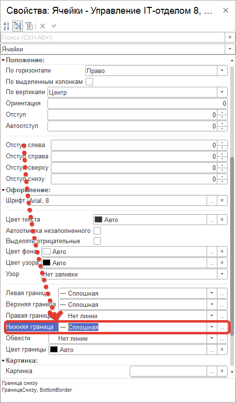
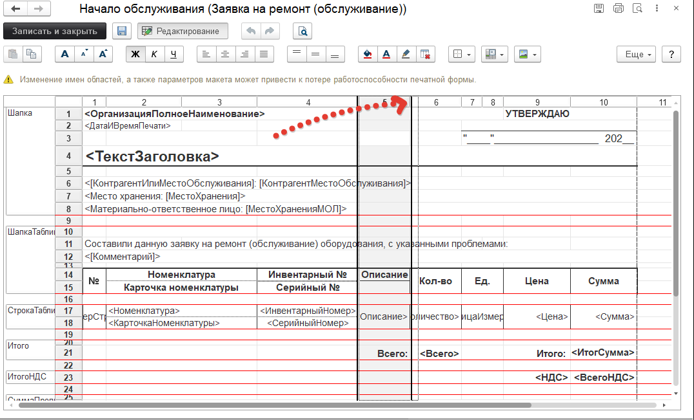

В макете печатной формы нажимаем кнопку «Записать и закрыть». В форме списка макетов напротив нашего макета появился значок, указывающий на то, что в макет были внесены изменения (рис.11):

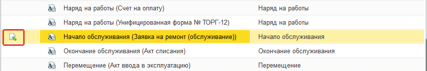

Для просмотра результата вернемся в форму документ и нажмем кнопку «Заявка на ремонт (обслуживание)», добавленное поле выводится на печать

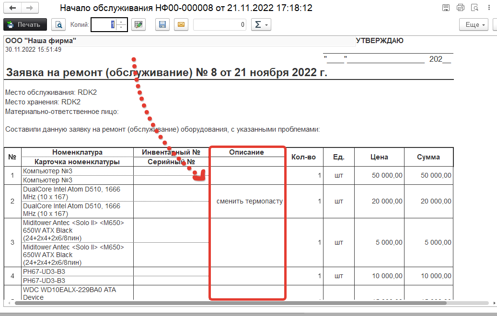

