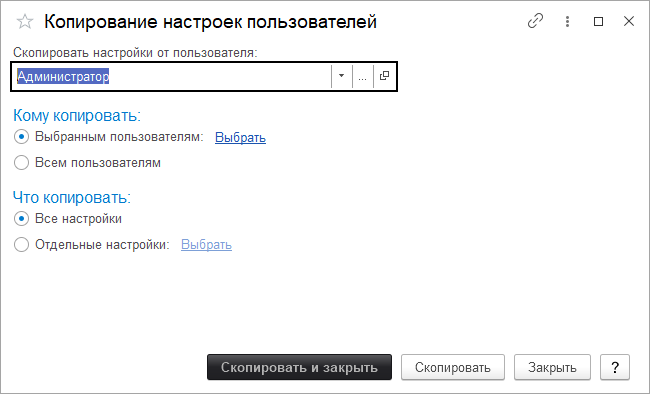

# Копирование настроек пользователей

Копирование настроек между учетными записями удобный и простой механизм для ввода нового пользователя, который сэкономит много времени. Для копирования необходимо создать нового пользователя. После этого перейти на вкладку **"Администрирование", "Настройки прав и пользователей"** и найти пункт **"Копирование настроек"**.

Копировать настройки нужно от пользователя у которого уже они созданы.

Далее выбрать пользователей кому будут копироваться настройки.

После этого, можно копировать все настройки, либо выбрать отдельные. При выборе отдельных настроек, можно копировать настройки внешнего вида, настройки отчетов, персональные настройки, настройки печати табличных документов и т.д.

Для копирования настроек отчетов, следует помнить, что при сохранении варианта отчета, в настройках сохранения отчет должен быть доступен данному пользователю.

