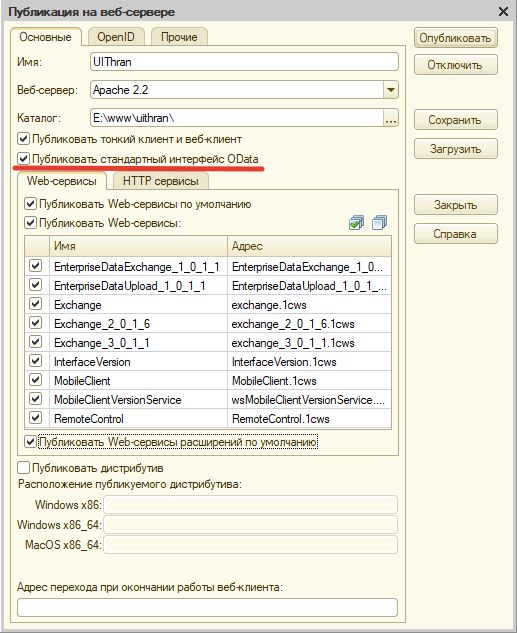

# Настройка интерфейса OData

**Требования:**

* версия программы **3.1.4.5** и выше.

**Интерфейс OData** позволяет настроить REST-сервис для обмена со сторонними программами, например, для решения таких задач:

* интеграция с интернет-сайтами;
* реализация сторонними средствами дополнительных функций без изменения программы;
* загрузка и выгрузка данных;
* интеграция с корпоративными программами без дополнительного программирования.

Можно выполнить также:

* получение списка документов или других элементов, с использованием различных фильтров;
* получение данных документа или элемента списка;
* редактирование данных одного документа или элемента списка;
* создание нового элемента списка или документа;
* проведение документа, отмена проведения.

## Настройка OData

В разделе *"Администрирование – Синхронизация данных"* перейдите по ссылке *"Настройки стандартного интерфейса OData"*, для того чтобы произвести настройки автоматического REST-сервиса для запроса и обновления данных:

*REST-сервис* позволяет читать данные 1С:Предприятия, изменять их, создавать новые объекты данных и удалять существующие. При этом синхронизация данных может быть отключена.

Для работы с *REST-сервисом* не рекомендуется использовать какие-либо уже существующие учетные записи с целью защиты данных программы от взлома, т.к. REST-сервис предназначен для работы со **сторонними программами**. На странице настройки размещено напоминание об этом.

На вкладке *"Авторизация"* включите флажок *"Создать для использования автоматического REST-сервиса отдельные имя пользователя и пароль (рекомендуется)"*.

Напишите *"Имя пользователя"*, *"Пароль"* и *"Подтверждение пароля"*. Нажмите кнопку *"Сохранить"*.

В разделе *"Информация для разработчиков"* можно подробнее ознакомиться с описанием технологии *REST-сервиса* и с документацией по его использованию с помощью гиперссылок.

На вкладке **"Состав"** можно определить, какие данные будут участвовать в работе автоматического *REST-сервиса*. По умолчанию список пуст.

Нажмите кнопку *"Загрузить метаданные"*, для того чтобы отобразить данные программы.

С помощью флажков предоставьте доступ к основным и подчиненным данным, которые будут участвовать в работе *REST-сервиса.* Например, если выбрать список *"Валюты"*, то программа автоматически подбирает зависимое перечисление *"Способы установки курса валюты"*, без которого сторонняя программа не сможет работать со списком.

После предоставления доступа к данным нажмите *"Сохранить и закрыть"* для продолжения работы в программе. Теперь сторонние программы получат доступ к выбранным данным.

Необходимо также убедиться, что флажок *"Публиковать стандартный интерфейс OData"* был включен при публикации ИБ на веб сервере, в противном случае следует выполнить повторную публикацию ИБ.

Для настройки прав доступа пользователей в программе предусмотрены следующие роли:

| Роль                                       | Краткое описание                           |
| ------------------------------------------ | ------------------------------------------ |
| Удаление данных OData                      | Дает право удалить данные интерфейса OData |
