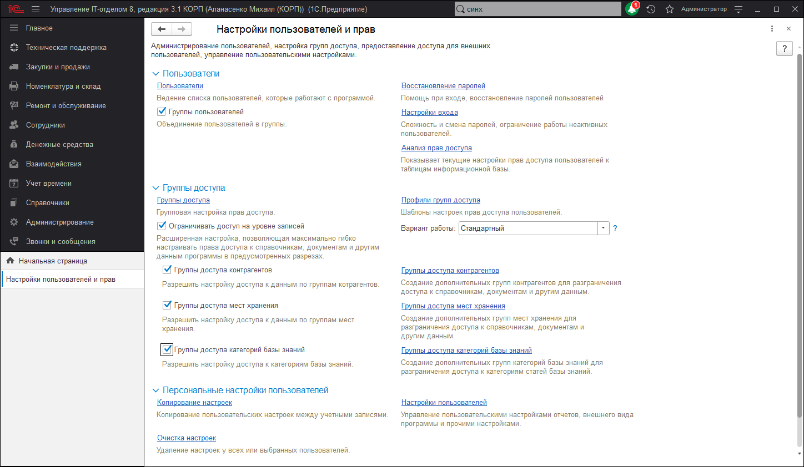

# Настройки пользователей и прав

## Пользователи

**Пользователи** - администрирование пользователей, которые работают с программой.
**Настройки входа** - переход к настройкам сложности и смены паролей пользователей. Можно установить сроки действия паролей, а также ограничение работы неактивных пользователей.
**Группы пользователей** - включите флажок, для того чтобы можно было использовать группы для пользователей и внешних пользователей. Один пользователь может быть участником нескольких групп. Права доступа, указанные для группы, назначаются всем ее участникам. Использование групп имеет смысл, если пользователей программы много.

## Группы доступа

* **Группы доступа** - настройка прав доступа и ограничений для пользователей и групп пользователей. Группа доступа определяет совокупность действий с данными программы, которые могут выполнять участники этой группы.
* **Профили групп доступа** - настройка предустановленных шаблонов групп доступа пользователей. Профили групп доступа, как правило, объединяют в себе несколько ролей. При включении пользователя в группу доступа ему назначаются все роли, заданные в профиле группы доступа.
* **Ограничивать доступ на уровне записей** - включите этот флажок, для того чтобы максимально гибко настраивать прав доступа пользователей к справочникам, документам и другим данным программы.
* **Группы доступа контрагентов** - включите этот флажок, для того чтобы разрешить настройку доступа к данным по группам контрагентов. Станет доступна команда:
  * **Группы доступа контрагентов** - создание дополнительных групп контрагентов для разграничения доступа к справочникам, документам и другим данным.
* **Группы доступа мест хранения** - включите этот флажок, для того чтобы разрешить настройку доступа к данным по группам мест хранения. Станет доступна команда:
  * **Группы доступа мест хранения** - создание дополнительных групп мест хранения для разграничения доступа к справочникам, документам и другим данным.
* **Группы доступа категорий базы знаний** - включите этот флажок, для того чтобы разрешить настройку доступа к данным по категориям базы знаний. Станет доступна команда:
  * **Группы доступа категорий базы знаний** - создание дополнительных групп категорий базы знаний для разграничения доступа к справочникам, документам и другим данным.

## Персональные настройки пользователей

* **Копирование настроек** - копирование настроек контекста работы программы от одного пользователя другим. Это бывает полезно при вводе нового пользователя.
* **Настройки пользователей** - просмотр и управление настройками выбранного пользователя.
* **Очистка настроек** - очистка настроек пользователя, группы пользователей или всех пользователей. Это восстанавливает целостность настроек и в некоторых случаях помогает нормализовать работу сеансов этого пользователя в программе.

## Дата запрета изменения

* **Дата запрета изменения** - включите флажок, для того чтобы использовать даты запрета изменения данных программы. После этого становится активной команда:
* **Настроить** - переход к установке запрета редактирования данных программы до определенной даты (данных прошлых периодов).

## Защита персональных данных

* **Настройки регистрации событий доступа к персональным данным** - настройки регистрации событий доступа в соответствии с требованиями Федерального закона от 27.07.2006 N152-ФЗ "О персональных данных".
* **Защита от персональных данных** - просмотр обращений к персональным данным выбранных объектов программы.
* **Скрывать персональные данные через** - включите флажок, для того чтобы по истечении определенного срока скрывать личные данные, например, через 7 дней. Причиной скрытия данных может быть истечение срока действия согласия субъекта или его отсутствие.