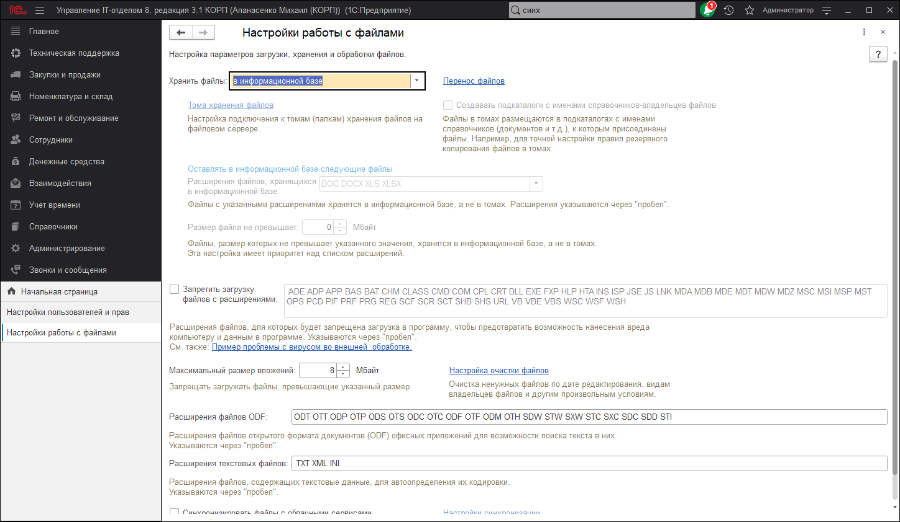

# Настройки работы с файлами

В данной панели осуществляется настройка параметров загрузки, хранения и обработки файлов. Доступны команды:

* **Хранить файлы в томах на диске** - выбор между хранением файлов в информационной базе или в томах на диске. В последнем случае файлы не будут храниться в программе.
  * **Если флажок включен, становится доступной команда Тома хранения файлов** - переход к настройке подключения к томам (папкам) хранения файлов на файловом сервере.
* **Тома хранения файлов** - переход к настройке подключения к томам (папкам) хранения файлов на файловом сервере.
* **Запретить загрузку файлов с расширениями** - включите флажок, для того чтобы запретить загрузку в программу файлов с указанными расширениями и укажите запрещенные к загрузке расширения файлов в поле ввода через пробел.
* **Максимальный размер файла** - введите ограничение загрузки в программу файлов, превышающих указанный размер. По умолчанию указан размер 50 Мб. Файлы большего размера не будут загружаться в программу. Если максимальный размер равен нулю, то объем файлов не ограничен.
* **Настройка очистки файлов** - выполните команду, для того чтобы настроить очистку ненужных файлов.
* **Расширения файлов ODF** - можно указать расширения файлов открытого формата документов для офисных приложений, текст из которых также будет извлекаться для построения индекса полнотекстового поиска. Расширения указываются через пробел. По умолчанию список заполнен основными расширениями файлов. Указывать или уточнять список расширений файлов открытого формата документов нужно при использовании операционных систем фирмы Microsoft, если для программы OpenOffice не установлено расширение IFilter.
* **Расширения текстовых файлов** - введите расширения файлов, содержащих текстовые данные. Расширения указываются через пробел.
* **Синхронизировать файлы с облачными сервисами** - включите флажок для синхронизации с Яндекс.Диск, Box и другими облачными сервисами для упрощения редактирования файлов.
* **Настройки синхронизации** - перейдите по ссылке для настройки синхронизации файлов с облачными сервисами.