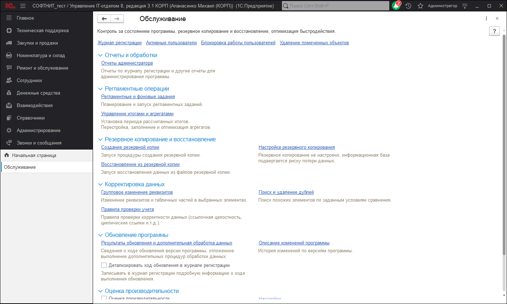

# Обслуживание

В данной панели осуществляется контроль над состоянием программы, резервное копирование и восстановление, обновление версии, оптимизация быстродействия.

* **Журнал регистрации** - просмотр событий и действий, которые происходили в регламентных заданиях или в процессе работы пользователей в программе.
* **Активные пользователи** - список пользователей, которые сейчас работают в программе.
* **Блокировка работы пользователей** - установка и снятие запрета работы пользователей с программой. При установке запрета завершается работа всех активных пользователей (включая текущего).
* **Удаление помеченных объектов** - окончательное удаление тех объектов программы, которым ранее была присвоена пометка на удаление.

## Отчеты и обработки

* **Отчеты администратора** - отчеты по журналу регистрации и другие отчеты для администрирования программы.

## Регламентные операции

* **Регламентные и фоновые задания** - переход к списку регламентных и фоновых заданий. Настройка, выполнение и отслеживание состояний регламентных и фоновых заданий. Регламентные задания автоматически выполняют регламентные операции по расписанию.
* **Управление итогами и агрегатами** - управление итогами регистров накопления и бухгалтерии и агрегатами оборотных регистров накопления. Правильная настройка итогов и агрегатов может повысить производительность программы.

## Резервное копирование и восстановление

С целью уменьшения риска потери данных необходимо регулярно выполнять резервное копирование программы.
Частота создания резервных копий зависит от интенсивности ввода новых данных в программу.

**Создание резервной копии** - выполнение резервного копирования программы: прямо сейчас, через некоторое время или при завершении работы.
**Настройка резервного копирования** - настройка автоматического резервного копирования по расписанию, или отключение контроля резервного копирования, если оно выполняется сторонними средствами.
**Восстановление из резервной копии** - восстановление программы из резервной копии.

## Корректировка данных

* **Групповое изменение реквизитов** - изменение реквизитов и табличных частей в выбранных элементах.
* **Поиск и удаление дублей** - поиск похожих элементов по заданным условиям сравнения.
* **Правила проверки учета** - правила проверки корректности данных(ссылочная целостность, циклические ссылки и т.д.).

## Обновление программы

* **Результаты обновления и дополнительная обработка данных** - сведения о ходе обновления версии программы, отложенное выполнение дополнительных процедур обработки данных.
* **Описание изменений программы** - просмотр списка изменений в установленной версии программы и рекомендаций по обновлению программы.
* **Детализировать ход обновления в журнале регистрации** - при включенной настройке в журнал регистрации записываются выполняемые обработчики обновления с указанием времени выполнения.

## Оценка производительности

* **Оценка производительности** - включите флажок для начала замеров интегральной производительности программы по методике APDEX.
* **Настройки** - настройки параметров оценки производительности.
* **Профили ключевых операций** - переход к настройке профилей ключевых операций. 
* **Экспорт замеров** - экспорт замеров производительности за произвольный период.
* **Импорт замеров** - Импорт замеров производительности за произвольный период.

