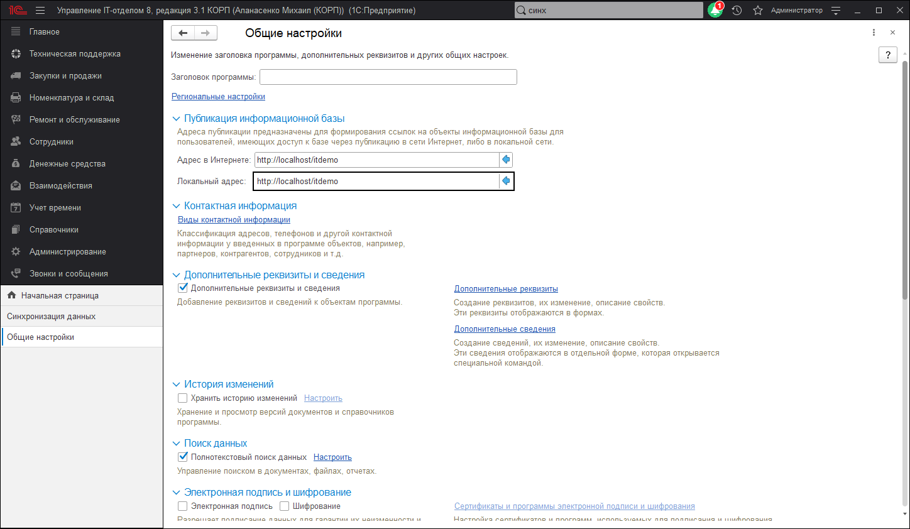

# Общие настройки

В данной панели осуществляется настройка основных параметров программы.

* **Заголовок программы** - введите текст, который будет отображаться в заголовке окна программы.
* **Часовой пояс** - часовой пояс, по которому ведется учет в программе. Все даты документов и регистров программы хранятся в этом часовом поясе.
* **Время текущего сеанса** - с помощью этой команды можно узнать, насколько время клиента отличается от времени сервера с поправкой на часовой пояс.

## Публикация информационной базы

* **Адрес в интернете** - предназначен для формирования ссылок на объекты информационной базы в сети интернет.
* **Локальный адрес** - предназначен для формирования ссылок на объекты информационной базы в локальной сети.

## Виды контактной информации

* **Виды контактной информации** - добавление и настройка видов контактной информации различных объектов программы, например, партнеров, контрагентов, сотрудников и т.д.

## Дополнительные реквизиты и сведения

* **Дополнительные реквизиты и сведения** - включите флажок, для того чтобы использовать дополнительные свойства для справочников и документов.
* **Реквизиты и сведения с общим списком значений** - включите флажок, для того чтобы разрешить добавление реквизитов, у которых общий список значений с другими реквизитами (команда Добавить - По образцу).
* **Общие реквизиты и сведения** - включите флажок, для того чтобы разрешить добавление реквизитов сразу к нескольким объектам программы одновременно (команда Добавить - Общий).
* **Дополнительные реквизиты** - настройка состава дополнительных реквизитов для справочников и документов.
* **Дополнительные сведения** - настройка состава дополнительных сведений для справочников и документов.

## История изменений

* **Хранить историю изменений** - хранение и просмотр версий документов и справочников программы.
* **Настроить** - настройка хранения и очистка версий документов и справочников.

## Поиск данных

* **Полнотекстовый поиск данных** - включите флажок, после этого становится доступной команда:
* **Настроить** - настройка полнотекстового поиска и поддержка индекса полнотекстового поиска в актуальном состоянии.

## Электронная подпись и шифрование

* **Электронная подпись** - включите флажок, для того чтобы разрешить использовать электронные подписи и проверять отсутствие изменений файла с момента формирования электронной подписи.
* **Шифрование** - включите флажок, для того чтобы разрешить шифрование файлов.
* **Настройки электронной подписи и шифрования** - переход к настройке параметров подключения средств криптографии: электронной подписи и шифрования.

