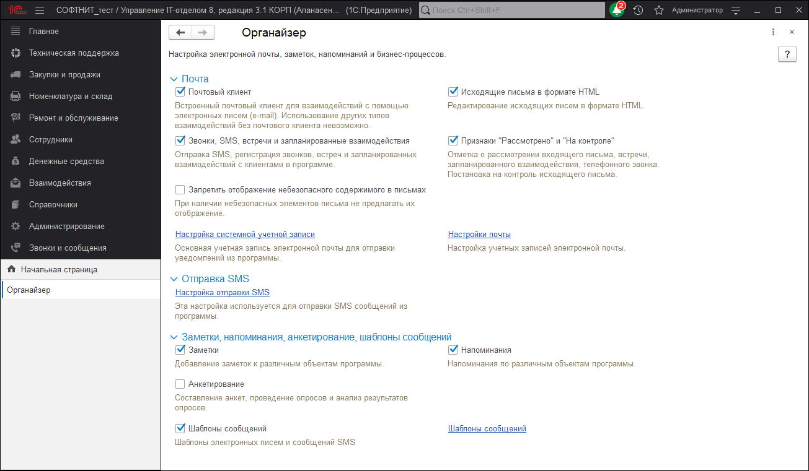

# Органайзер

В данной панели осуществляется настройка электронной почты, заметок, напоминаний и бизнес-процессов. Доступны команды:

## Почта

* Почтовый клиент - включите флажок, для того чтобы использовать возможности встроенного в программу почтового клиента для взаимодействий с помощью электронных писем (e-mail).
* **Исходящие письма** в формате HTML - включите флажок, для того чтобы редактировать исходящие письма в формате HTML.
* **Звонки,** SMS, встречи и запланированные взаимодействия - включите флажок, для того чтобы регистрировать в программе звонки, встречи, сообщения SMS и запланированные взаимодействия.
* **Признаки "Рассмотрено**" и "На контроле" - включите флажок, для того чтобы можно было ставить отметки о рассмотрении входящих писем, встреч, телефонных звонков и запланированных взаимодействий, а также для постановки на контроль исходящего письма. Этот флажок полезно использовать для организации совместной работы в программе.
* **Запретить отображение** небезопасного содержимого в письмах - включите флажок, для того чтобы при наличии небезопасных элементов в письмах не предлагать их отображение. Входящие письма могут содержать элементы, позволяющие отправителю скрытно отслеживать действия с письмом, в частности, время просмотра и некоторые параметры устройства, на котором письмо было прочитано. К небезопасным элементам относятся загружаемые из Интернета картинки или встроенные скрипты. В целях безопасности такие элементы автоматически отключаются при просмотре письма.
* **Настройка системной** учетной записи - переход к настройке основной учетной записи электронной почты для отправки уведомлений из программы.
* **Настройки почты** - администрирование всех учетных записей электронной почты.

## Отправка SMS

* **Настройка отправки SMS** - переход к настройке параметров отправки SMS-сообщений из программы.

## Заметки, напоминания, анкетирование, шаблоны сообщений

* **Заметки** - включите этот флажок, для того чтобы можно было использовать заметки - произвольную текстовую информацию, для которой не получается подобрать какого-либо более подходящего справочника или документа, и которая больше никому не должна быть доступна. Заметки могут быть произвольными или по предмету, ссылаясь, например, на элемент справочника, документ, или другой объект программы.
* **Напоминания** - включите этот флажок, для того чтобы можно было вводить напоминания, которые срабатывают в назначенное время. Укажите время и предмет, по поводу которого в программе в указанное время будет выведен список напоминаний. Напоминания могут быть произвольными или по предмету, ссылаясь, например, на элемент справочника, документ, или другой объект программы.
* **Анкетирование** - включите этот флажок, для того чтобы стал доступным соответствующий раздел программы, в котором можно готовить опросы, составлять анкеты, проводить опросы среди респондентов, а также и анализировать результаты опросов.
* **Шаблоны сообщений** - включите флажок, для того чтобы стала доступной команда:
  * **Шаблоны сообщений** - в программе предусмотрена возможность разработки шаблонов сообщений для почтовых сообщений и сообщений SMS, их хранение и управление ими в списке шаблонов. Возможна отправка писем и сообщений SMS, сформированных на основании списков или документов и по заранее подготовленным шаблонам сообщений.
