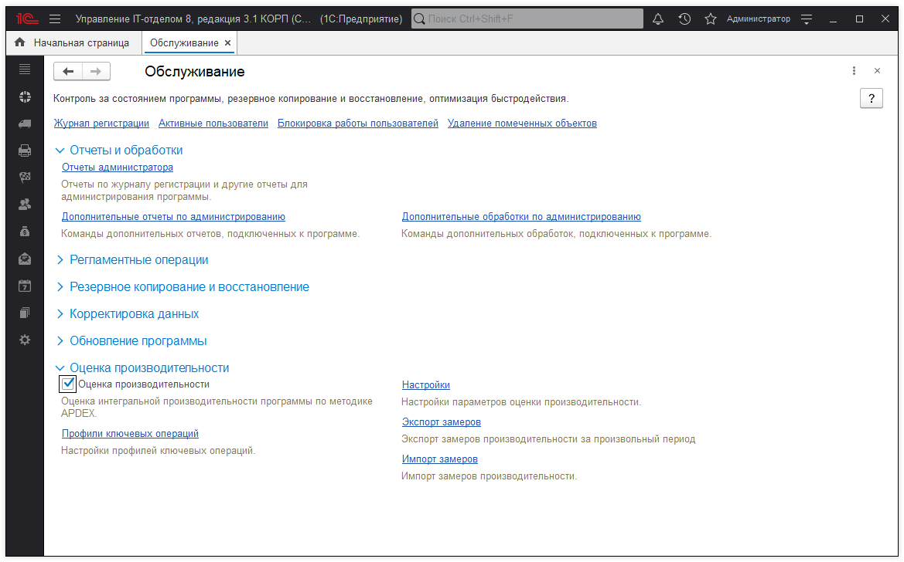
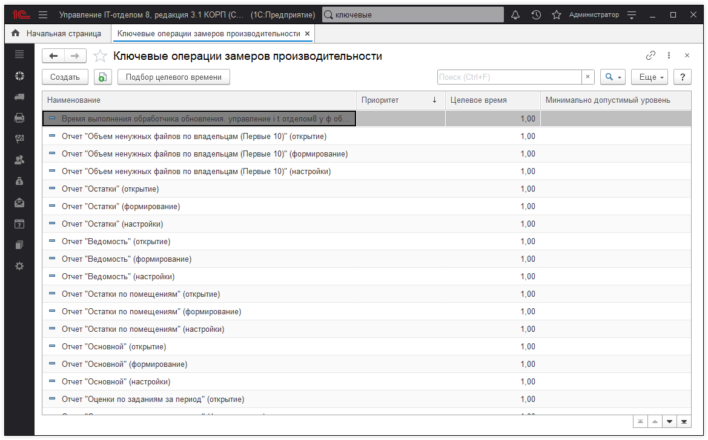
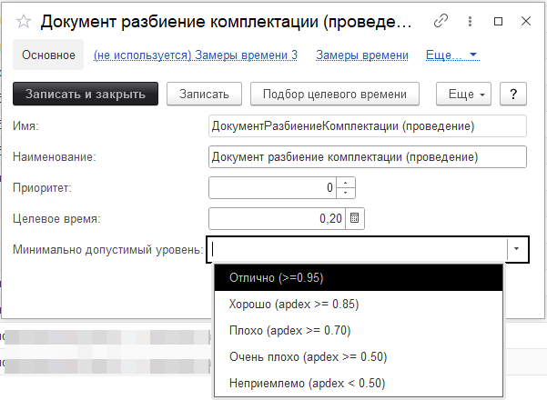
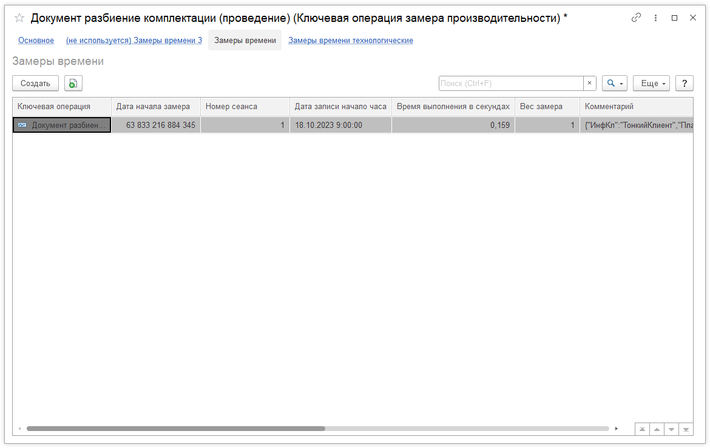
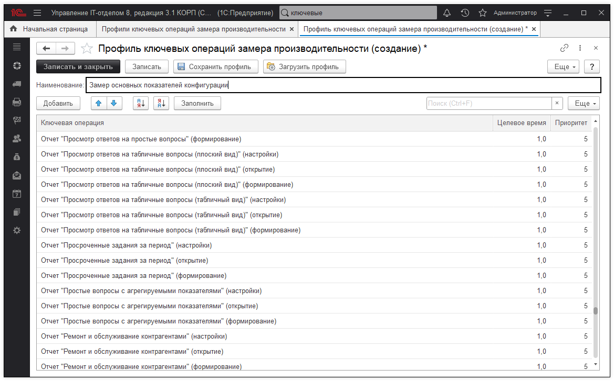
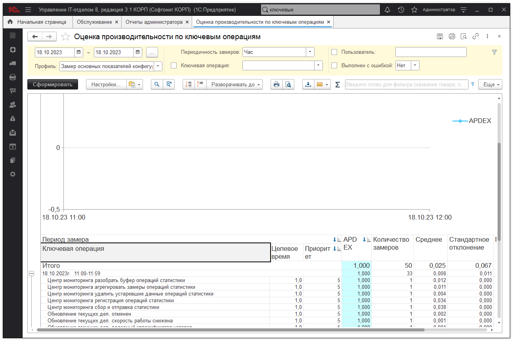
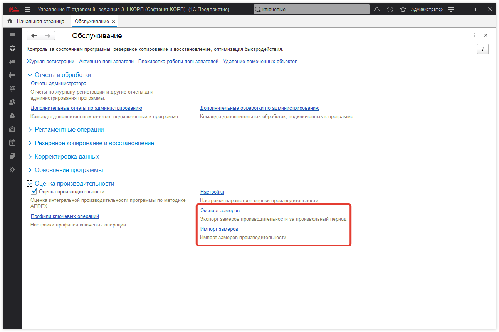
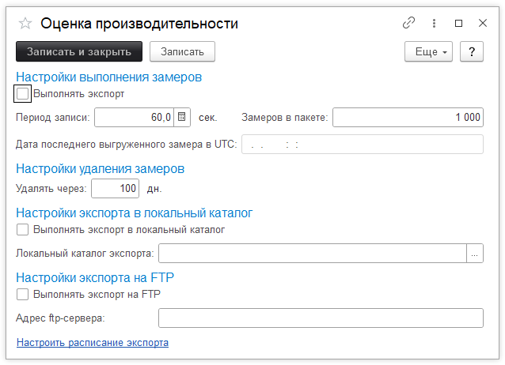
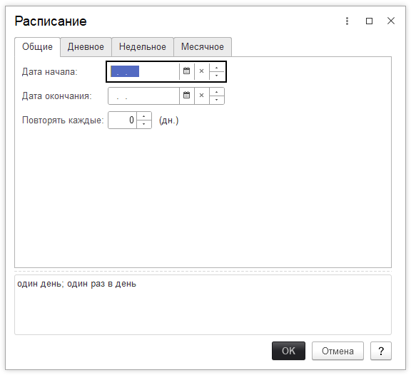

# Оценка производительности

В конфигурации есть средства для сбора и анализа данных о производительности работы по APDEX, которая является международным стандартом оценки производительности информационных систем. Оценка производительности программы по методике APDEX состоит из следующих основных этапов:

* **Заполнение профиля ключевых операций** (в профиле заполняются приоритет и целевое значение времени для каждой ключевой операции, предусмотренной в программе);  
* Сбор информации о времени выполнения каждой ключевой операции;  
* **На основании собранных данных** – формирование отчета Оценка производительности по ключевым операциям. 
*  
Для начала замера производительности нужно установить флажок **Оценка производительности** в разделе **Администрирование > Обслуживание > Оценка производительности**. 

После этого в фоне будет автоматически собираться информация о времени выполнения по всем ключевым операциям, предусмотренным в программе, а также становятся доступными ссылки:

* **Профили ключевых операций** – переход к настройке профилей ключевых операций;  
* **Настройки** – настройки параметров оценки производительности;  
* **Экспорт замеров** – экспорт замеров производительности за произвольный период;  
* **Импорт замеров** – получение замеров производительности из указанного файла на компьютере.  

**Ключевые операции** – это различные действия пользователей в программе: формирование отчетов, проведение документов, открытие форм документов. Открываются по команде **Ключевые операции** раздела **Администрирование**.

Каждая ключевая операция характеризуется свойствами:

* **Приоритет;**   
* **Целевое время;**  
* **Минимально допустимый уровень.**  
 
В списке можно просмотреть информацию о ключевой операции дважды щелкнув по ней мышью или выполнить команду **Еще > Изменить**, для того чтобы просмотреть или заполнить данные.

Для просмотра замера времени по ключевой операции, нужно нажать на ссылку **Замеры времени** на панели навигации.

**Профили ключевых операций** - это наборы ключевых операций, сгруппированные для оценки производительности. Открываются по команде **Профили ключевых операций** раздела **Администрирование**.

В список можно добавить новую ключевую операцию, заполнив **Целевое время** и **Приоритет**. Профили можно сохранять на компьютер и загружать с компьютера.

Анализ производительности осуществляется с помощью отчета **Оценка производительности по ключевым операциям**, к которому можно перейти, воспользовавшись соответствующей ссылкой в разделе **Администрирование > Обслуживание > Отчеты и обработки > Отчеты администратора**.

Замеры производительности можно экспортировать в файл и импортировать в конфигурацию.

Для того чтобы настроить выгрузку замеров производительности, необходимо перейти по ссылке Настройки в разделе **Администрирование > Обслуживание > Оценка производительности.**

Экспорт выполняется автоматически с помощью регламентного задания. Для перехода к дальнейшей настройке экспорта нужно нажать ссылку **Настроить расписание экспорта.**

