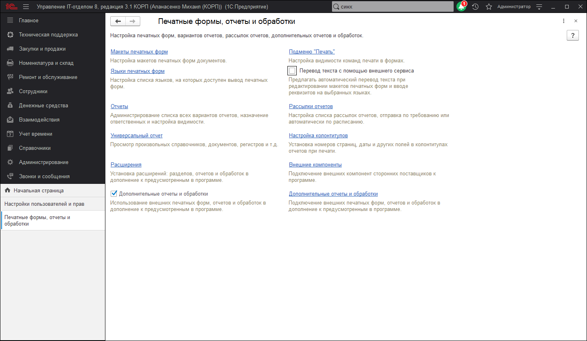

# Печатные формы, отчеты и обработки

В данной панели осуществляется настройка печатных форм, вариантов отчетов, рассылок отчетов, дополнительных отчетов и обработок. Доступны команды:  

* **Макеты печатных форм** - переход к списку макетов для настройки печатных форм, формируемых из программы.
* **Подменю "Печать"** - переход к настройке команд подменю Печать.
* **Отчеты** - переход к списку вариантов отчетов для настройки их доступности и размещения в разделах программы.
* **Рассылки отчетов** - переход к списку рассылок отчетов для автоматического формирования отчетов и доставки сформированных отчетов получателям.
* **Универсальный отчет** - предназначен для получения отчета по выбранным данным программы - по спискам, документам, регистрам и т.д.
* **Настройка колонтитулов** - установка номеров страниц, даты и други полей в колонтитулах отчетов при печати
* **Расширения** - подключение расширений: разделов, отчетов и обработок в дополнение к предусмотренным в программе.
* **Внешние компоненты** - переход к списку внешних компонент. Программа предоставляет администратору возможность контролировать список внешних компонент, используемых на рабочих местах. В списке администратор может подключить внешние компоненты из файла на компьютере или обновить их.
* **Дополнительные отчеты и обработки** - включите флажок, для того чтобы подключать к программе внешние печатные формы, отчеты и обработки в дополнение к предусмотренным в программе. После включения становится доступной команда:
  * **Дополнительные отчеты и обработки** - переход к подключению внешних печатных форм, отчетов и обработок в дополнение к предусмотренным в программе.
