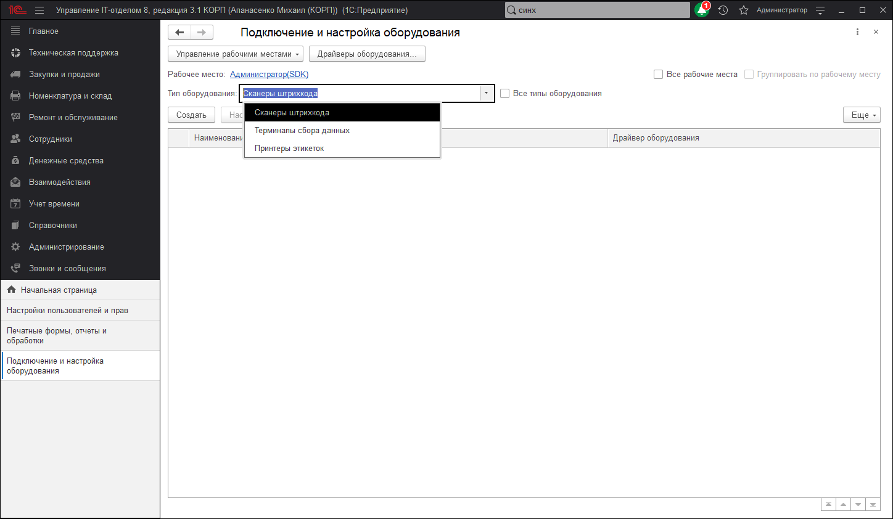

# Подключаемое оборудование

Данная форма предназначена для подключения и настройки внешнего оборудования, подключенного в справочнике "Внешнее оборудование".
Чтобы подключить и настроить оборудование необходимо выполнить описанные ниже шаги:

* Установить необходимые драйверы
* На соответствующих закладках в табличных полях задать строки, соответствующие необходимому оборудованию
* Активизировать строку, содержащую информацию о внешнем оборудовании и нажать кнопку «Настроить»
* Произвести настройку параметров экземпляра оборудования

