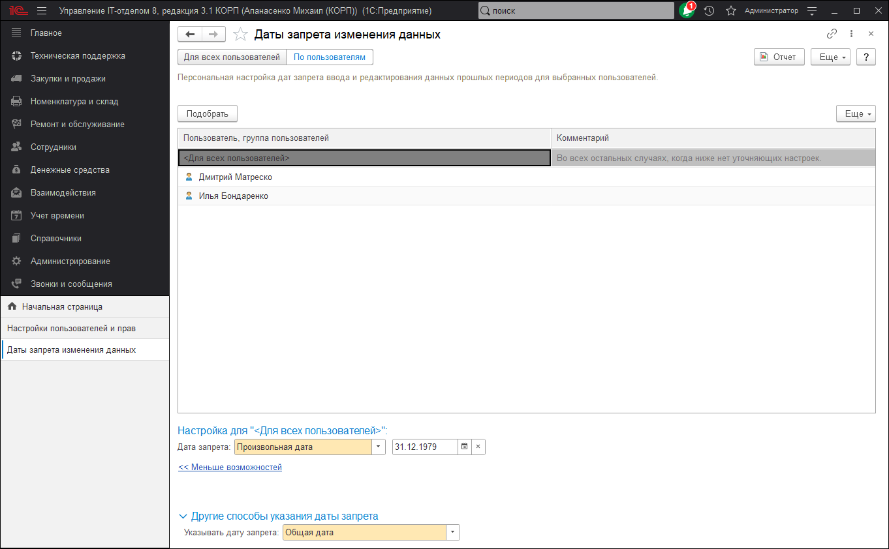

# Даты запрета изменения данных

Предназначена для установки даты запрета изменения (загрузки) данных.

Запреты загрузки данных могут не использоваться. В этом случае доступно только окно настройки дат запрета изменения данных.

Установка даты запрета изменения данных и различные настройки, связанные с ней, выполняются по соответствующей команде в разделе **Администрирование - Настройка пользователей и прав - Дата запрета изменения**.

Установка даты запрета загрузки данных выполняется по соответствующей команде в разделе **Синхронизация данных**.

Также можно найти эти команды в разделе **Интегрируемые подсистемы**.

## О запрете изменения (загрузки) данных
* Иногда при работе с программой требуется установить запрет изменения каких-либо данных до определенной даты. Например, после сдачи квартальной бухгалтерской отчетности в налоговую инспекцию обычно устанавливается запрет изменения тех данных, которые использовались для формирования этой отчетности, то есть данных по последний день отчетного периода.
* Запрет загрузки, в отличие от запрета изменения, может быть установлен для данных, которые должны редактироваться только в одном узле информационной базы, а также по правилам, которые следуют из требований синхронизации данных, а не из типовых бизнес-процессов организации. Например, решение редактировать данные по некоторым организациям только в центральном офисе (в центральном узле), для того чтобы технически обеспечить закрепление ответственности за эти данные за конкретным сотрудником центрального офиса, является основанием запрета загрузки данных из других узлов.

## Проявление установленного запрета

* **Если дата запрета изменения данных установлена**, то при попытке внести изменения в программу до даты запрета изменения выводится сообщение о невозможности изменения данных.
    * **Если в закрытом периоде есть объекты**, помеченные на удаление, то их удаление будет невозможно.
    * **Если дата запрета изменения не установлена**, то ограничения не действуют.
* **Если дата запрета загрузки данных установлена**, то при попытке получить данные в программу до даты запрета загрузки все запрещенные для получения данные будут пропущены, сведения о них будут записаны в журнал регистрации, а разрешенные данные будут получены.

## Установка даты запрета

* В программе предусмотрена возможность установить или отключить дату запрета изменений (дату запрета загрузки данных). Для этого в поле Установка даты запрета выберите соответствующее значение:
    * **Нет запрета изменения (загрузки) данных** - в этом случае отключаются все установленные ранее даты запрета.
    * **Для всех пользователей** (Для всех информационных баз). При этом становятся доступными поля Способ указания даты запрета и Дата запрета.
    * **По пользователям** (По информационным базам). Эту возможность можно использовать, если дату запрета необходимо установить для конкретного пользователя или группы пользователей (для конкретной информационной базы), или разным пользователям (информационным базам) необходимо установить разные значения даты запрета.
        * **При этом становится доступным список**, в который можно добавлять пользователей/группы пользователей (информационные базы) и настраивать для каждого из них свое значение даты запрета.
        * Список состоит из колонок:
            * **Пользователь, группа пользователей** (Программа: информационная база - наименование программы и информационной базы для этой программы).
            * **Комментарий** - напишите дополнительную информацию о пользователе (об информационной базе).
        * В списке по умолчанию всегда присутствует элемент <Для всех пользователей> (<Для всех информационных баз>). Элемент нельзя удалить или изменить. Настройки даты запрета, выполненные для этого элемента, будут использоваться для всех пользователей (информационных баз), кроме тех, которые содержатся в списке.
        * При необходимости добавьте в список нужных пользователей /группу пользователей (информационные базы):
            * Нажмите Подобрать, для того чтобы выбрать из списка несколько пользователей (информационных баз).
            * Нажмите Все действия (в интерфейсе Такси Еще) - Добавить над списком, для того чтобы Выбрать пользователя/группу пользователей (программу и информационную базу для этой программы. Для каждой программы можно также выбрать элемент <Все информационные базы>).
* Для того чтобы выполнить настройку даты запрета, необходимо выделить в списке нужного пользователя/группу пользователей (информационную базу) или элемент <Для всех пользователей> (<Для всех информационных баз>), а сами настройки выполнить ниже в полях 

Способ указания даты запрета и Дата запрета.

## Способы указания даты запрета

Программа позволяет задавать различные Способы указания даты запрета изменений:

* **Общая дата** – при этом способе одна дата запрета задается для всех элементов данных программы.
* **По разделам** – для каждого раздела программы устанавливается своя дата запрета.
  * Когда дата запрета задается по разделам, становится доступным список, в который можно добавлять **Разделы** (соответствующей командой) и указывать для каждого раздела свое значение даты запрета. Список состоит из колонок:
        * **Раздел, объект** - в данном случае в колонке перечисляются разделы программы;
        * **Дата запрета** - выберите из списка тип значения даты запрета (можно выбрать произвольную дату или одну из относительных дат);
        * **Запрет изменения по** - для произвольной даты напишите или выберите значение, для относительной даты значение проставляется программой автоматически.
    * В списке по умолчанию присутствует элемент **<Общая дата>**. Значение даты запрета для этого элемента будет использоваться для всех разделов по умолчанию, кроме тех, которые уже содержатся в списке.
    * **Если в поле Установка даты запрета** указано Для всех пользователей (Для всех информационных баз), то удалить элемент <Общая дата> и разделы нельзя, при этом по умолчанию доступны все разделы, их можно только Изменить - указать Дату запрета.
    * **Если в поле Установка даты запрета** указано По пользователям (По информационным базам), то удалить элемент <Общая дата> и разделы можно. Если дата запрета изменений устанавливается для определенного пользователя/группы пользователей (информационной базы), то необходимо выбрать один или несколько разделов.
      * Для добавления раздела выполните команду **Разделы**, выберите нужные с помощью флажков, затем нажмите кнопку ОК.
* **По объектам** – даты запрета задаются в разрезе объектов программы. Для каждого объекта устанавливается своя дата запрета. Если выбрано это значение, то становится доступным список, в который можно добавлять объекты (соответствующей командой) и указывать для каждого объекта свое значение даты запрета. Так же, как и в предыдущем способе, в списке для аналогичных целей содержится элемент **<Общая дата>**.
* **По разделам и объектам** – даты запрета задаются и в разрезе разделов, и в разрезе объектов.
  * При этом становится доступным список, в который можно добавлять разделы и объекты, указывая для каждого раздела и каждого объекта свое значение даты запрета. Так же, как и в предыдущих способах, в списке содержится элемент **<Общая дата>** для аналогичных целей.
    * Для выбора разделов выполните команду **Разделы**.
        * Для выбора нескольких объектов в выделенном разделе выполните команду **Подобрать**.
        * Также в нужном разделе можно выполнить команду Добавить контекстного меню по правой кнопки мыши, затем указать объект с помощью кнопки Выбрать. Также можно воспользоваться аналогичной командой меню **Все действия** (в интерфейсе Такси Еще).
      
Для того чтобы установить дату запрета изменения нужного раздела (объекта) или изменить общую дату, в нужной строке в колонке Дата запрета выполните команду Изменить контекстного меню по правой кнопке мыши или дважды щелкните по ней мышью. Для задания даты запрета нажмите кнопку Выбрать. После выбора даты для возврата к дальнейшим настройкам нажмите кнопку ОК.

## Дата запрета

* **При установке даты запрета** можно задавать не только произвольную дату , но и относительную.
* Значения относительных дат:
    * **Конец прошлого года;**
    * **Конец прошлого квартала;**
    * **Конец прошлого месяца;**
    * **Конец прошлой недели;**
    * **Предыдущий день.**
* **Для относительных дат** (кроме значения Предыдущий день) можно задать количество дней «отсрочки» до установки даты запрета, в течение которых изменение данных все еще будет разрешено.
  * Для этого необходимо включить флажок Разрешить изменение данных до даты запрета. Затем задайте количество дней "отсрочки", например, в течение 10 дней после даты запрета.
* **Если установлена относительная дата,** то для того, чтобы дата запрета изменения в будущем изменялась по заданным правилам автоматически, в программе используется регламентное задание "Пересчет текущих значений относительных дат запрета изменения".
* **Если по каким-либо причинам использование регламентных заданий невозможно** (например, в файловом варианте работы программы и в других случаях может потребоваться выполнить пересчет текущих значений относительных дат запрета вручную), то перерасчет текущих значений относительных дат запрета можно выполнять с помощью команды Все действия (В интерфейсе Такси Еще) - Пересчитать даты. При этом команду необходимо выполнять периодически в соответствии с установленной относительной датой. Например, если установлено значение Предыдущий день, то команду необходимо выполнять ежедневно; если установлено значение Конец прошлого месяца, то команду необходимо выполнять ежемесячно.
 
## Отчеты по датам запрета

Отчеты доступны по соответствующей команде. В отчетах возможна группировка данных:

* **по разделам/объектам:** выберите отчет Даты запрета по разделам и объектам для пользователей (Даты запрета по разделам и объектам для информационных баз);
* **по пользователям** (по информационным базам): выберите отчет Даты запрета по пользователям (Даты запрета по информационным базам).
Отчеты позволяют увидеть результирующие даты запрета, установленные для пользователей/групп пользователей (информационных баз) с учетом приоритетов.