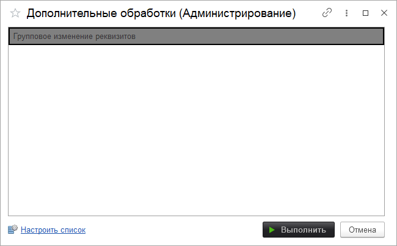

# Дополнительные обработки

Позволяет запускать дополнительные обработки. Сами обработки добавляются в разделе [Печатные формы, отчеты и обработки](https://softonit.ru/FAQ/courses/?COURSE_ID=1&LESSON_ID=124)

