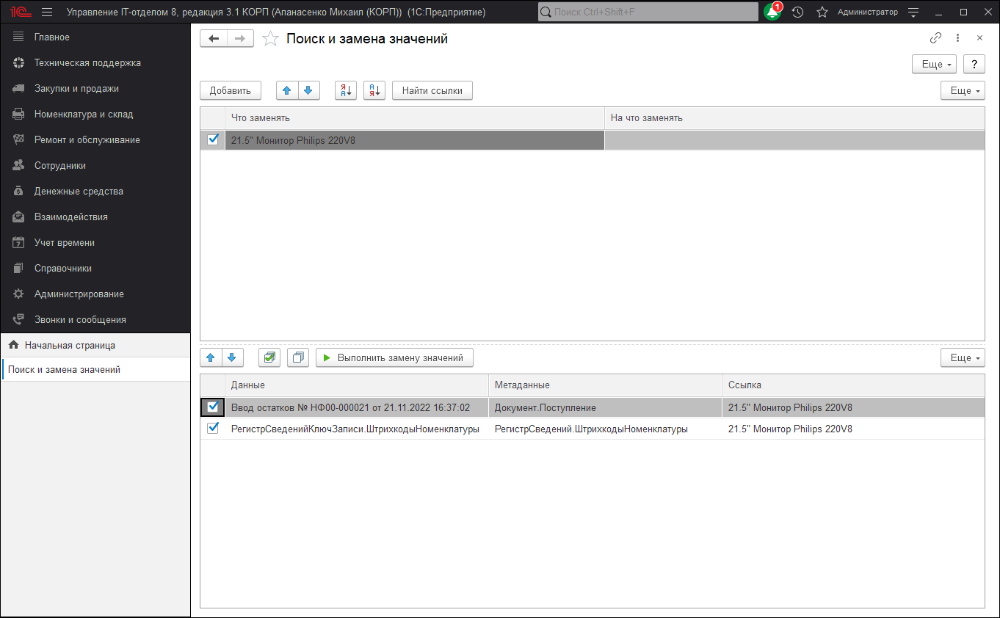

# Поиск и замена значений

Универсальная обработка **"Поиск и замена значений"** предназначена для поиска и замены ссылочных значений в различных объектах информационной базы 1С:Предприятия.

Необходимость в выполнении такой операции может возникнуть, например, если в процессе работы в справочник контрагентов по ошибке один и тот же контрагент введен дважды, и оба значения уже использовались в различных документах. В этом случае, прежде чем удалить один из элементов справочника следует исправить все документы (и  другие объекты, если таковые существуют), в которых используется этот элемент. Данная обработка позволяет выполнить такую процедуру автоматически.

!!!
**ВНИМАНИЕ!!!** Обработка выполняет замену значений в объектах информационной базы универсальным образом. При этом не учитываются особенности конкретной конфигурации. Использование обработки может нарушить логическую взаимосвязь значений объектов, которая поддерживается конфигурацией при ручной корректировке значений. Рекомендуется перед использованием обработки сделать архивную копию информационной базы. После использования обработки следует убедиться в том, что изменения произведены корректно и не вызвали логических нарушений в данных тех объектов, в которых производилась замена значений. При необходимости следует вручную изменить те данные, значения которых, зависят от измененных обработкой значений.
!!!

Для выполнения замены следует заполнить список пар значений **"Замещаемые объекты"**. В качестве значения  **"Что заменять"** можно выбрать тот элемент справочника, который  введен ошибочно, а в качестве значения "На что заменять" - тот элемент, который реально должен использоваться в документах, справочниках и других объектах.

В списке **"Замещаемые объекты"** двойным щелчком мыши или нажатием клавиши Enter 
можно открыть значение, на котором установлен курсор.

Далее следует нажать кнопку **"Найти ссылки"**. Программа будет выполнять поиск объектов (документов, справочников и т.д.) в которых использовались значения выбранные в колонке **"Что заменять"**. Поиск может занять продолжительное время.

В списке найденных ссылок можно отменить замену текущей пары значений для отдельных объектов. Для этого следует отключить соответствующие флажки в списке.

Для выполнения замены значений следует нажать кнопку **"Выполнить замену значений"**. Программа будет выполнять замену значений в тех объектах, замена в которых не отменена.