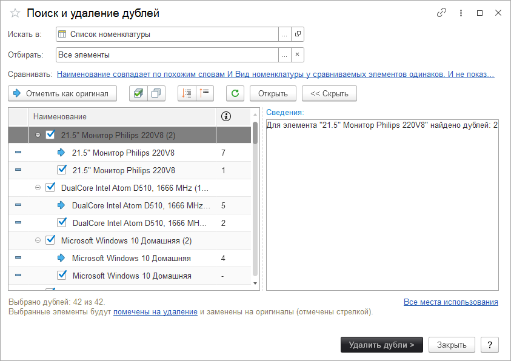

# Поиск и удаление дублей

В данной панели осуществляется поиск и удаление дублирующихся данный один из дублирующихся объектов вы можете отметить как оригинал, а остальные дубли просто удалить.

* **Искать в** - позволяет выбрать справочник, в котором будет производиться поиск дублей.
* **Отбирать** - задает условия отбора для поиска.
* **Сравнить** - выбор свойства, по которому будут сравниваться элементы.
* **Отметить как оригинал** - позволяет отметить выбранный элемент как оригинал (останется после удаления дублей). В списке он отмечается стрелкой, а дубли галочками.
* **Открыть** - открывает выбранный элемент.
* **Свернуть группы дублей** - сворачивает все группы дублей.
* **Развернуть группы дублей** - разворачивает все группы дублей.
* **Повторить поиск** - производит повторный поиск дублей.

