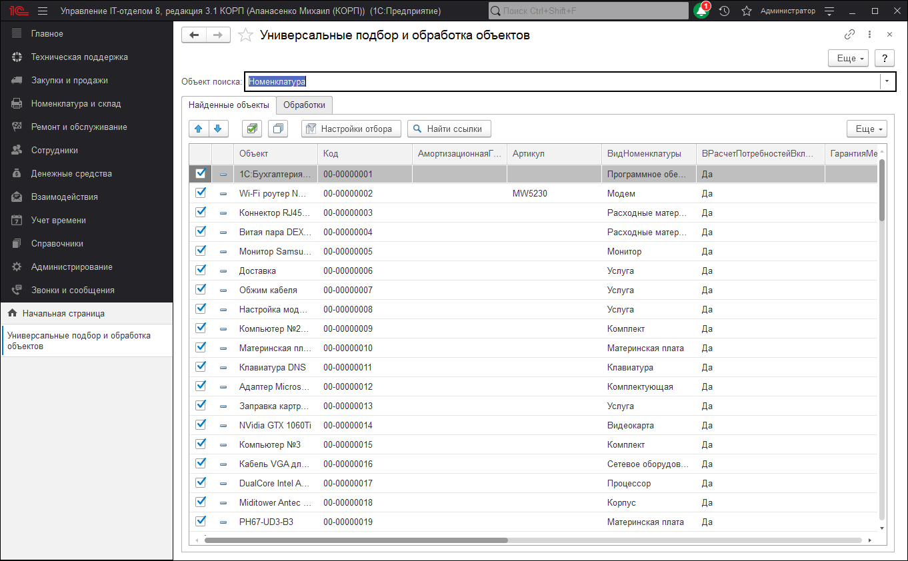

# Универсальный подбор и обработка объектов

Обработка "Универсальные подбор и обработка объектов" предназначена для поиска объектов в справочниках и документах по произвольному условию и дальнейшей обработки найденных объектов.

Для подбора объектов необходимо в поле выбора **"Объект поиска"** выбрать искомый объект, задать необходимые условия поиска по кнопке **"Настройки отбора"** на закладке **"Найденные объекты"** и нажать кнопку **"Найти ссылки"**.

Для поиска по строке во всех строковых полях объекта необходимо ввести искомую строку в поле ввода **"Строка поиска**" на закладке **"Найденные объекты"** и нажать кнопку **"Найти ссылки"** (клавиша `F9`). При этом будут учтены и все условия, заданные в настройках отбора.

Результат поиска выводится в табличное поле, расположенное на закладке "Найденные объекты". Для включения объекта в обработку необходимо включить флажок в соответствующей строке.

Для обработки объектов необходимо перейти на закладку "Обработки".

В дереве **"Доступные обработки"** на первом уровне отображаются все доступные обработки. При двойном щелчке мыши или нажатии `Enter` на первом уровне дерева доступных обработок открывается форма новой настройки обработки с возможностью сохранения текущей настройки (кнопка **"Сохранить настройку"**) и непосредственного выполнения обработки (кнопка **"Выполнить"**). Настройки обработок отображаются на втором уровне дерева доступных обработок. При добавлении новой строки создается новая настройка обработки, которую в дальнейшем можно изменять, удалять, копировать и выбирать для выполнения. Сохранение и добавление настроек возможно только для обработок, в которых предусмотрена и необходима пользовательская настройка.

В табличном поле **"Выбранные обработки"** отображаются настройки доступных обработок, участвующие в групповой обработке объектов. Заполнение списка осуществляется выбором настройки в дереве доступных обработок и перетаскиванием их мышкой в поле **"Выбранные обработки"**. Для добавления обработки, не предусматривающей пользовательских настроек, необходимо при добавлении выбирать непосредственно обработку. При двойном щелчке мыши или нажатии `Enter` в строке табличного поля выбранных обработок открывается форма редактирования настройки обработки с возможностью сохранения текущей настройки (кнопка **"Сохранить настройку**") и непосредственного выполнения обработки (кнопка **"Выполнить"**). Групповая обработка объектов выполняется нажатием кнопки **"Выполнить"** панели **"Выбранные обработки"**. Для включения настройки в групповую обработку необходимо включить флажок в соответствующей строке.