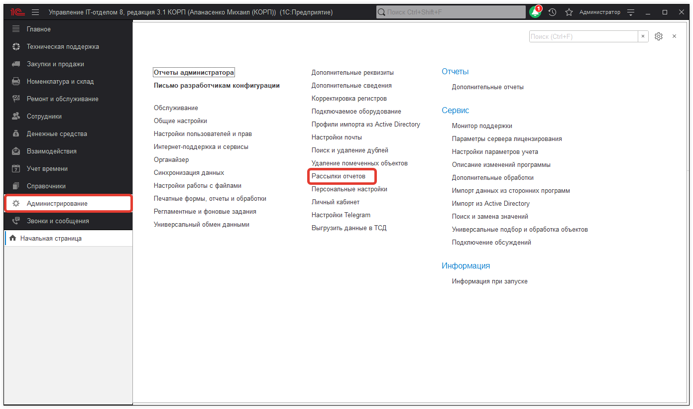
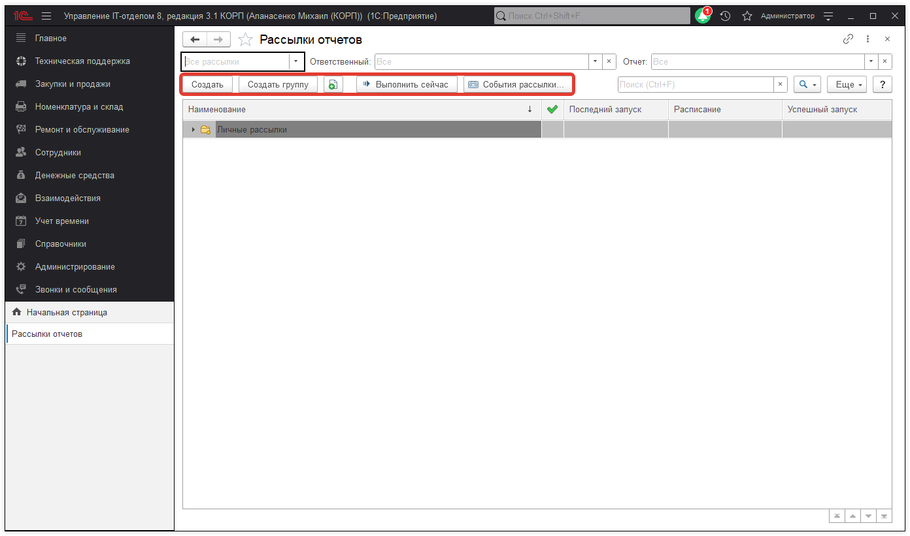
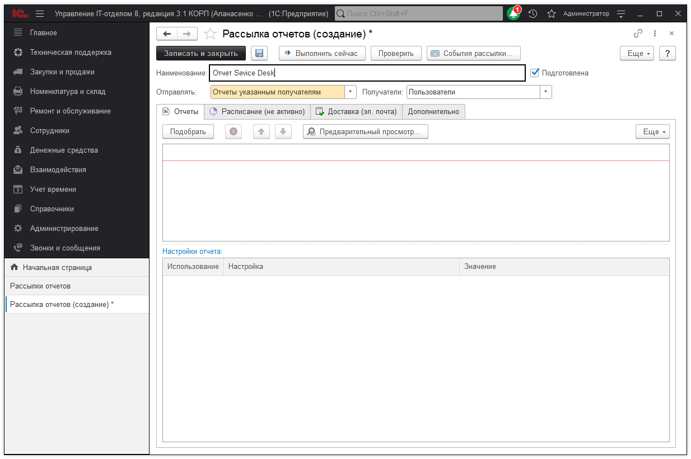
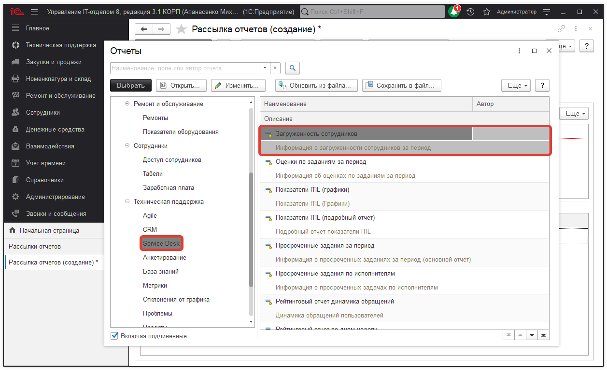
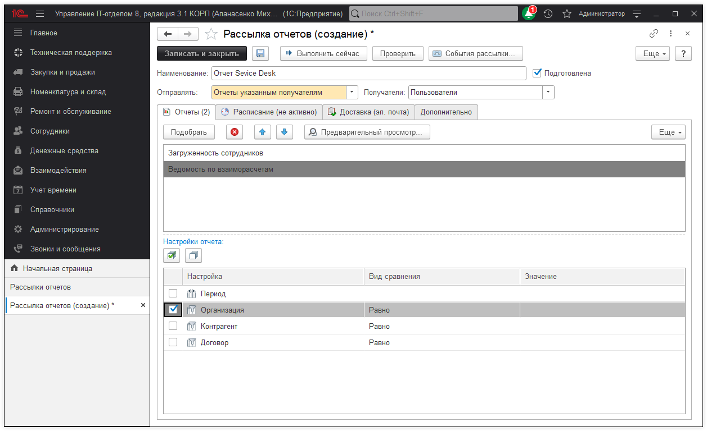
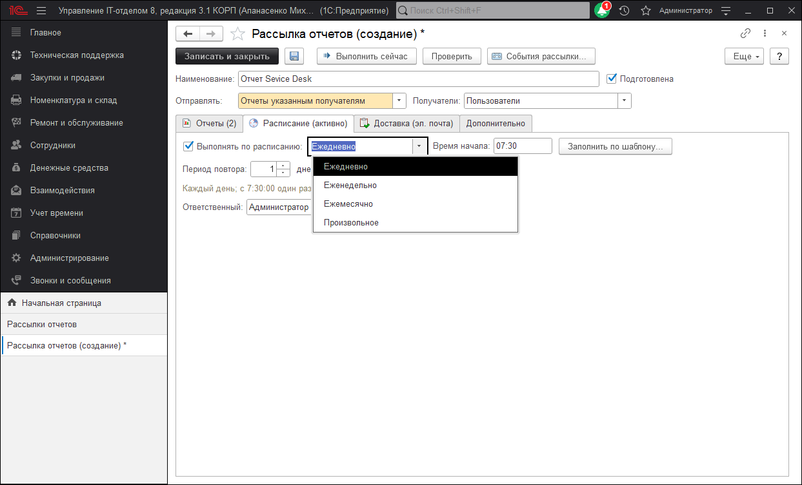
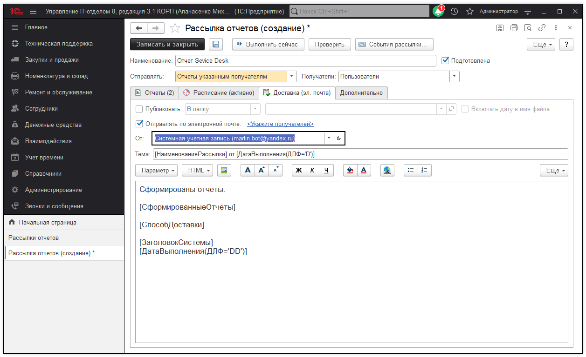
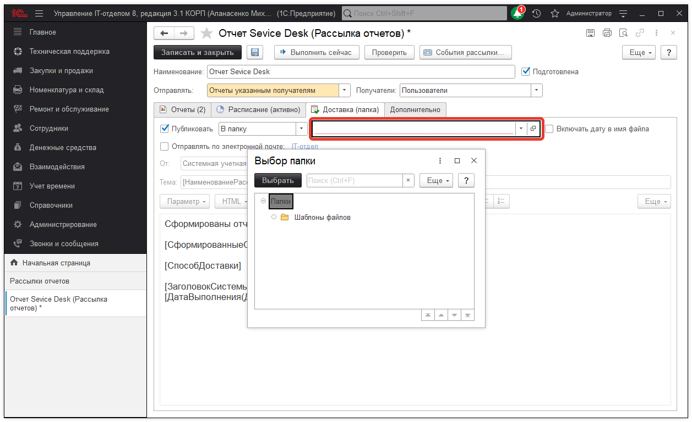
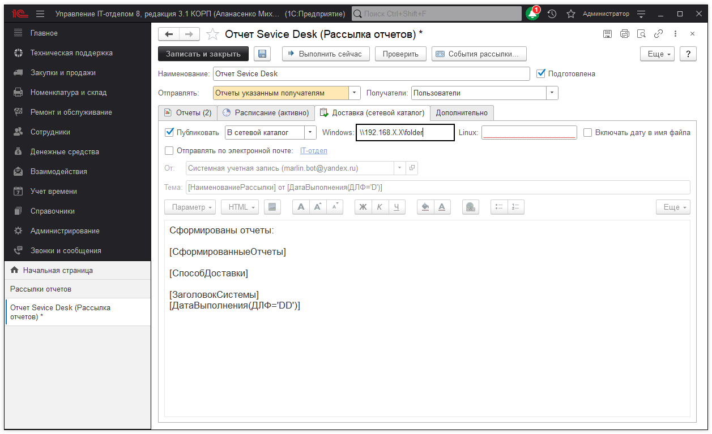

# Рассылка отчетов

Зачастую возникает потребность в регулярной автоматической рассылке отчетов, которые формируются в конфигурации. Подобная возможность предусмотрена в программе и позволит отправлять отчеты пользователям конфигурации в определенный период времени. Отчеты будут отправлены в виде файлов электронным письмом или выгружены на указанный жесткий диск. При этом сами отчеты могут формироваться или вручную, или по указанному расписанию автоматически. 

## Подсистема "Рассылки отчетов"

Для вызова подсистемы необходимо перейти в раздел **"Администрирование" -> "Рассылки отчетов"**.

**Кнопки, расположенные на командной панели позволяют выполнять следующие действия:**
* [x] **Создать** - создать новую рассылку;
* [x] **Создать группу** - создать группу рассылки;
* [x] **Скопировать** - позволяет создать новую рассылку путем копирования;
* [x] **Выполнить сейчас** - позволяет запустить рассылку отчетов вручную;
* [x] **События рассылки** - позволяет открыть журнал регистрации, в котором настроен отбор событий по текущей рассылке. Используется при анализе ошибок, произошедших во время рассылки.

## Создание рассылки

Для создания новой рассылки нужно нажать соответствующую кнопку "Создать", после чего откроется форма создания рассылки. В верху формы необходимо заполнить реквизиты:

* **Наименование** - краткое представление рассылки, которое может быть использована в теме электронного письма;
* **Подготовлена** - флажок, который обозначает готовность рассылки к выполнению. Установка флажка активизирует дополнительные проверки заполнения реквизитов. По умолчанию установлен. 
* **Отправлять** - выбирается вариант отправки рассылки (отчеты указанным, свой отчет для каждого получателя, только мне(личная рассылка));
* **Получатели** - указывается вид получателя (Пользователи, Контрагенты).

## Отчет для рассылки

Для того, чтобы выбрать вариант отчета, необходимо нажать кнопку "Подобрать", которая выведет список доступных вариантов для рассылки. Форма выбора разделяется на две части, в левой части располагаются подсистемы конфигурации, а в правой отображается список доступных отчетов выбранной подсистемы.

Если, выбранный вариант отчета включает собственные настройки реквизитов (Организация, период и т.д.), то тогда они настраиваются в поле "Настройки отчета".

После подбора и настройки отчета для осуществления рассылки, перейдем к подготовки расписания. На одноименной закладке "Расписание" активируем флажок "Выполнять по расписанию", после чего станет доступна тонкая настройка расписания.  Стоит отметить, что для проведения рассылки в программе создается регламентное задание "Рассылка отчетов".

Следующим шагом будет указание способа доставки, это может быть либо отправка на электронную почту, либо выгрузка в указанную(папку, сетевой каталог, FTP ресурс). 

## Настройка рассылки по электронной почте

Активируем флаг **"Отправлять по электронной почте"** и укажем получателей электронной почты. После в реквизите "От" необходимо указать учетную запись электронной почты, которая будет отправлять рассылку отчетов. Далее остается дополнить тему рассылки и основной текст, если это необходимо. 

## Отправка рассылки в указанную папку

Активируем флаг **"Публиковать"**, если выбирать из выпадающего списка вариант публикации **"В папку"**, тогда отчеты будут выгружены в одну из выбранных папок (файлов) конфигурации. 

Для размещения рассылки в сетевом ресурсе, необходимо выбрать соответствующий вариант и указать сетевой путь. Поддерживается, как `Windwows`, так и `Linux`. Аналогичные действия проводятся для `FTP` ресурса, указывается путь `ftp` и данные для доступа. 

На закладке "Дополнительно" применяются дополнительные настройки рассылки. Указывает формат отчета, который будет отправлен (`.word`, `exel`, `pdf` и т.д.).
Флаг **"Транслировать имена файлов"** транслирует на латиницу имя отправляемого отчета, например, `otchet.pdf`.   
Флаг **"Архивировать"** создаст архив из рассылки и установит пароль если это необходимо.    
В реквизите "Адрес ответа" указывается адрес электронной почты, на которую необходимо принимать ответы на отправленную рассылку.   

Для того, чтобы получатели не видели других адресатов рассылки нужно активировать флаг **"Отправлять письма через скрытые копии"**.

 