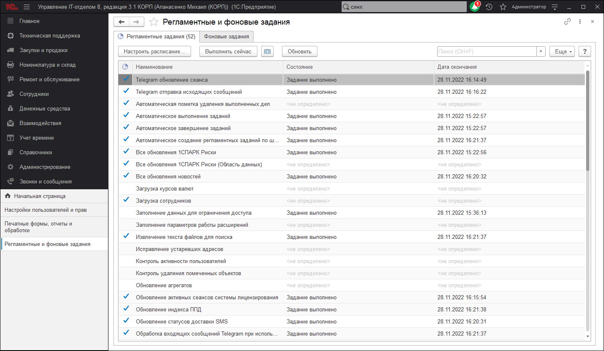

# Регламентные и фоновые задания

Предназначен для администрирования регламентных и фоновых заданий.

Ряд действий в программе может выполняться автоматически в фоновом режиме, по определенному расписанию. Такие действия называются регламентными заданиями, например, это ежедневная загрузка курсов валют, регулярная рассылка отчетов, отложенное проведение документов и т.п. Регламентные задания облегчают работу в программе, позволяя перенести выполнение рутинных задач в саму программу, и в то же время они снижают человеческий фактор (например, можно забыть загрузить курсы валют в один из перегруженных другими задачами дней).

Открывается по команде Регламентные и фоновые задания в разделе Администрирование - Обслуживание - Регламентные операции.

***Cписок предоставляет следующие возможности:***

* **Регламентные задания;**  
* **Фоновые задания;**  
* **Контроль выполнения регламентных заданий.**  

## Регламентные задания

В списке можно включить (или отключить) то или иное регламентное задание и поменять расписание.

В списке выводится:

* Флажок в колонке означает, что регламентное задание Включено и выполняется в соответствии с заданным расписанием;
* **Наименование** - полное наименование регламентного задания;  
* **Состояние** - информация о выполнении регламентного задания;  
* **Дата окончания** - дата и время завершения регламентного задания.  

## Обновление списка
* **С помощью кнопки Обновить** можно актуализировать информацию в списке регламентных заданий, а также на вкладке Фоновые задания, т.к. списки связаны, при этом будет произведен отбор в соответствии с указанными ранее настройками.  

## Настройка расписания

* Для каждого регламентного задания может быть задано расписание, в соответствии с которым регламентное задание будет автоматически запущено на исполнение. В программе поддерживаются однократные и периодические расписания.  
* **Нажмите Настроить расписание.** 

## Выполнение регламентного задания

* Для того чтобы начать выполнение регламентного задания сразу же, нажмите **Выполнить сейчас**.
* В файловом режиме работы программы оно будет выполнено в текущем сеансе.
* В клиент-серверном режиме работы программы выполнение произойдет в фоновом задании на сервере. При выполнении процедуры в фоновом задании на сервере не меняется дата последнего выполнения, используемая для запуска по расписанию.
* Одновременное выполнение двух версий одного и того же регламентного задания невозможно. Если запустить то же самое регламентное задание, которое выполняется в данный момент, то программа выведет сообщение о невозможности вторичного запуска регламентного задания.

## Ввод нового регламентного задания

* В некоторых случаях бывает необходимо задать два разных расписания для одного регламентного задания. Тогда в список можно добавить новое регламентное задание по одному из предопределенных шаблонов, предусмотренных в программе.
* Нажмите **Добавить**, выберите из списка шаблон, нажмите кнопку **ОК**. Заполните необходимые поля.

## Фоновые задания  

Технически, в соответствии с заданным расписанием для выполнения регламентного задания создается фоновое задание, которое выполняет регламентные действия. Например, если задано ежедневное расписание на 9:15, то каждый день в 9:15 будет запускаться новый сеанс фонового задания. После завершения регламентной операции фоновое задание автоматически завершается.

В списке выводится:

* **Состояние** - выполнение задания;
* **Наименование** - наименование фонового задания;
* **Начало** - дата и время начала выполнения фонового задания;
* **Окончание** - дата и время окончания выполнения фонового задания;
* **Регламентное задание** - наименование регламентного задания.
 
Для контроля выполнения регламентных заданий можно воспользоваться отбором фоновых заданий по различным признакам:

|  Отбор        | Описание |
| ------------------------ | --------------------------------------------------------------------------------------------------------------------------------------------------------------------------------------------------------------------------------------------------------------------------------------------------------------------------------------------------------------------------------------------------------- |
| По состоянию                                     | Позволяет выполнить отбор по состоянию (дополнительно к отбору по периоду и по регламентному заданию): Выполнено; Завершено с ошибками; Отменено; Выполняется. Включите нужные отборы с помощью флажков.                       |
| По периоду                                       | Позволяет выполнить отбор по периоду (дополнительно к отбору по состоянию и по регламентному заданию): произвольный - можно установить нестандартный период; все время - отбор по периоду не выполняется; прошлая ночь - стандартный период 12 часов с 21:00-09:00; вчера - стандартный период 24 часа с 00:00-23:59 вчерашнего дня; сегодня - стандартный период 24 часа с 00:00-23:59 сегодняшнего дня.                                                                              |
| По регламентному заданию                         | Позволяет выполнить отбор по регламентному заданию (дополнительно к отбору по состоянию и по периоду). Включите флажок Отбирать по регламентному заданию. Выберите наименование регламентного задания из списка. Наименование регламентного задания "<не определено>" используется для отбора фоновых заданий, запущенных для выполнения прочих (не регламентных) заданий.|

!!!
**Внимание!** Для того чтобы отобрать фоновые задания в соответствии с выбранными настройками, нажмите Обновить.
!!!

### Просмотр информации о фоновом задании

* Для того чтобы просмотреть свойства фонового задания, дважды щелкните мышью по нужной строке. Также можно нажать Открыть.
Контроль выполнения регламентных заданий

### Контроль может быть либо простым, либо детальным.

* Простой контроль - это анализ колонок **Состояние** и **Дата окончания** на вкладке **Регламентные задания**, а также анализ текста поля **Сообщения пользователю и описание информации об ошибке** в окне редактирования регламентного задания.
* Детальный контроль - это анализ списка фоновых заданий (на вкладке **Фоновые задания**), которые были созданы и выполнены для выполнения регламентного задания.
* Детальный контроль производится отбором фоновых заданий по интересующему регламентному заданию, и анализом реквизитов фоновых заданий. Следует учитывать, что сведения о выполнении регламентного задания получаются выборкой части сведений о выполнении последнего фонового задания.
* Отбор фоновых заданий производится только по команде **Обновить**, поэтому после изменения настройки отбора нужно выполнить эту команду.
* Для детального анализа хода выполнения регламентных заданий в клиент-серверном режиме см. отчет **Продолжительность работы регламентных заданий** из группы отчетов **Анализ журнала регистрации**, который открывается по соответствующей команде в разделе **Администрирование - Поддержка и обслуживание - Отчеты администратора**.  