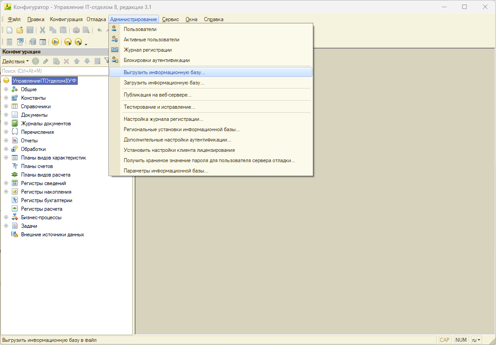
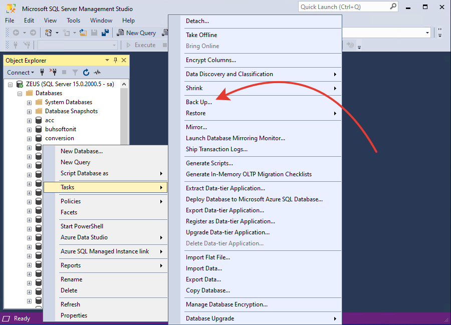

# Резервное копирование информационной базы

Создание резервной копии информационной базы 1С является важной процедурой для обеспечения сохранности данных и возможности их восстановления в случае сбоев или ошибок. Ниже представлены инструкции по созданию резервных копий для файловых и клиент-серверных баз данных 1С.​

## Резервное копирование файловой базы 1С

Файловая база данных 1С хранится в виде отдельного файла на диске. Для создания ее резервной копии можно воспользоваться следующими способами:​

### Копирование файла базы данных

* Определите расположение базы данных:​
  * Запустите программу "1С:Предприятие".
  * В окне выбора информационной базы выберите нужную базу и нажмите "Изменить".
  * В поле "Каталог информационной базы" будет указан путь к папке, где хранится файл базы данных 1Cv8.1CD.
* Создайте копию файла:​
  * Закройте программу "1С:Предприятие" и убедитесь, что никто не работает с базой данных.
  * Перейдите по указанному пути в "Проводнике" Windows.
  * Скопируйте файл 1Cv8.1CD в безопасное место (например, на внешний носитель или в облачное хранилище).
  
Этот способ позволяет быстро создать резервную копию базы данных путем копирования основного файла базы.

### Выгрузка базы данных в файл формата .dt через "Конфигуратор"

* Запустите "Конфигуратор":​
  * В окне выбора информационной базы выберите нужную базу и нажмите "1С:Конфигуратор".
* Выполните выгрузку базы:​
  * В меню "Администрирование" выберите пункт "Выгрузить информационную базу".
  * Укажите место сохранения и имя файла с расширением .dt.
  * Нажмите "Сохранить" и дождитесь завершения процесса.



Этот способ создает файл-дамп базы данных (dt-файл), который можно использовать для восстановления или переноса базы.

## Резервное копирование клиент-серверной базы 1С

В клиент-серверном варианте 1С используется сервер баз данных (например, Microsoft SQL Server или PostgreSQL). Для создания резервной копии необходимо использовать средства соответствующей системы управления базами данных (СУБД). Ниже приведен общий алгоритм для Microsoft SQL Server:​

### Создание резервной копии средствами SQL Server

Если информационная база 1С использует для работы MS SQL, выполните следующие действия:

* Откройте SQL Server Management Studio (SSMS).​
* Подключитесь к серверу баз данных.​
* Выберите базу данных 1С:​
  * В дереве объектов раскройте узел "Databases" и выберите нужную базу данных.
* Создайте резервную копию:​
  * Кликните правой кнопкой мыши на базе данных, выберите "Tasks" → "Back Up...".
  * В разделе "Destination" укажите путь и имя файла для резервной копии.
  * Нажмите "OK" для начала процесса резервного копирования.



Этот способ позволяет создать резервную копию базы данных с помощью встроенных средств SQL Server.

### Создание резервной копии средствами PostgreSQL

​Создание резервной копии информационной базы 1С, работающей на СУБД PostgreSQL, можно выполнить с помощью встроенных утилит PostgreSQL. Наиболее распространённой утилитой для этой задачи является `pg_dump`, которая позволяет создавать резервные копии отдельных баз данных.​

#### Создание резервной копии с помощью pg_dump

1. Определите параметры подключения к базе данных:
   * **Имя базы данных**: название вашей базы данных 1С.​
   * **Пользователь**: имя пользователя PostgreSQL с достаточными правами доступа.​
   * **Пароль**: пароль указанного пользователя.​
   * **Сервер**: адрес сервера базы данных (например, `localhost` для локального сервера).​
   * **Порт**: порт подключения к PostgreSQL (по умолчанию `5432`).​

Выполните команду `pg_dump` в командной строке:

```bash
pg_dump -U [пользователь] -h [сервер] -p [порт] -F c -b -v -f "[путь_к_резервной_копии]" [имя_базы_данных]
```

Где:

* `-U [пользователь]` — имя пользователя PostgreSQL.​
* `-h [сервер]` — адрес сервера базы данных.​
* `-p [порт]` — порт подключения.​
* `-F c` — формат резервной копии в формате custom.​
* `-b` — включает большие объекты в резервную копию.​
* `-v` — режим подробного вывода информации.​
* `-f "[путь_к_резервной_копии]"` — путь и имя файла для сохранения резервной копии.​
* `[имя_базы_данных]` — имя базы данных 1С.​

Пример для Windows:

```cmd
"C:\Program Files\PostgreSQL\14\bin\pg_dump.exe" -U postgres -F c -b -v -f "E:\BACKUP\uit_backup.dump" uit
```

В этом примере создаётся резервная копия базы данных `uit` и сохраняется в файл `uit_backup.dump` на диске `E:`.

*Примечание: при выполнении команды система запросит пароль пользователя PostgreSQL.*

## Автоматизация процесса резервного копирования

Для регулярного создания резервных копий рекомендуется автоматизировать процесс с помощью пакетных файлов и планировщика задач.​

1. **Создайте пакетный файл (например, backup_1c.bat):**

```cmd
@echo off
set PGUSER=postgres
set PGPASSWORD=ваш_пароль
set PGDATABASE=bux
set BACKUP_DIR=E:\BACKUP
set DATE=%date:~6,4%-%date:~3,2%-%date:~0,2%_%time:~0,2%-%time:~3,2%-%time:~6,2%
set BACKUP_FILE=%BACKUP_DIR%\%PGDATABASE%_%DATE%.backup
"C:\Program Files\PostgreSQL\14\bin\pg_dump.exe" -F c -b -v -f "%BACKUP_FILE%"
```

Примечание: замените ваш_пароль на пароль пользователя PostgreSQL.

2. **Настройте планировщик задач Windows для регулярного запуска пакетного файла:**

* Откройте "Планировщик заданий" (Task Scheduler).​
* Создайте новую задачу и укажите расписание её выполнения (например, ежедневно в определённое время).​
* В разделе "Действия" добавьте запуск созданного пакетного файла.​

*Примечание: при настройке автоматического резервного копирования убедитесь, что права доступа и параметры безопасности настроены корректно, чтобы обеспечить успешное выполнение задач.​*

## Рекомендации по резервному копированию

* **Регулярность**: Настройте регулярное автоматическое резервное копирование (например, ежедневно или еженедельно) для минимизации риска потери данных. ​
* **Хранение копий**: Сохраняйте резервные копии на внешних носителях или в облачных хранилищах, чтобы обеспечить дополнительную защиту данных.​
* **Проверка копий**: Периодически проверяйте целостность и работоспособность резервных копий путем тестового восстановления.​

Следуя этим рекомендациям, вы обеспечите надежное сохранение и восстановление данных вашей информационной базы 1С.​

## Создание резервных копий просто и без сложностей

Если вы хотите упростить создание резервных копий и добавить дополнительные возможности для создания резервных копий, рекомендуем вам обратить свое внимание на [Автоматическое обновление информационных баз 1С](https://softonit.ru/catalog/products/updater/)

Помимо автоматического обновление информационных баз, эта программа умеет делать резервные копии.
