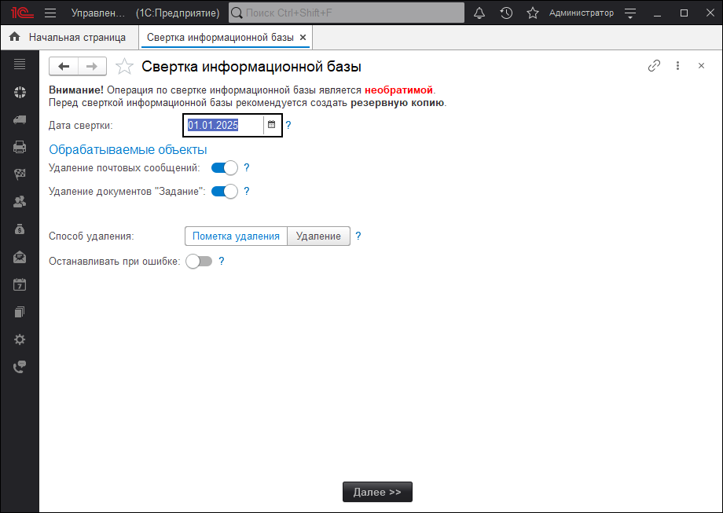
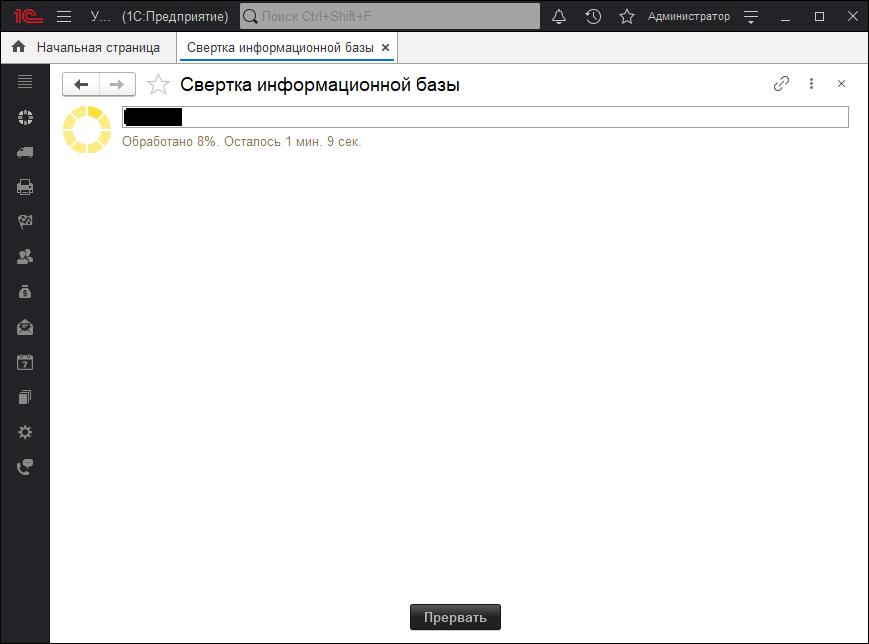

# Свертка информационной базы

​Свертка информационной базы 1С — это процедура, позволяющая уменьшить объем базы данных за счет удаления неактуальных до определенной даты данных. Это способствует повышению производительности системы и снижению времени на резервное копирование и обновление.

!!!primary Уточнение
Наша обработка не совсем свертка, все же, свертка работает с остатками. Обработка удаляет данные, которые занимают большой объем данных.
!!!

## Как использовать свертку в Управление IT-отделом 8?

Обработка находится в Администрирование > Сервис > Свертка информационной базы. В результате будет открыта обработка:

## Пошаговая инструкция по выполнению свертки

1. Установите дату свертки. Вплоть до этой даты обработка удалит все данные, которые будут установлены в обрабатываемых объектах.
2. Укажите те данные, которые необходимо обработать. На данный момент, можно указать:
   1. Удаление электронных писем (почтовых сообщений) и их вложений.
   2. Удаление заданий, комментариев и их вложений. А так же будут очищены все реквизиты там, где они встречаются.
3. Укажите способ удаления. Рекомендуем выбрать "Пометка удаления", а затем произвести "Удаление помеченных объектов". Так же, есть возможность удаления объектов сразу из информационной базы.
4. Тумблер "Останавливать по ошибке" означает, что делать, если обработка не сможет удалить / пометить на удаление какой-то объект? Если тумблер будет установлен, то обработка перестанет работать и вернет текст ошибки.
5. После установки этих нехитрых настроек необходимо нажать на кнопку "Далее >>" и обработка начнет удалять объекты в фоне.

Обработка дополнительно показывает прогресс и сколько осталось времени для обработки всех объектов.

!!!tip Совет
Желательно, чтобы в процессе удаления база не использовалась. Но, в принципе, остальным пользователям можно продолжить работу если это критично для вашей организации.
!!!

Функционал доступен начиная с версии: **3.1.22.4**
