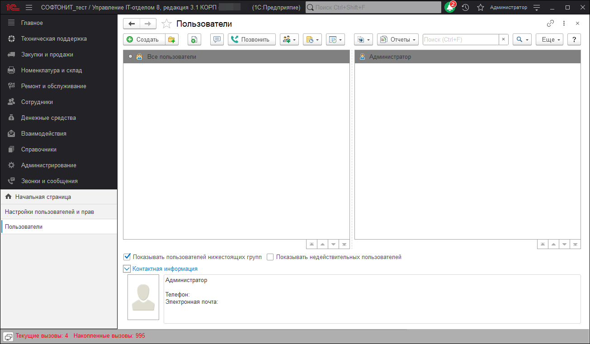

# Создание первого пользователя в конфигурации

Для того, чтобы создать первого пользователя в конфигурации нужно перейти на вкладку "Администрирование", "Настройки пользователей и прав", "Пользователи". Обязательно нужно стоять на строке "Все пользователи".

Так же первого пользователя нужно создавать с полными правами. После того, как пользователь создан, его можно переместить в группу.