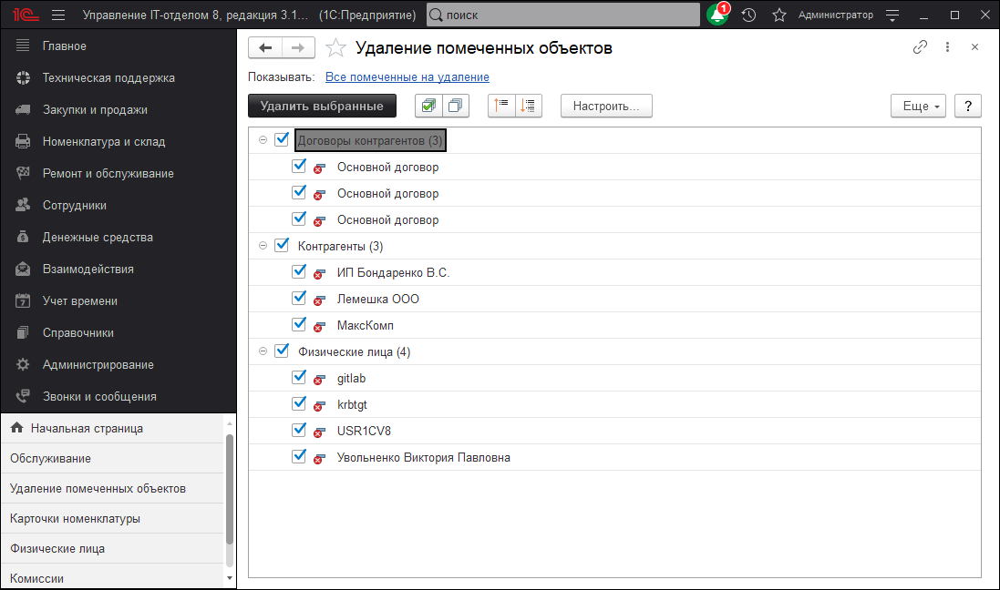
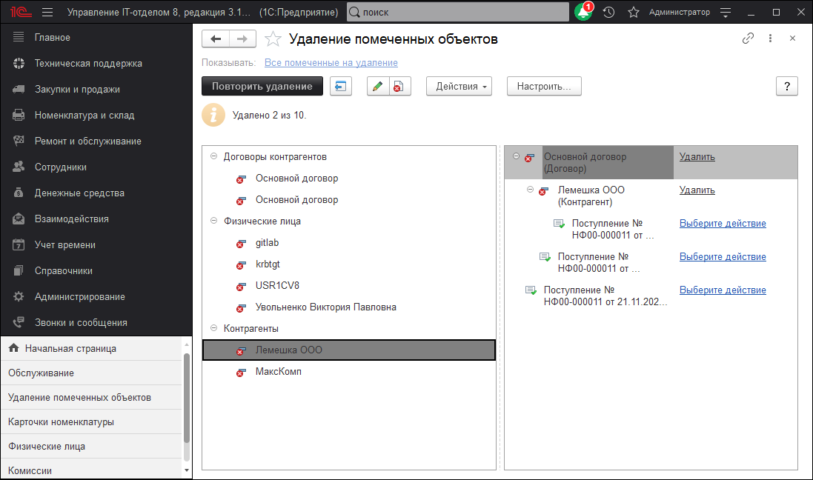

# Удаление помеченных объектов

В нашей конфигурации существует запрет на прямое удаление некоторых объектов для сохранения целостности данных, их можно только пометить на удаление. Само удаление осуществляется с помощью менеджера **Удаление помеченных объектов** (*"Администрирование" - "Обслуживание" - "Удаление помеченных объектов"*). 

Перед Вами откроется окно со всеми помеченными на удаление объектами. После этого вы сможете отметить галочками объекты, которые вы хотите удалить.

Если какие-то объекты используются в каких либо документах или других объектах, то Вы увидите окно показанное ниже. Чтобы все-таки провести удаление, нужно пометить на удаление все места использования удаляемого объекта и повторите удаление.

