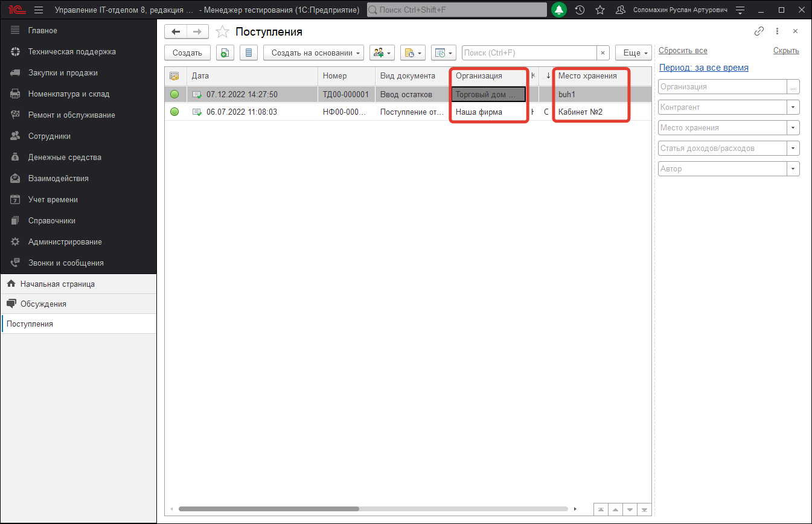

# Управление доступом и ограничение видимости

## Управление доступом

Программа позволяет настроить доступ пользователей к различным функциям, спискам и документам. Предусмотрены предопределенные наборы ролей. Кроме этого, имеется возможность самостоятельной настройки доступа. Для управления доступом необходима роль **Полные права**.

Для ведения списка пользователей и настройки их прав предназначены списки **Пользователи** и **Группы доступа** (раздел **Администрирование – Настройка пользователей** и прав). Группа доступа определяет совокупность действий с данными программы, которые могут выполнять участники этой группы. Как правило, группы доступа соответствуют различным должностным обязанностям (или видам деятельности) пользователей программы. Пользователь может входить одновременно в одну или несколько групп доступа, которые в совокупности образуют его персональные настройки прав доступа.

!!!
Для настройки прав доступа следует использовать только пользовательский режим 1С:Предприятия.
!!!

## Настройка программы

Для того чтобы максимально гибко настраивать права доступа пользователей, необходимо включить режим ограничения прав доступа пользователей на уровне записей. Для этого необходимо включить флажок **Ограничивать доступ на уровне записей** в разделе **Администрирование – Настройки пользователей и прав – Группы доступа**. Включить этот режим рекомендуется в тех случаях, когда он действительно востребован (например, с программой работает много пользователей), т.к. это в значительной степени повлияет на производительности системы.

В этом случае становятся доступными следующие возможности:

**1. Флаг "Группы доступа контрагентов"** – разрешить настройку доступа к данным по группам контрагентов, в этом случае становится доступной команда: **Группы доступа контрагентов** – создание групп партнеров для разграничения доступа к справочникам, документам и другим данным.

**2. Флаг "Группы доступа мест хранения"** – включите флажок, для того чтобы разрешить настройку доступа к данным по группам мест хранения. После этого становится доступной команда: **Группы доступа мест хранения** – создание дополнительных групп доступа мест хранения для разграничения доступа к данным.

**3. Флаг "Группы доступа категорий базы знаний"** – включите флажок, для того чтобы разрешить настройку доступа к категориям базы знаний. После этого становится доступной команда: **Группы доступа категорий базы знаний** – создание дополнительных групп категорий базы знаний для разграничения доступа к категориям статей базы знаний.

**4. Флаг "Группы доступа местоположений"** – включите флажок, для того чтобы разрешить настройку по группам доступа местоположений. После этого становится доступной команда: **Группы доступа местоположений** – создание дополнительных групп доступа местоположений для разграничения доступности информации по местоположениям.

Например, в карточке места хранения после включения флажка "Группы доступа мест хранения" появится обязательный к заполнению реквизит "Группа доступа".

Включение режима ограничения прав доступа пользователей на уровне записей может занять длительное время в зависимости от объема данных, введенных в программу.  

Если в программу до включения этого режима был введен большой объем данных, программа выводит предупреждение.

Подготовка служебных данных, необходимых для работы в этом режиме, выполняется в фоне с помощью регламентного задания Заполнение данных для ограничения доступа. Если в программу введен большой объем данных, то рекомендуется предварительно настроить его запуск в то время, когда с программой не работают пользователи.

## Настройка групп доступа

С помощью групп доступа можно задавать и администрировать общие настройки прав доступа для некоторой группы пользователей, выполняющих однотипные функции в программе, например: **Техники центрального офиса** или **Администраторы филиалов**. Права на редактирование списка **Группы доступа** имеются только у администраторов программы, перечисленных в предопределенной группе доступа **Администраторы**. Кроме того, пользователь, указанный в группе доступа как **Ответственный**, может изменять состав участников данной группы.

Группа доступа всегда связана с одним из имеющихся профилей групп доступа, которые, как правило, объединяют в себе несколько ролей. При включении пользователя в группу доступа ему назначаются все роли, заданные в профиле группы доступа. Например, предопределенная группа доступа **Администраторы** связана с профилем **Администратор**, в состав которого входит роль Полные Права. Эта роль предоставляет неограниченный доступ ко всем данным и назначается всем администраторам программы, перечисленным в группе доступа **Администраторы**.

Для создания новой группы доступа необходимо перейти в список **Группы доступа** раздела **Администрирование – Настройки пользователей и прав – Группы доступа**.

Нажмите кнопку **Создать**.

Заполните поле **Наименование**.

Рекомендуется называть группу доступа во множественном числе таким образом, чтобы ее имя содержало указание на используемый в ней профиль (в поле **Профиль**) и однозначно характеризовало определенный в ней состав настроек прав доступа. Например, на базе профиля **Сотрудник ремонта** могут быть введены группы доступа **Сотрудники ремонта Главного офиса** и **Сотрудники ремонта Филиал 1**.

В карточке группы доступа нужно выбрать один из имеющихся **Профилей** групп доступа.

На вкладке **Участники группы** перечислите список пользователей (и групп пользователей), на которых должны распространяться настройки прав доступа.

Для быстрого перечисления пользователей можно нажать кнопку **Подобрать**. Подберите нужных пользователей.

Открывшийся список выбора состоит из двух частей.

В левой части окна выберите нужную группу пользователей (можно выбрать всю группу сразу), выберите нужных пользователей из этой группы, затем нажмите кнопку **Завершить и закрыть** для возврата к настройке группы доступа.

В поле **Ответственный** выберите пользователя, который будет ответственным за состав участников группы доступа.

Затем на вкладке **Ограничения доступа** необходимо указать дополнительные настройки прав доступа. **Примечание**: вкладка может быть недоступна для тех групп доступа, в которых такая настройка не предусмотрена (зависит от настроек выбранного профиля).

На этой вкладке с помощью поля **Вид доступа** можно задать границы области данных, с которой разрешено работать участникам группы доступа. Под видом доступа подразумевается некоторое правило, по которому «разрешается» доступ к данным программы. Например, с помощью вида доступа **Организации** можно разрешить работать пользователям только с документами по конкретным организациям; или наоборот, скрыть от них документы некоторых организаций. Состав видов доступа, перечисленных на вкладке **Ограничения доступа**, зависит от профиля, выбранного в поле **Профиль**. Кроме того, профиль также определяет, как именно действует настройка вида доступа: она разрешает только просмотр или также включает возможность редактирования данных. Например, в случае если профиль групп доступа включает в себя роль для чтения документов, то пользователи получают возможность просматривать документы по заданным организациям. Если же в профиле содержится роль для добавления и изменения, то появляется возможность редактировать такие документы.

Для каждого вида доступа можно указать либо список разрешенных значений, либо наоборот, список тех значений, которые не должны быть доступны. Первый способ настройки подходит в тех случаях, когда стоит задача предоставить доступ только к определенной области данных. Второй способ настройки удобен тогда, когда требуется закрыть доступ к заранее известной области данных, а для всех новых значений, вводимых в программу, должны по умолчанию действовать разрешительные правила. Например, если с помощью вида доступа **Организации** задано правило, запрещающее работать с документами по организации **Наша фирма**, то на новую организацию **Торговый дом**, введенную в программу позднее, эти ограничения распространяться не будут. При этом следует учитывать, что разрешающие настройки имеют приоритет над запрещающими. Так, если в приведенном выше примере пользователю будет разрешен ввод документов по организации **Наша фирма** в какой-либо другой группе доступа с тем же профилем, то в итоге он получит доступ ко всем документам по этой организации.

В ряде случаев для упрощения настройки прав доступа, в списке разрешенных или запрещенных значений можно указывать не отдельные элементы, а целые группы элементов. Например, для вида доступа **Группы мест хранения** (см. Рис.3) можно ограничить доступ в разрезе групп доступа мест хранения, а не по каждому месту хранения в отдельности. Для этого необходимо определить список групп доступа мест хранения, и у каждого места хранения задать принадлежность к той или иной группе. Эти действия могут быть выполнены не только администратором, но и любым пользователем с соответствующими правами на редактирование списка мест хранения. Аналогичным образом действует запрещающая настройка.

Пользователь может быть включен сразу в несколько групп доступа. В этом случае его совокупные права доступа складываются (объединяются по «или») из прав доступа каждой группы. Например, в группе доступа **Сотрудники ремонта** пользователю разрешено добавление/изменение документа **Начало обслуживания** по организации **Наша фирма**. В группе доступа **Сотрудники склада** ему разрешено добавление/изменение документа Поступление по организации **Торговый дом**. В результате у него появляются права на добавление/изменение документов Начало обслуживания по организации Наша фирма и Поступление по организации **Торговый дом**. При этом следует учитывать, что объединяются не списки разрешенных значений, указанные в группах, а именно права доступа. Т.е. ошибочно считать, что в приведенном примере пользователь получит доступ на добавление/изменение обоих видов документов одновременно по обеим организациям.

## Настройка прав доступа отдельных пользователей

Для просмотра и настройки состава групп доступа интересующего пользователя (или группы пользователей; далее просто «пользователя») можно воспользоваться командой Права доступа в панели навигации карточки пользователя.

С помощью кнопки **Включить в группу** на вкладке **Группы доступа** администратор может добавить пользователя в состав участников любой из имеющихся групп доступа.

С помощью кнопки **Исключить из группы** можно удалить пользователя из выделенной группы доступа.

Также эту настройку могут выполнять ответственные за состав участников группы доступа для своих групп доступа.

С помощью кнопки **Изменить группу** можно перейти к карточке группы доступа, выбранной в списке.

На вкладке Разрешенные действия (роли) справочно выводится совокупный список ролей, которые назначены пользователю. Список ролей складывается из всех ролей, входящих в состав групп доступа, в которые включен пользователь. Этот же список можно увидеть в Конфигураторе, в свойствах пользователя информационной базы. При этом не следует редактировать этот список в режиме конфигурирования 1С:Предприятия, настройка прав доступа пользователей должна выполняться только с помощью групп доступа.

С помощью кнопки По подсистемам можно соответственно сгруппировать разрешенные действия.

## Отчет по правам доступа

Для того чтобы увидеть полный список прав доступа пользователя, можно воспользоваться аналитическим отчетом **Отчет по правам доступа пользователя**.

Отчет можно открыть из карточки пользователя (группы пользователя) со страницы **Права доступа** с помощью соответствующей кнопки.

Отчет с помощью стандартных кнопок можно распечатать или сохранить на компьютере в нужном формате.

## Создание нового профиля для групп доступа

В ряде случаев предустановленных профилей групп доступа оказывается недостаточно для осуществления требуемой настройки прав доступа пользователей. В таких случаях администратор имеет возможность добавить новые или изменить предустановленные профили групп доступа.

Профиль групп доступа объединяет в себе несколько ролей, а также содержит описание видов доступа, в разрезе которых администратор может настраивать права с помощью групп доступа. Таким образом, профиль представляет собой определенный шаблон, в соответствии с которым администратор ведет группы доступа.

С одним профилем может быть связана одна или несколько групп доступа. Например, на базе профиля **Сотрудник ремонта** могут быть настроены группы доступа **Сотрудники ремонта "Наша фирма"** и **Сотрудники ремонта "Торговый дом"**, которые отличаются друг от друга разрешенными организациями "Наша фирма" и "Торговый дом" соответственно.

Список **Профили групп доступа** можно открыть по соответствующей команде в разделе **Администрирование – Настройка пользователей и прав – Группы доступа**.

С помощью поля **Показать** в списке можно отобрать профили групп доступа:

* Все профили;
* Поставляемые;
* Непоставляемые;
* Устаревшие.

Для ввода нового профиля групп доступа воспользуйтесь кнопкой **Создать**.

При добавлении нового профиля сначала необходимо определить состав его ролей, исходя из потребностей целевой группы пользователей.

Роль определяет некоторую совокупность действий над объектами программы, которые может выполнять пользователь. Роли могут соответствовать как различным должностным обязанностям (или видам деятельности) пользователей программы, так и могут соотноситься с более мелкими функциями. Зачастую, роли либо разрешают просмотр, либо дают возможность редактирования тех или иных данных в программе.

Каждому пользователю, посредством профилей и групп доступа, может быть назначена одна или несколько ролей, которые в совокупности образуют его персональные настройки прав доступа.

Как правило, различают основные и дополнительные профили.

Основной профиль описывает некоторую совокупность прав доступа, достаточную для выполнения в программе определенного участка работ.

С помощью дополнительных профилей пользователям могут быть выданы какие-либо вспомогательные права дополнительно к основному профилю.

В основных профилях важно предусмотреть такой набор ролей, который с одной стороны, не будет давать избыточного (нежелательного) доступа к функциям и данным программы, а с другой – будет достаточным для работы пользователей в рамках их круга задач и обязанностей. В частности, в основном профиле следует предусмотреть ряд вспомогательных ролей, которые напрямую не связаны с основной деятельностью пользователей, но, тем не менее, необходимы для нее.

Например, для сотрудника склада помимо роли на добавление и изменение складских документов нужно также не забыть включить в профиль следующие роли:

* Роль для входа в программу с помощью тонкого, толстого или веб-клиента;  
* Предопределенные роли **Базовые права** и **Базовые права УФ**;   
* Роли для просмотра справочников, элементы которых требуется выбирать в полях документов и т.п.
При вводе нового профиля групп доступа введите его Наименование.  

Если профилей групп доступа много, то их можно группировать по разным признакам, например, можно выделить в отдельные группы основные и дополнительные профили групп доступа, также можно сгруппировать профили групп доступа и по другим признакам.

На вкладке **Разрешенные действия** (роли) с помощью флажков выберите одну или несколько ролей. Роли обычно выводятся в алфавитном порядке.

С помощью команды **По подсистемам** меню **Еще** можно увидеть роли, сгруппированные по подсистемам.

С помощью соответствующей кнопки можно вывести в список **Только выбранные роли**.

Затем на вкладке **Ограничения доступа** необходимо принять решение по поводу состава видов доступа, которые должны быть определены в профиле. Под видом доступа подразумевается некоторое правило, по которому «разрешается» доступ к данным программы. С их помощью можно более точно настраивать границы области данных, с которой разрешено работать участникам тех или иных групп доступа. В простейшем случае, если в профиль не включено ни одного вида доступа, то права доступа к данным определяются только ролями. Например, в случае если профиль включает в себя роль чтения складских документов, то участники групп доступа получают возможность просмотра всех складских документов. Но если в дополнение к этой роли в профиль добавить вид доступа Организации, то появляется возможность разрешать пользователям работу с документами только по конкретным организациям; или наоборот, скрывать от них документы некоторых организаций. Таким образом, если список ролей в профиле отвечает на вопрос, «что должно быть доступно, а что – нет» (какие функции и данные программы), то виды доступа уточняют, как именно они должны быть доступны (в разрезе каких разрешенных и запрещенных значений). Состав видов доступа в профиле рекомендуется определять, исходя из соображений гибкости настройки прав доступа.

Для каждого вида доступа, заданного в профиле, можно указать один из четырех вариантов настройки:

* **Все запрещены, исключения назначаются в группах доступа** – применяется в тех случаях, когда по умолчанию доступ ко всем данным должен быть закрыт, но для отдельных объектов в группах доступа могут быть настроены разрешения;
* **Все разрешены, исключения назначаются в группах доступа** – аналогично предыдущему варианту, но по умолчанию все данные разрешены, а для отдельных объектов в группах доступа могут быть установлены исключения – запрет;
* **Все запрещены, исключения назначаются в профиле** – используется тогда, когда в группах доступа не предполагается предоставлять возможность настройки для вида доступа; т.е. вся настройка должна быть выполнена непосредственно в самом профиле и не может быть изменена в группах доступа. Такие виды доступа скрыты в группах доступа;
* **Все разрешены, исключения назначаются в профиле** – аналогично предыдущему варианту.

Если данная возможность в программе отключена, то вид доступа будет неактивен и в нижней части окна программа выводит об этом сообщение.

Для быстрого перехода к списку групп доступа, созданных на базе данного профиля, можно воспользоваться командой **Группы доступа** на панели навигации.

В данном списке с помощью кнопки **Создать** можно добавить новые группы доступа, с помощью соответствующих команд меню Еще также можно **Скопировать, Изменить, Пометить к удалению** существующие.

## Состав профилей групп доступа

Для настройки прав доступа пользователей в распоряжении администратора имеются следующие профили:

* **Администратор** - настройка прав доступа пользователей и администрирование программы. Включает в себя роль Полные права, которая предоставляет неограниченный доступ ко всем данным.  
* **Бухгалтер** - включает в себя набор функций, необходимых для работы бухгалтера(выписка документов по учету денежных средств);  
* **Внешний поставщик** - включает в себя набор функций, позволяющих работать контрагентам - поставщикам ( Внешний контрагент);  
* **Сотрудник ремонта** - включает в себя набор функций для работы специалистов - техников отдела IT (работа с документами по обслуживанию и ремонту);  
* **Сотрудник склада** - включает в себя набор функций для кладовщиков (работа со складскими документами).

## Ограничение доступа по группам местоположений

Поскольку ограничение по группам доступа местоположений могут на первый взгляд ввести в заблуждение, разберем поподробней эту возможность разграничения. Все дело в том, что при настройке профиля по данному виду ограничения необходимо понимать, что разграничение осуществляется именно по справочнику **"Местоположение"**. А данный справочник в свою очередь связан с множеством сущностей конфигурации, а это как раз и может посеять непонимание работы данного функционала. Для наглядности приведем пример, нужно ограничить документ "Поступление". Из-за того, что данный документ имеет в своем составе сразу несколько реквизитов, в которых указываются объекты привязанные к местоположениям. Нами было принято решение для каждых документов определять собственный набор реквизитов, по которым будет осуществляться проверка. 

Для документа **"Поступления"** - это местоположения объектов, указанных в реквизитах **"Организация, Место хранения и Контрагент"**. Следовательно, функционал разграничения по группам местоположений, будет проверять местоположения указанных: организации, места хранения и контрагента. Если все три местоположения доступны, тогда пользователь увидит данный документ, в противном случае документ будет скрыт.

И так, озвученный выше пример разберем на скриншотах. Первым делом, включаем использования разграничения по группам доступа местоположений и создаем две группы.

Следующий шаг, это настройка профиля групп доступа пользователей, в котором мы укажем соответствующий вид ограничения и назначим исключения.

Стоит отметить, что после включения ограничения "Группы доступа местоположений", в одноименном справочнике "Местоположения" появляется обязательный реквизит "Группа доступа". Именно этот реквизит нужно заполнить у всех местоположений информационной базы. Для этого перейдем в справочник и расставим каждому местоположению соответствующую группу доступа.

Из скриншота видно, что местоположение **"Кабинет 312"** будет доступен только для группы **"Группа 1"**, которая указана в соответствующем профиле как исключение. То есть, объекты с заполненным местоположением "Кабинет 312" будут доступны пользователю нашего примера. Теперь необходимо указать соответствующие местоположение у необходимых объектов конфигурации и проверить работу разграничения видимости. Установим данное местоположение организации **"Торговый дом ООО"** и месту хранения "**buh1**".

После проделанных манипуляций перейдем в раздел "Номенклатура и склад" и создадим новый документ "Поступление", в котором укажем в качестве организации **"Торговый дом ООО"** и место хранения **"buh1"**. При этом в базе есть еще один документ "Поступление", который оформлен на другую организацию и другое место хранения, у которых указано совершенно другое местоположение не доступное нашему тестовому пользователю. 

Теперь запустим программу под тестовым пользователем, у которого стоят соответствующие ограничения и проверим какой из двух документов отображается для него.

Как видим, данный пользователь действительно видит только тот документ, который ему разрешен по настройкам ограничений доступа. Но внимательный читатель мог заметить, что в начале речь шла о необходимости заполнения трех реквизитах документа, которые будут участвовать в проверке ограничения. В примере были продемонстрированы только два заполненных - это организация и место хранение. Все очень просто, дело в том, что для того чтобы документ был доступен после проверке, необходимо получить **ИСТИНА** по всем трем реквизита. А поскольку контрагента мы вообще не указали, то его проверка автоматически была пройдена **положительно**. 

## Список реквизитов объектов влияющих на разграничение по местоположениям

### Документ "Задание"

* **Инициатор** - проверяется доступность местоположения указанного инициатора.

### Документ "Соглашение SLA"

* **Организация** - если у соглашения установлен вид "Коллективный", тогда проверяется местоположение указанной 
организации. Если указан вид "Индивидуальный", тогда проверяются местоположения клиентов и организации вместе.

### Документы подсистемы "Agile"

* **Участники команды Agile** - проверяются местоположения указанные у участников команды Agile, которая 
связана с документами: ежедневный стендап, ретроспектива, покер планирования.

### Складские документы

* **Организация, место хранения и контрагент** - в зависимости от типа документа основными объектами для проверки являются именно местоположения указанные у объектов в данных реквизитах.

### Справочники

* **Местоположение** - все основные справочники конфигурации осуществляют проверку только по собственному местоположению.

### Карточки номенклатуры

* **Место хранения** - в виду предотвращения дублей было реализовано разграничение только карточек номенклатуры, а сама номенклатура не скрывается, поскольку смысла в скрытии номенклатуры нет. Ведь именно карточка хранит в себе всю конфиденциальную информацию. Проверка осуществляется только тех карточек, которые оприходованы на остатки, берется их место хранения и проверяется местоположение.
