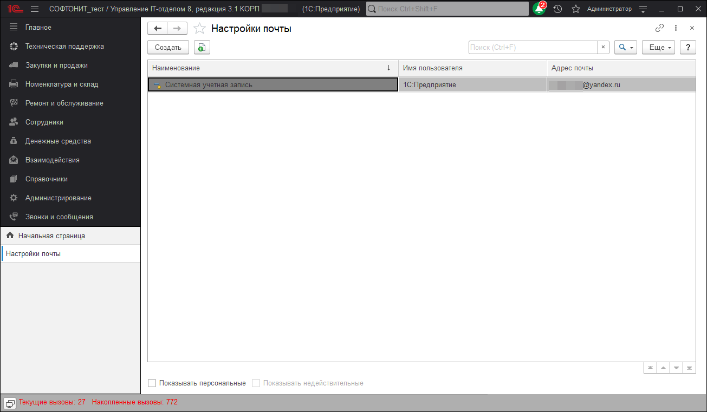
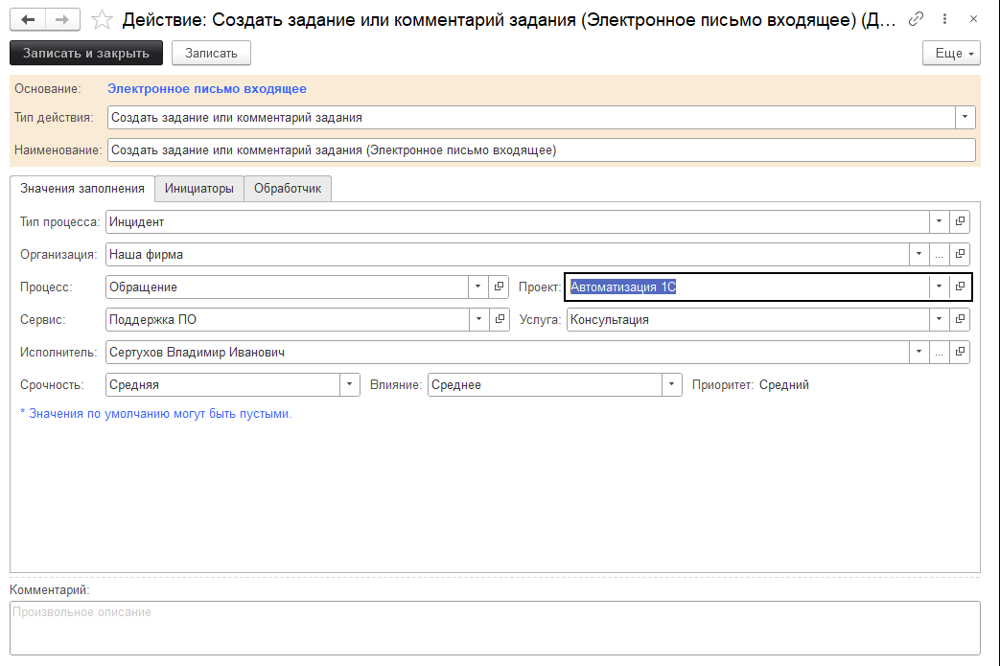

# Учетные записи электронной почты для создания заданий из писем

Форма позволяет настраивать разное поведение для разных учетных записей электронной почты.

Так выглядит окно настройки учетной записи. Как вы видите здесь можно задать параметры, которые будут подставляться в задание при его генерировании по входящим письмам.

