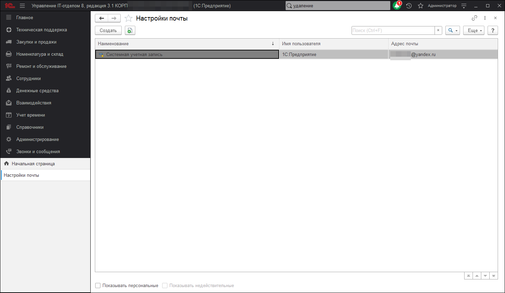

# Учетные записи электронной почты

Предназначен для ведения учетных записей электронной почты, которые используются для получения и отправки электронных сообщений.

Список можно открыть соответствующей командой в разделе **Администрирование - Учетные записи электронной** почты.

***В списке выводится:***
 
* **Наименование** учетной записи;  
* **Имя пользователя** - указывается имя отправителя писем, оно может отличаться от имени пользователя в программе;  
* **Адрес электронной почты учетной записи** в формате пользователь@почтовыйсервер.  
Для учетных записей, получение и отправка с которых выполняется автоматически без участия пользователя, должен быть обязательно введен пароль. Также для корректной работы программы обязательно должна быть настроена системная учетная запись электронной почты.

## Системная учетная запись электронной почты 

Программа поставляется с предопределенной учетной записью - системной учетной записью электронной почты. Она используется по умолчанию для рассылки различных уведомлений из программы, например, для автоматической отправки сообщений администратору по завершению обновления программы. Перед использованием этих возможностей необходимо настроить системную учетную запись.

* Настройка системной учетной записи производится по соответствующей команде в разделе Администрирование - Учетные записи электронной почты. Также можно Изменить ее в списке.

## Ввод учетной записи электронной почты

При попытке сохранения программа проверяет введенные учетные записи электронной почты (пытается отослать пробное сообщение). Учетные записи, не прошедшие проверку, не сохраняются.

* Нажмите **Создать**, введите необходимые поля:
  * Укажите Адрес электронной почты учетной записи в формате пользователь@почтовыйсервер;
  * Введите Пароль учетной записи. Для системных учетных записей рекомендуется запомнить пароль, для того чтобы программа могла рассылать сообщения от такой учетной записи без участия пользователя. Тем не менее решение о хранении паролей в информационной базе принимается в каждом случае индивидуально;
  * Установите с помощью флажков, как Использовать учетную запись:
    * Для отправки писем;
    * Для получения писем;
  * Установите с помощью переключателя, Для кого учётная запись:
    * Для всех;
    * Только для меня;
  * Укажите Имя отправителя (Ваше имя или название организации);
  * С помощью переключателя определите способ создания учетной записи:
    * Определить параметры подключения автоматически (рекомендуется);
      * Нажмите Создать. Программа предпримет попытку автоматической настройки и проверки учетной записи. Следуйте указаниям программы. При этом если при автоматической настройке произошел сбой, можно попытаться настроить параметры вручную (см. ниже).
  * Настроить параметры подключения вручную;
  * Укажите Дата начальной загрузки;
  * Нажмите Далее для заполнения остальных параметров, при этом программа проставляет рекомендуемые параметры для большинства почтовых серверов. Их требуется только проверить и попытаться сохранить учетную запись заново.

## Настройка учетной записи электронной почты

* Нажмите Изменить, с помощью программы произведите необходимые настройки.

## Проверка учетной записи электронной почты

* Откройте на редактирование учетную запись, нажмите Проверить настройки для проверки введенных параметров учетной записи. При этом проверяется возможность соединения с сервером входящих почтовых сообщений (если учетная запись используется для получения почты).
* Если в учетной записи не прописан пароль, программа его запрашивает. При необходимости введите пароль.

