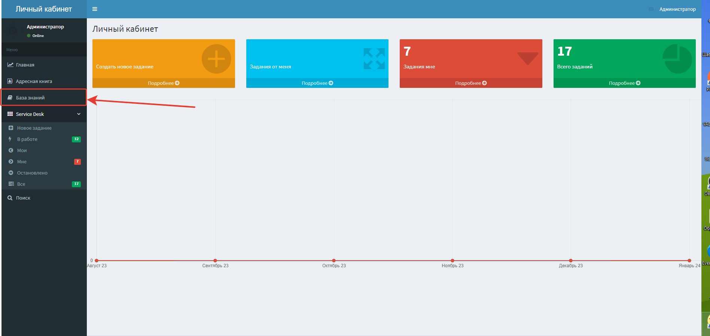

# Работа с базой знаний через личный кабинет

## Публикация на web-сервере

Чтобы база знаний работала корректно, необходимо правильно опубликовать конфигурацию. Подробнее о публикации можете посмотреть [по ссылке.](https://softonit.ru/FAQ/courses/?COURSE_ID=1&CHAPTER_ID=0590)

> **Обязательно!** При публикации на web-сервере, обязательно убедитесь, что поля `API` и `APIDebug` заполнены. 

## Взаимодействие с базой знаний

* Для открытия базы знаний, войдите в личный кабинет, и в панели разделов, выберете "База знаний".

* Откроется окно базы знаний, в который вы можете не только читать статьи, но и добавлять новые, непосредственно из личного кабинета.

Инструкция по добавлению, изменению статей [по ссылке.](https://softonit.ru/FAQ/courses/?COURSE_ID=1&LESSON_ID=944) 