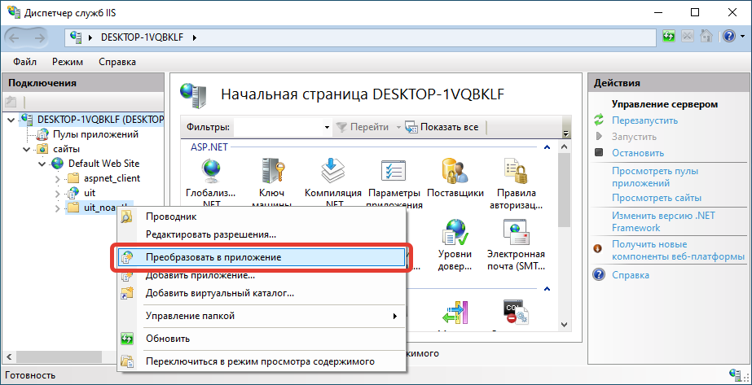

# Доступ к базе знаний в ЛК без авторизации

> :warning: **Важно** <br />
> Функционал доступен с релиза 3.1.20.8

В этой статье описывается алгоритм для настройки публикации базы знаний с использованием сервера **Apache (XAMPP)** или **IIS**, таким образом, чтобы можно было открыть статью базы знаний в личном кабинете по внешней ссылке без введения логина и пароля пользователя.

## Настройка личного кабинета

Данный механизм не работает при включенной собственной авторизации. Поэтому прежде всего проверим ее статус и, если он активен, отключим.


## Настройка пользователя

Необходимо создать служебного пользователя, который будет использоваться для входа в базу знаний.

> Обязательно запомните данные для входа, они понадобятся нам позже при редактировании VRD-файла публикации.


В целях безопасности зададим минимальные права для данного пользователя.


По необходимости можем разрешить данному пользователю редактировать базу знаний.


## Настройка VRD-файла публикации

После создания пользователя его необходимо прописать в VRD-файле. Для работы с внешним доступом создадим отдельную публикацию базы. Для этого необходимо скопировать папку публикации и назвать другим именем, по которому в дальнейшем будут идти обращения к базе знаний.

Найдите папку публикации базы.

**Apache:**

Расположение папки зависит от выбора, который был сделан при создании публикации через конфигуратор.


**IIS:**

Расположение папки по умолчанию находится на системном диске в папке `inetpub\wwwroot`.


---

В ней должен находиться VRD-файл `default.vrd`.

**Apache:**


**IIS:**


---

Далее необходимо сделать копию папки публикации.

**Apache:**


**IIS:**


---

После этого переименуем папку.

**Apache:**


**IIS:**


---

Откроем переименованную папку.

**Apache:**


**IIS:**


---

В переименованной папке откроем файл `default.vrd` любым удобным редактором кода. Затем заменить все строчки `enable="true"` на `enable="false"`.


Затем изменить код в соответствии с пометками. Прописываем ранее созданного служебного пользователя и его пароль (при наличии), а также меняем и добавляем выделенные (красная рамка) параметры.


Фрагменты кода измененного файла `default.vrd`.

```xml
<?xml version="1.0" encoding="UTF-8"?>
<point xmlns="http://v8.1c.ru/8.2/virtual-resource-system"
		xmlns:xs="http://www.w3.org/2001/XMLSchema"
		xmlns:core="http://v8.1c.ru/8.1/data/core"
		base="/uit_noauth"
		ib="File=&quot;C:\Users\uit_user\Documents\SoftOnIT\UIT&quot;;usr=&quot;Пользователь БЗ&quot;;pwd=&quot;ANY_PASSWORD&quot;;"
		enable="false">
	<ws enable="false"
			pointEnableCommon="true"
			publishExtensionsByDefault="true">
		(...)
	</ws>
	<httpServices publishByDefault="true"
			publishExtensionsByDefault="true">
		<service name="API"
				rootUrl="api"
				enable="true"
				reuseSessions="autouse"
				sessionMaxAge="20"
				poolSize="10"
				poolTimeout="5"/>
		<service name="APIDebug"
				rootUrl="api_debug"
				enable="true"
				reuseSessions="autouse"
				sessionMaxAge="20"
				poolSize="10"
				poolTimeout="5"/>
		<service name="Telegram"
				rootUrl="telegram"
				enable="false"
				reuseSessions="autouse"
				sessionMaxAge="20"
				poolSize="10"
				poolTimeout="5"/>
		<service name="ЛичныйКабинет"
				rootUrl="lk"
				enable="true"
				reuseSessions="autouse"
				sessionMaxAge="20"
				poolSize="10"
				poolTimeout="5"/>
		<service name="УстановкаОценокПоЗаданиям"
				rootUrl="score"
				enable="false"
				reuseSessions="autouse"
				sessionMaxAge="20"
				poolSize="10"
				poolTimeout="5"/>
	</httpServices>
</point>
```

Затем необходимо изменить конфигурацию сервера **Apache** или **IIS**.

## Конфигурация сервера

### Apache (XAMPP)

Необходимо открыть конфигурацию сервера **Apache (XAMPP)**.


Найти в тексте конфигурации фрагмент, описывающий публикацию базы.


```text
# 1c publication
Alias "/uit" "C:/1c_public/uit/"
<Directory "C:/1c_public/uit/">
    AllowOverride All
    Options None
    Require all granted
    SetHandler 1c-application
    ManagedApplicationDescriptor "C:/1c_public/uit/default.vrd"
</Directory>
```

Затем необходимо скопировать этот фрагмент и изменить по аналогии, представленной ниже.


```text
# 1c publication
Alias "/uit" "C:/1c_public/uit/"
<Directory "C:/1c_public/uit/">
    AllowOverride All
    Options None
    Require all granted
    SetHandler 1c-application
    ManagedApplicationDescriptor "C:/1c_public/uit/default.vrd"
</Directory>

# 1c publication
Alias "/uit_noauth" "C:/1c_public/uit_noauth/"
<Directory "C:/1c_public/uit_noauth/">
    AllowOverride All
    Options None
    Require all granted
    SetHandler 1c-application
    ManagedApplicationDescriptor "C:/1c_public/uit_noauth/default.vrd"
</Directory>
```

Сохраняем измененную конфигурацию.


И перезапускаем сервер **Apache**.


### IIS

Найдем скопированную публикацию в диспетчере служб **IIS**.


И преобразуем эту публикацию в приложение.



Подтверждаем преобразование.


Затем перезапустим службы **IIS**.


## Важное замечание

Пока что при вышеописанных настройках из базы знаний можно перейти в личный кабинет и получить доступ к адресной книге.


Чтобы избежать этой проблемы, можно настроить фильтр для определённых адресов на стороне сервера **Apache** или **IIS**.

> Эта инструкция носит рекомендательный характер.

> Техническая поддержка не предоставляет консультации по настройке сервера.

### Apache

Добавим в файл `httpd.conf` инструкцию, которая будет запрещать запросы с точным совпадением регулярному выражению `^/uit_noauth/hs/lk/$`.


Ниже представлен фрагмент конфигурации, который обеспечивает необходимую фильтрацию запросов.

```text
<LocationMatch "^/uit_noauth/hs/lk/$">
    Require all denied
</LocationMatch>
```

В результате при обращении к веб-странице личного кабинета запрос блокируется на стороне сервера **Apache**, и браузер выводит страницу с описанием ограничения доступа.


### IIS

Чтобы открыть настройки фильтрации запросов для сервера **IIS**, необходимо перейти в публикацию без авторизации `uit_noauth` и в центральном окне найти и запустить раздел `Фильтрация запросов`.


В открывшемся окне `Фильтрация запросов` выберем вкладку `URL-адрес`. Затем с помощью действий на правой панели добавим правила, как изображено на картинке ниже.


В результате при обращении к веб-странице личного кабинета запрос блокируется на стороне сервера **IIS**, и браузер выводит страницу с описанием ограничения доступа.


## Заключение

Теперь можно открывать базу знаний, например, по корневому адресу (без авторизации):

```text
http://localhost/uit_noauth/hs/lk/kb.html
```

или

```text
https://<public_domain>/uit_noauth/hs/lk/kb.html
```

<br />

А также по адресу страницы (без авторизации):

```text
http://localhost/uit_noauth/hs/lk/kb.html#/obshchee-prostranstvo/instruktsii-dlya-tekhnikov?pageId=b374c93e-c035-11ee-bfa1-548028503e9d
```

или

```text
https://<public_domain>/uit_noauth/hs/lk/kb.html#/obshchee-prostranstvo/instruktsii-dlya-tekhnikov?pageId=b374c93e-c035-11ee-bfa1-548028503e9d
```

<br />

И по адресу пространства (без авторизации):

```text
http://localhost/uit_noauth/hs/lk/kb.html#/obshchee-prostranstvo?spaceId=62338dc4-2340-11e7-8298-d4b04f333983
```

или

```text
https://<public_domain>/uit_noauth/hs/lk/kb.html#/obshchee-prostranstvo?spaceId=62338dc4-2340-11e7-8298-d4b04f333983
```

---

> :warning: **Важно** <br />
> Функционал доступен с релиза 3.1.20.8
