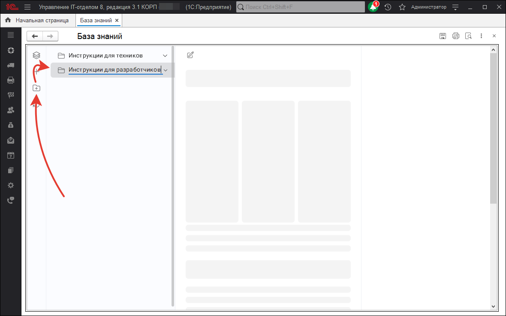
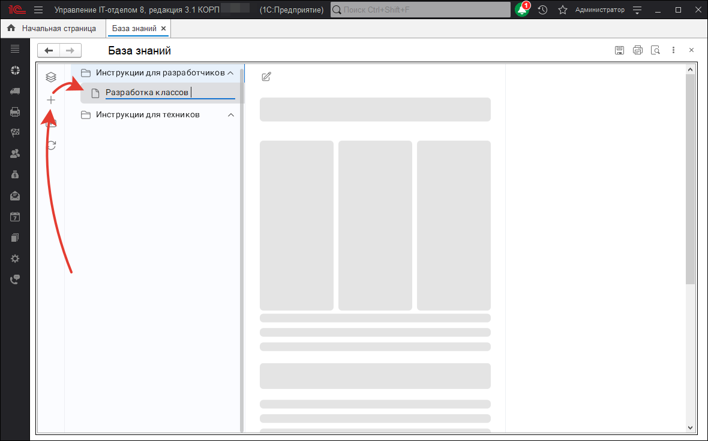
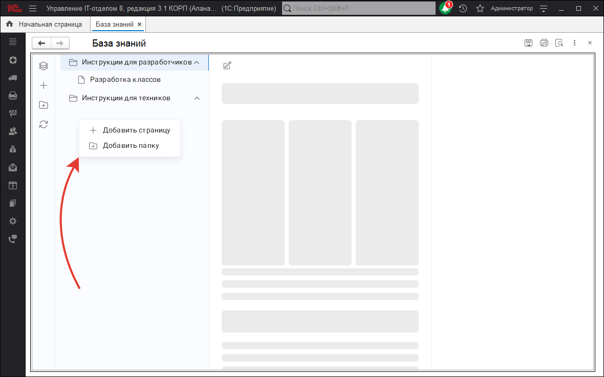
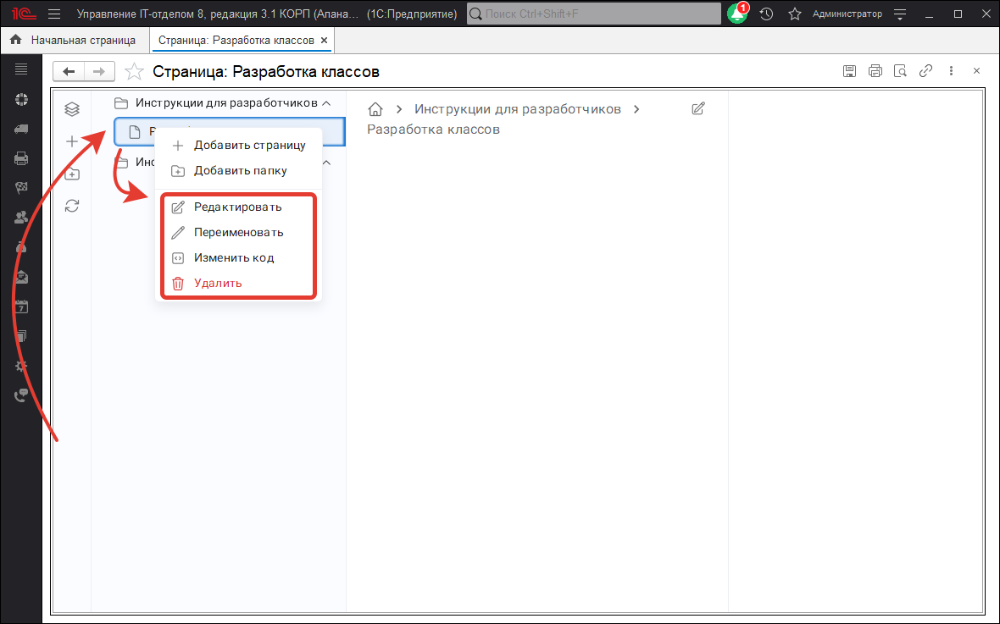
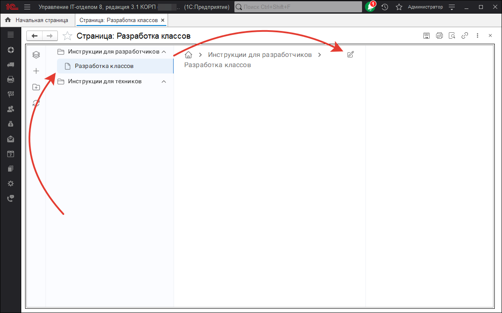
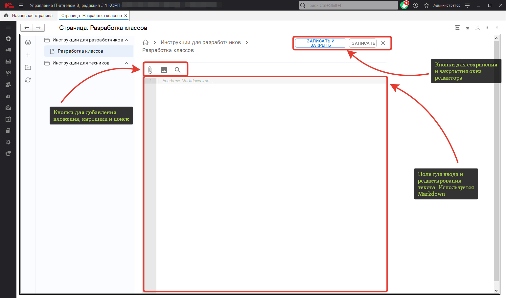

# Создание каталога
Для того чтобы создать каталог для статей нужно нажать на соответствующую кнопку слева от дерева навигации, ввести наименование и нажать на клавишу **"Enter"**

# Создание статьи
Для создания статьи нужно нажать на кнопку слева от дерева навигации, ввести наименование и нажать на кнопку **"Enter"**

# Создание статьи и каталога через контекстное меню
Создавать каталоги и статьи можно и через контекстное меню, нажав на правую клавишу мыши в области дерева навигации и выбрать в меню что мы хотим сделать.

# Удаление, переименование, изменение символьного кода статьи или каталога через контекстное меню
Если в навигационном дереве выбрать каталог или статью, а затем вызвать контекстное меню правой кнопкой мыши, на выбранном объекте, то можно увидеть дополнительные действия над выбранным объектом, а именно **Удаление**, **Переименование**, **Изменение символьного кода** и если выбранный объект является статьей **Редактирование**

# Редактирование статьи
После создания статьи, вызвать окно редактора, можно через контекстное меню или через кнопку.

Окно редактирования выглядит следующим образом. Для редактирования используется Markdown.

