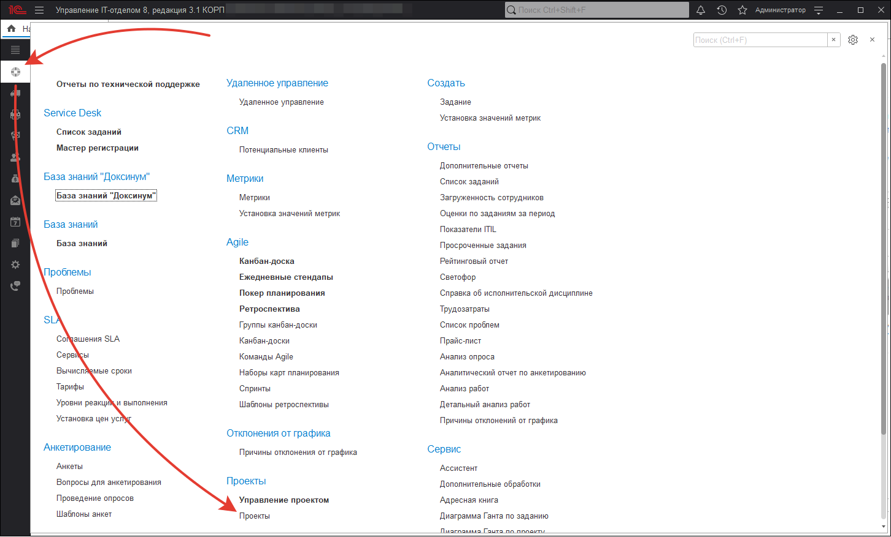
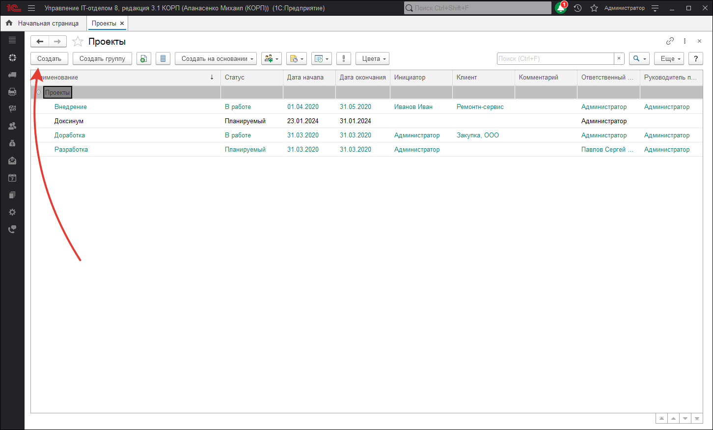
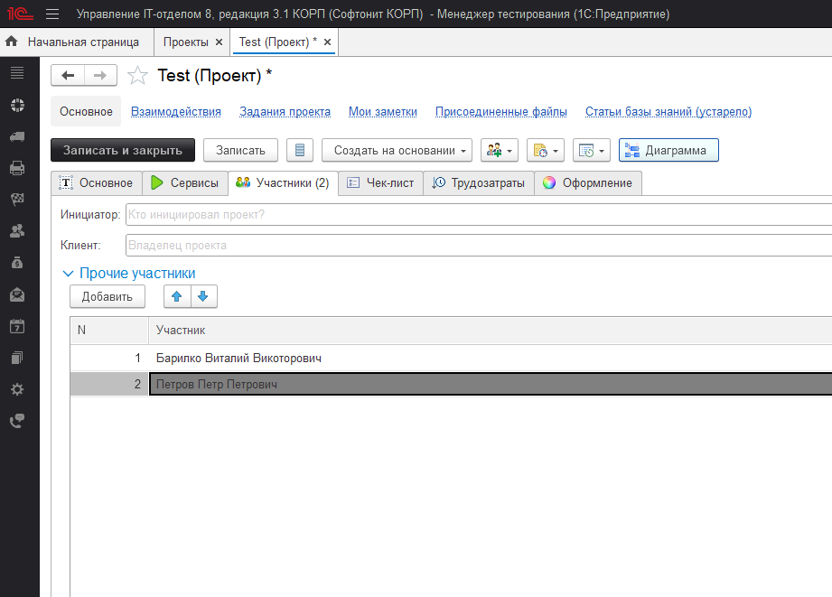
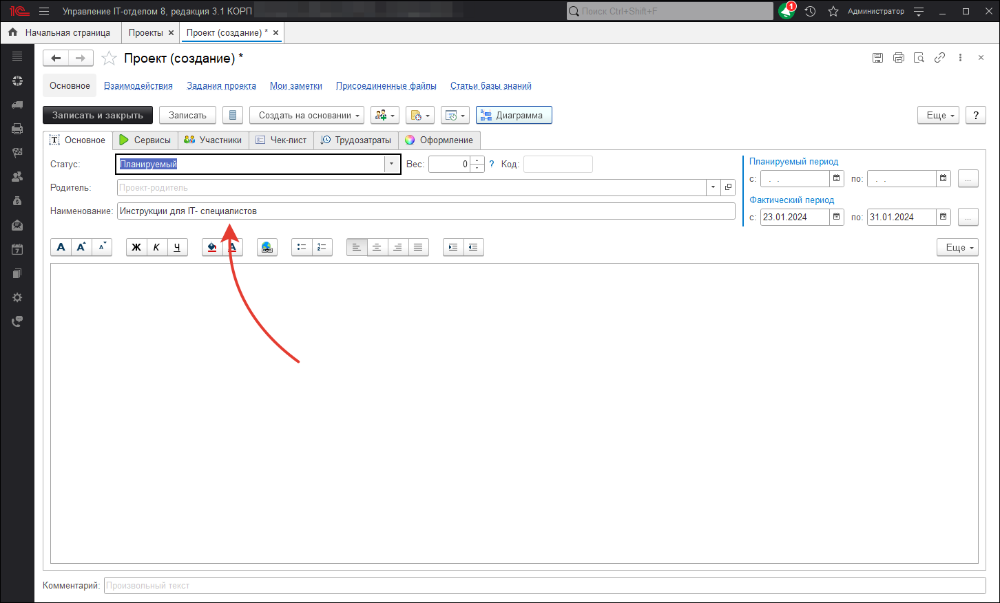
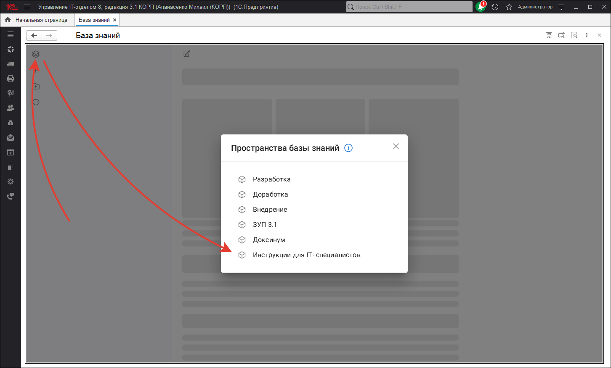

# Что такое пространство
**Доксинум** состоит из пространств. Вы можете создать отдельные пространства для технических специалистов, разработчиков, менеджеров и т.д. Другими словами это способ создавать разные базы знаний. В пространстве строится дерево из каталогов и статей. 
Каждая статья должна находится в определенном пространстве.
Чтобы создать пространство нужно создать проект. То есть проекты составляют пространства в базе знаний. 

## Создание пространства

Для создания пространства перейдите в раздел **"Техническая поддержка"**.

Перейдите в **"Проекты" и нажмите "Создать"**.

В открывшемся окне заполните **"Наименование"**.

В закладке "Участники", вы можете указать участников проекта.

**Важно!** Если не указать участников проекта, документация по данному проекту, будет видна всем пользователям. Если указать участников, документация будет отображаться только указанных.

Нажмите **"Записать и закрыть"**.

Теперь если перейти в раздел **"Техническая поддержка"**, открыть **"База знаний "Доксинум""** и нажать на кнопку для выбора пространства вы увидите в списке, созданное нами, пространство. Обратите внимание что в этом списке видны и другие пространства, это остальные проекты.

