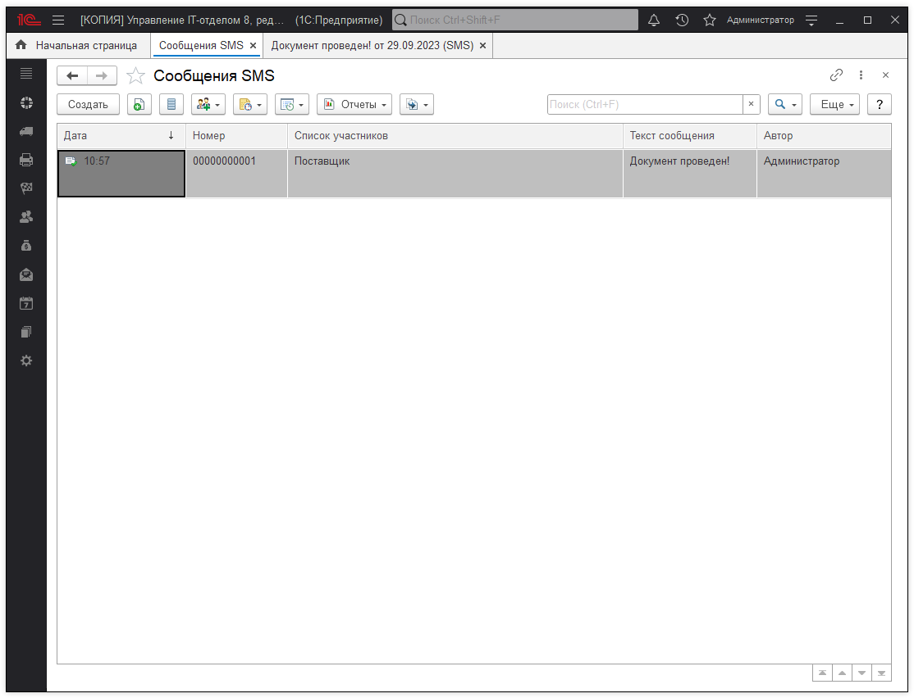
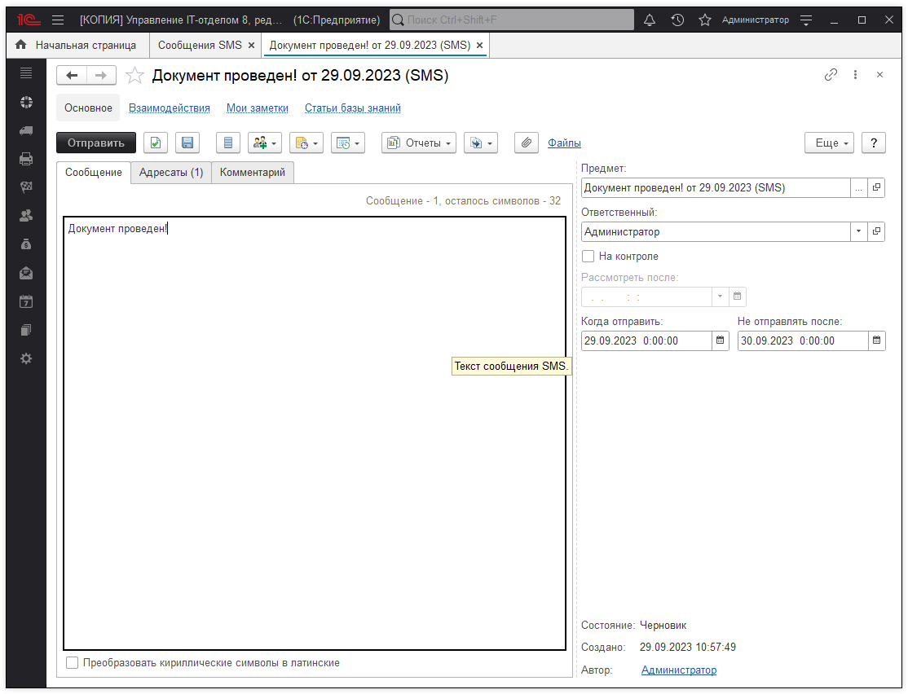

# SMS сообщения

Предназначен для выбора документа "Сообщение SMS". Документ используется для отправки сообщения SMS одному или нескольким адресатам.

Открывается по кнопке **"Написать SMS"** после выбора типа данных "Сообщение SMS" (например, при заполнении поля **"Предмет"** в каком-либо документе взаимодействий). 

В списке выводится:  

* **Дата** - дата создания документа;
* **Номер** - номер присваивается автоматически.
* 
## Выбор документа

* Выделите документ, нажмите **"Выбрать"**.
* Также можно использовать двойной щелчок мыши.

### Отбор по периоду

* С помощью соответствующей команды меню **"Все действия"** (в интерфейсе Такси **"Еще"**) можно **"Установить интервал дат"**.

### Ввод документа Сообщение SMS

Нажмите **"Создать"**. Заполните нужные поля.

### Создание взаимодействий на основании сообщения SMS

Выделите нужный документ **"Сообщение SMS"**. Нажмите **"Взаимодействия"**, для того чтобы:

* [x] Запланировать взаимодействие;  
* [x] Запланировать встречу;  
* [x] Написать электронное письмо;  
* [x] Написать SMS;  
* [x] Позвонить  

Так выглядит окно самого сообщения. Можно указать несколько адресатов для отправки, а также указать дату отправки SMS.

