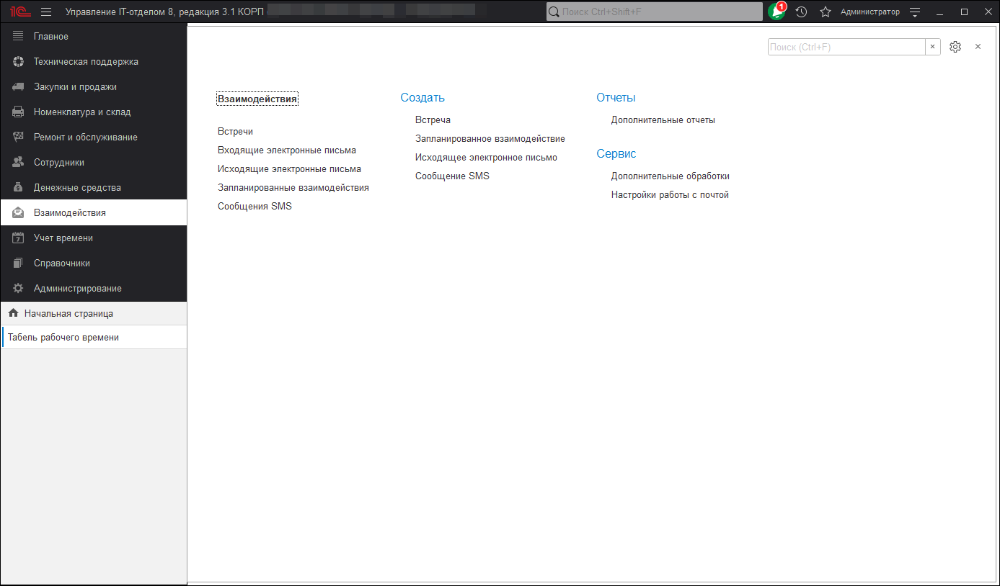

# Взаимодействия

Позволяет вести протоколирования взаимодействий сотрудников ИТ отдела с другими отделами либо организациями. В конфигурации предусмотрена возможность оформлять взаимодействия по самому факту, либо распланировать их на будущее.

**Список ролей для работы с подсистемой "Взаимодействия".**
* [x] Добавление и изменение взаимодействий.