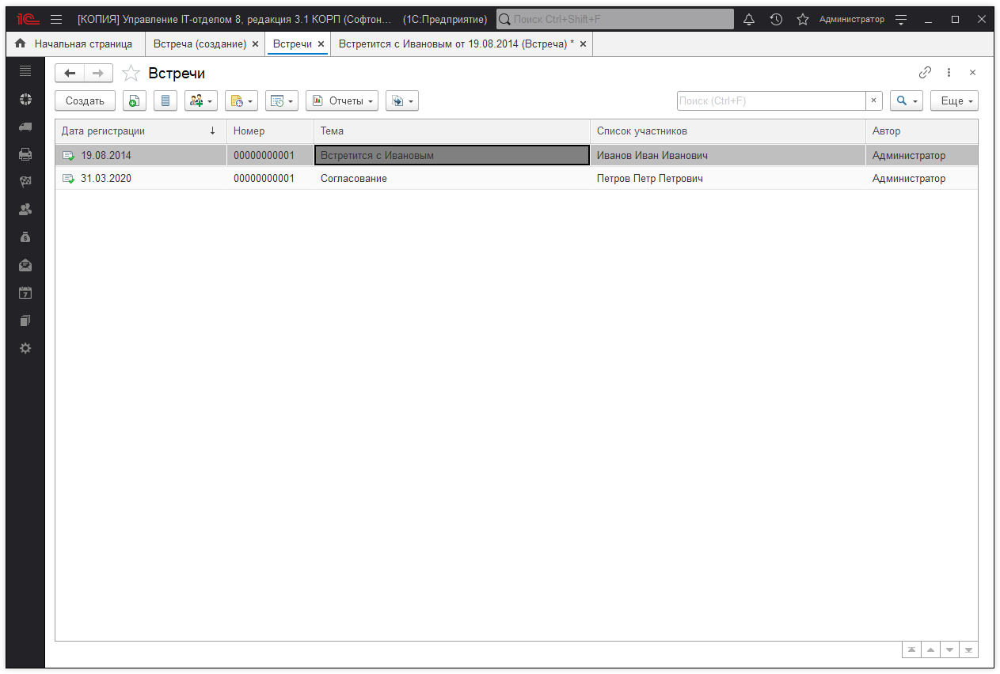
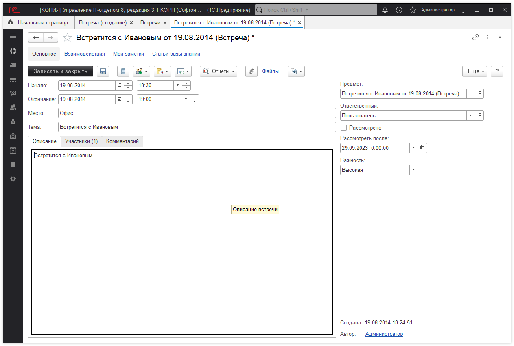
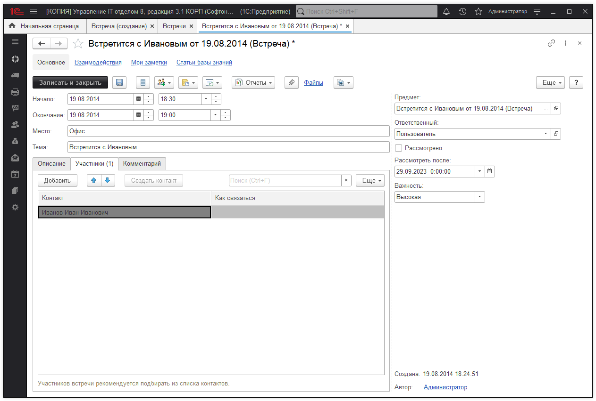
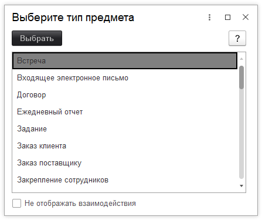

# Документ "Встречи"
Документ предназначен для регистрации информации о прошедших встречах для планирования и отражения факта встреч - совещаний, семинаров и т.п. Например, в этом документе можно отразить результаты обсуждения с клиентом нового коммерческого предложения.

Какие реквизиты можно указать в документе?

Как указать участников встречи?

Какие взаимодействия можно создать на основании встречи?

Как просмотреть взаимодействия, созданные на основании встречи?

## Заполните необходимые поля:

* **Начало** - дата и время начала встречи.  
* **Окончание** - дата и время окончания встречи.   
* **Предмет** - то, чему посвящена встреча, например, обсуждению претензии клиента. Нажмите " Выбрать" , укажите " Тип данных" , затем из соответствующего списка выберите документ взаимодействий или какой-либо документ программы. Если предмет встречи не определен, то в качестве предмета выступает текущий документ, который представляет собой первое взаимодействие цепочки. При выполнении команды " Взаимодействия" во вновь созданном документе автоматически проставляется предмет, указанный в исходном документе, при этом основные поля будут также скопированы. Так можно создать цепочку взаимодействий.   
* **Место** - укажите адрес (номер) помещения, в котором происходила встреча.   
* **Тема** - краткое описание того, чему была посвящена встреча.   
* **Ответственный** - выберите ответственного за данное взаимодействие из списка пользователей. По умолчанию программа указывает в качестве ответственного для большинства документов взаимодействия текущего пользователя.   
* **Рассмотрено** - признак того, что данное взаимодействие рассмотрено и не требует дальнейшего внимания. С рассмотренных документов программа снимает выделение. Использовать флажок Рассмотрено рекомендуется при коллективной работе с документами взаимодействия.  
* **Рассмотреть после** - необходимо заполнить дату и время, если рассмотрение данной встречи планируется отложить до определенной даты. Выберите из списка нужное значение: " Через 15 мин" , " Через 30 мин" , " Через 1 час", " Через 3 часа" , " Завтра" . Помимо этих значений можно указать произвольную дату и время с помощью кнопки.  
* **Важность** - выберите из списка признак необходимости уделения данному взаимодействию дополнительного внимания, или наоборот, признак несущественности. Может принимать значения " Низкая" , " Обычная" , " Высокая" . Отображается в списке специальными значками.    
* **Описание** - подробное описание хода и итогов встречи. Поле является обязательным. Располагается на специальной вкладке.   
* **Комментарий** - произвольный текстовый комментарий. Располагается на специальной вкладке.   
* **Создана** - дата и время создания документа. По умолчанию в этом поле программой автоматически проставляется текущая дата и время записи документа. Поле недоступно для редактирования.   
* **Автор** - пользователь, который создал документ. Указывается программой автоматически. Поле недоступно для редактирования.   

!!!
Реквизиты **"Рассмотрено"** и **"Рассмотреть после"** доступны для указания, если это предусмотрено настройками программы. Изменить данные настройки можно в разделе **"Администрирование" - "Органайзер"** .
!!!

### Участники

Для фиксирования контактов, которые участвовали в мероприятии, используется список **"Участники"** . Перейдите на соответствующую вкладку. Информация об участниках вводится в табличную часть документа. Нажмите **"Добавить"**. В списке указывается имя участника и информация о том, как с ним связаться. Список является обязательным - хотя бы один участник должен быть указан.
 
* Список состоит из колонок:   
    * **Представление контакта** - полное наименование контакта;   
    * **Как связаться** - контактная информация (телефон, адрес электронной почты и т.п.);   
    * **Контакт** - поле выбора участника.  
* Если участник уже зарегистрирован в программе, то информация о нем указывается в поле **"Контакт"** . С помощью кнопки **"Выбрать"** найдите контакт в окне Выбор контакта. После выбора контакта поля **"Представление контакта"** и **"Как связаться будут"** заполнены автоматически.    
* Если информацию о участнике встречи не планируется хранить, то достаточно указать **"Представление контакта"** и **"Как связаться"**. В этом случае в документе появляется информационное сообщение **"Не все контакты подобраны"**.  
* Зарегистрировать контакт можно после сохранения документа, нажав Создать контакт . Для выбора предлагаются списки программы. Заполните необходимые поля.  

### Создание взаимодействий на основании встречи   
Нажмите **"Взаимодействия"** , для того чтобы:

* [x] Запланировать взаимодействие;
* [x] Запланировать встречу;
* [x] Написать SMS;
* [x] Написать электронное письмо;
* [x] Позвонить

## Просмотр взаимодействий, созданных на основании встречи

* Нажмите **"Взаимодействия"** на панели навигации для перехода к списку взаимодействий, созданных на основании данного документа.

Предмет встречи выбирается из списка. На основании этого выбора будет предложено указать конкретный документ. Активированный флажок **"Не отображать взаимодействия"** убирает из списка типы, относящиеся к взаимодействиям.

