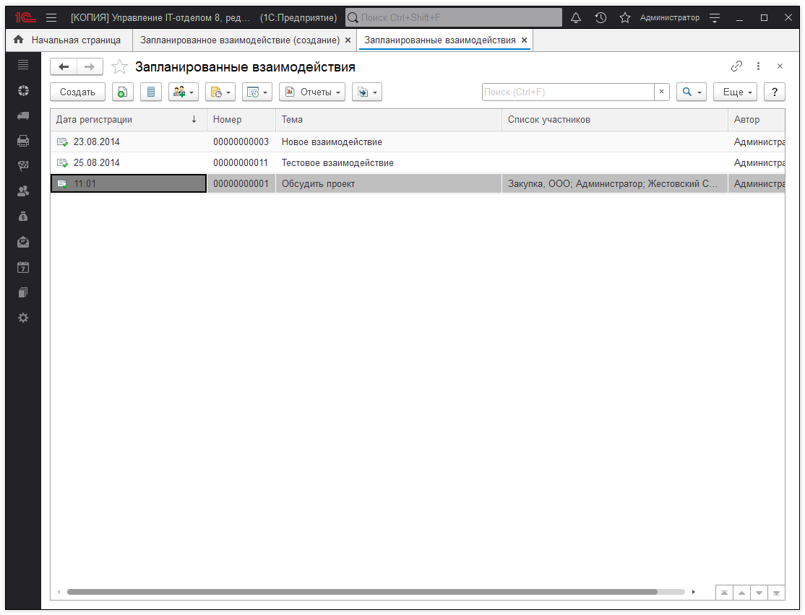
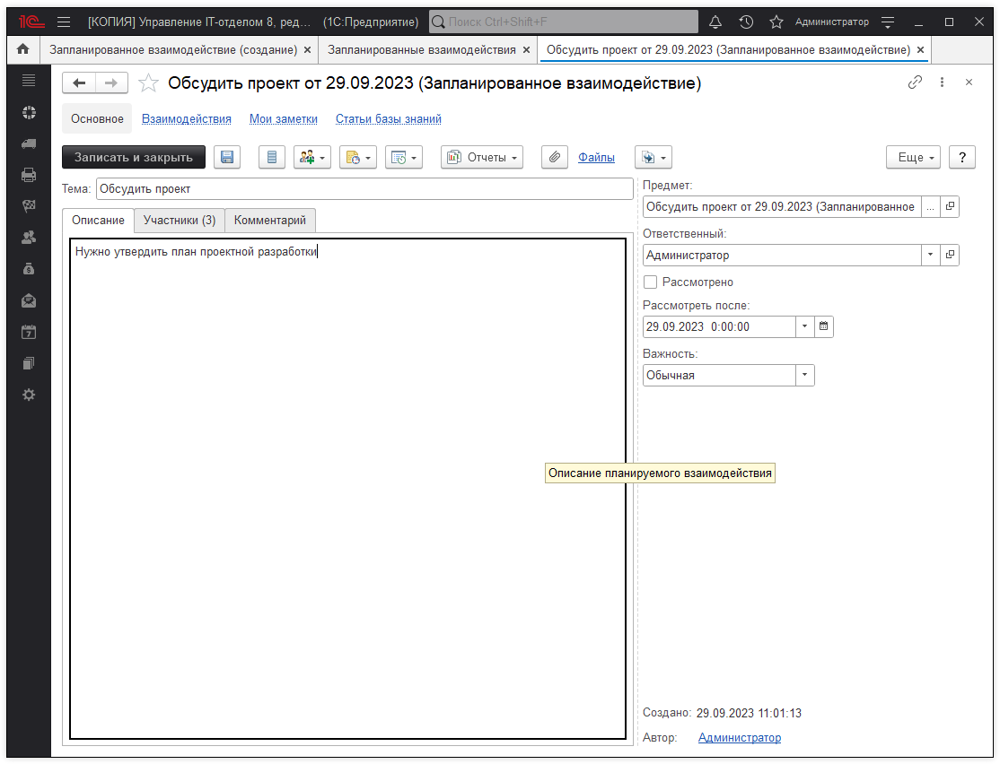

# Запланированные взаимодействия
Документ предназначен для планирования взаимодействия с одним или несколькими контактами. Документ вводится в том случае, если необходимо запланировать взаимодействие, однако как именно будет производиться взаимодействие (телефонный звонок, встреча, электронное письмо, сообщение SMS), еще не известно.

Окно создания взаимодействия.

