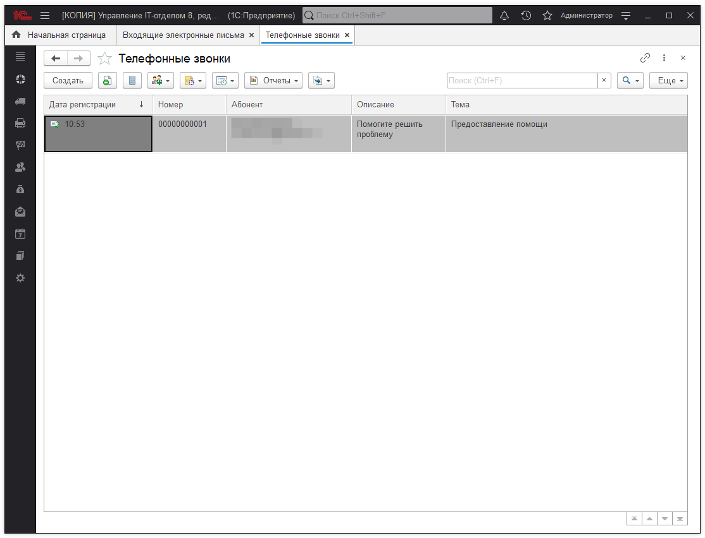
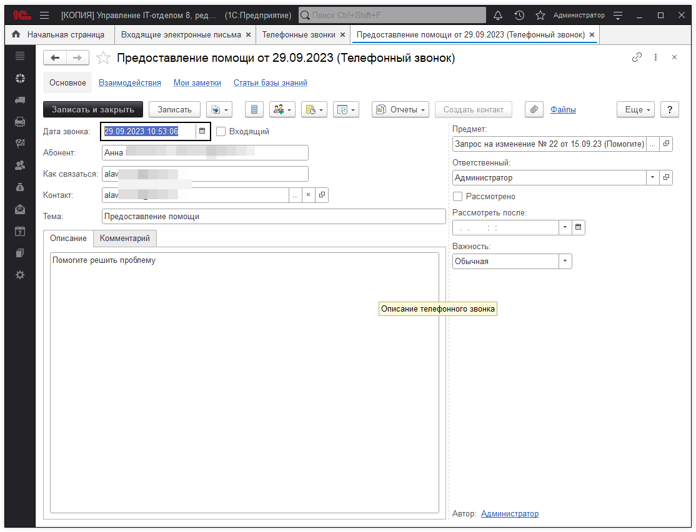

# Телефонные звонки

Предназначен для выбора документа **"Телефонный звонок"**.

Открывается по кнопке ... после выбора типа данных **"Телефонный звонок"** (например, при заполнении поля **"Предмет"** в каком-либо документе взаимодействий).

В списке выводится:  

* **Дата регистрации** - дата создания документа;  
* **Номер** - присваивается автоматически;  
* **Описание** - в поле указывается, какие действия необходимо выполнить в рамках взаимодействия;  
* **Предмет** - то, чему посвящен документ взаимодействий, например претензии клиента. Предметом могут быть документы программы идокументы взаимодействий. Если предмет взаимодействия не определен, то в качестве предмета автоматически проставляется значение текущего документа, т.е. такой документ взаимодействия начинает цепочку взаимодействий;  
* **Абонент** - контакт, который указан в телефонном звонке. 

## Выбор документа

* Выделите документ, нажмите **"Выбрать"**.
* Также можно использовать двойной щелчок мыши.

### Отбор по периоду

* С помощью соответствующей команды меню **"Все действия"** (в интерфейсе Такси **"Еще"**) можно **"Установить интервал дат"**.

### Ввод документа Телефонный звонок

Нажмите **"Создать"**. Заполните нужные поля.

### Создание взаимодействий на основании телефонного звонка

Выделите нужный документ **"Телефонный звонок"**. Нажмите **"Взаимодействия"**, для того чтобы:

* [x] Запланировать взаимодействие;
* [x] Запланировать встречу;
* [x] Написать электронное письмо;
* [x] Написать SMS;
* [x] Позвонить

Так выглядит окно телефонного звонка.

