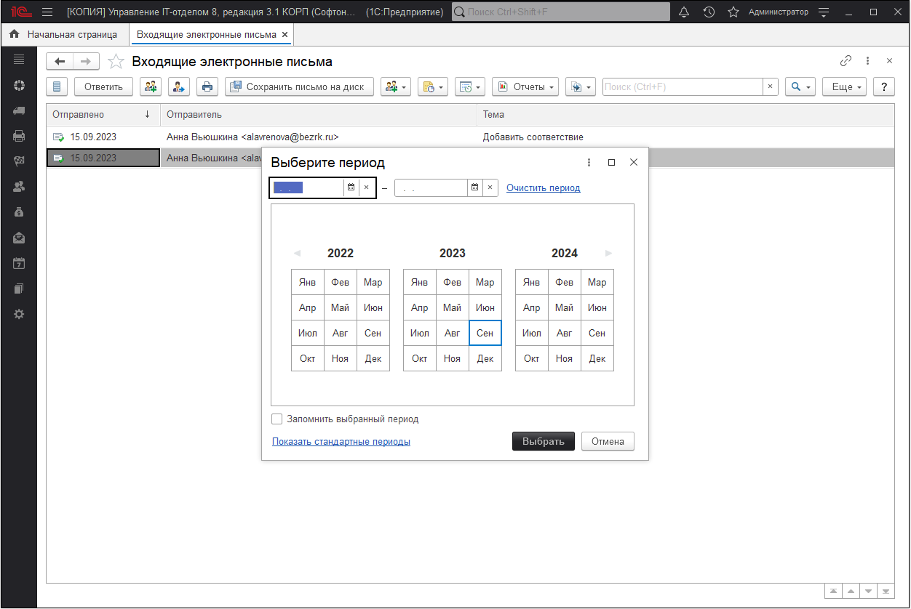

# Электронные письма

Предназначен для работы с документами "Входящее электронное письмо" и "Исходящее электронное письмо". Этот документ можно только получить, ввести его невозможно.

В списке выводится:

* **Отправлено** - дата отправки письма;  
* **Отправитель** - адрес электронной почты отправителя входящего письма.  
* **Тема** - поле заполняется отправителем;  

## Отбор по периоду

С помощью соответствующей команды меню **"Все действия"** (в интерфейсе Такси **"Еще"**) можно **"Установить интервал дат"**.

### Создание исходящего электронного письма на основании входящего электронного письма

Воспользуйтесь одной из кнопок или командами меню **"Все действия"** (в интерфейсе Такси **"Еще"**):

* **Ответить** - в созданном исходящем письме в качестве получателя будет указан отправитель письма. Исходящее письмо при этом входит в цепочку взаимодействий.  
* **Ответить всем** - в созданном исходящем письме в качестве получателей будут указаны отправитель и все получатели данного письма (в полях "Кому" и "Копии").  
* **Переслать** - получатели не заполняются. Будет сформировано исходящее письмо, включающее в себя текст и вложения входящего письма.  

### Распечатка письма 

* Нажмите **"Печать"**;  
* в окне **"Печать"** укажите необходимые настройки для принтера - количество копий, размер бумаги и т.п.  

### Создание взаимодействий на основании входящего электронного письма  

Выделите нужный документ. Нажмите **"Взаимодействия"**, для того чтобы:

* [x] Запланировать взаимодействие;
* [x] Запланировать встречу;
* [x] Написать электронное письмо;
* [x] Написать SMS;
* [x] Позвонить

Ниже мы видим входящее письмо. Мы можем ответить на него, переслать, привязать к заданию и ответственному сотруднику.

Окно **"Исходящие электронные письма"** отличается только тем что из него можно создать и отправить исходящее письмо.