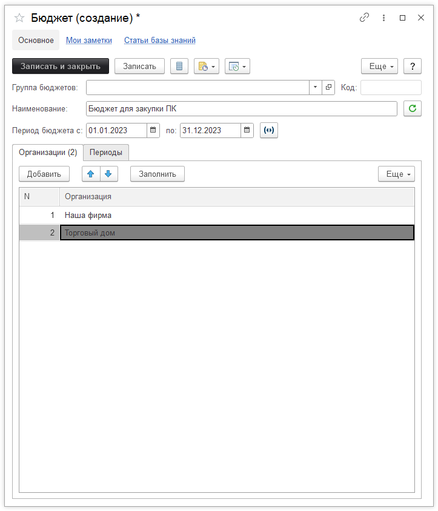
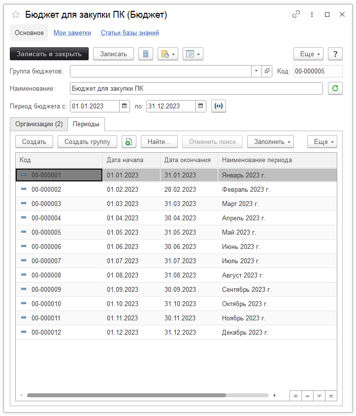

# Бюджетирование

[Конфигурация](https://softonit.ru/catalog/products/it/#detail) позволяет вести план/фактный учет расходов.

Для начала ведения такого учета, необходимо заполнить справочник "Бюджеты", подсистемы "Денежные средства":

На закладке **"Организации"** содержатся данные по организациям, которые входят в бюджет.  
Бюджеты можно вести как по конкретной организации, так и сквозным методом, при указании нескольких организаций.  
Так же выбирается период ведения бюджета (обычно год) и наименование. Идем на вкладку "Периоды":

Бюджеты прежде всего интересны в каком-то временном "срезе" (помесячно, поквартально и т.д.).

По кнопке "Заполнить", мы можем заполнить бюджеты в соответствии с необходимым сроком.

Так же не мало важным "срезом" является статьи затрат (или статьи расходов). Этот справочник тоже необходимо заполнить в соответствии с Вашими потребностями.
