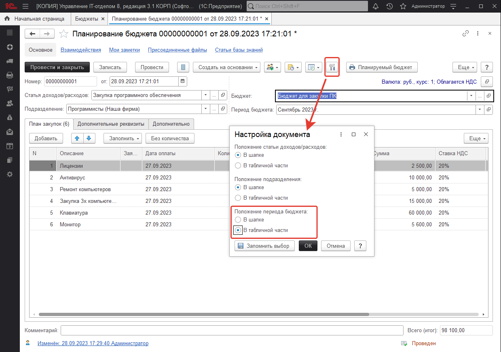
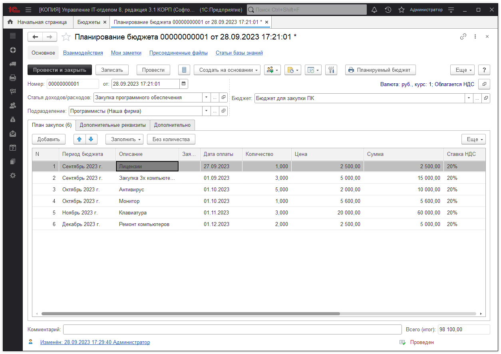

# В документе "Планирование бюджета" перенести реквизит из табличной части в шапку

Почти в любом документе есть значок с ключиком и отверткой:

Там можно отметить, что показывать в шапке, а что в табличной части. Переключите что бы показывался период бюджета в табличной части и будет то, что вы хотите. По умолчанию, для документов вы можете тут же это сохранить, нажав "Запомнить выбор", чтобы для новых документов, всегда показывалось все в табличной части.
Это очень удобно. Если вы разносите за один период, период бюджета в шапку и разносим документ, меньше реквизитов вносим, если за несколько периодов, период в табличную часть и так же разносим.

