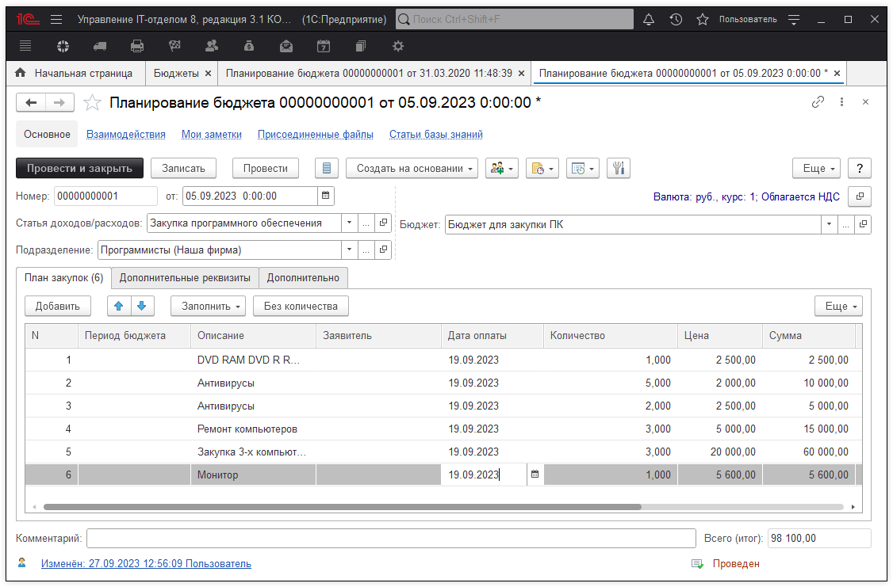

# Планирование расходов

Для того, чтобы получить плановые затраты необходимо заполнить плановые суммы затрат, которые выделены подразделению. Для этого на закладке "Денежные средства" находим и открываем "Планирование бюджетов":

Заполняем документ. С помощью кнопки "Настройка документа"  мы можем управлять расположением реквизитов **"Подразделение"** и **"Статья затрат"** *(в шапке - одно значение реквизита на целый документ, в табличной части - для каждой строки свое значение)*.

Документ отражает план затрат, которые являются плановыми показателями.
